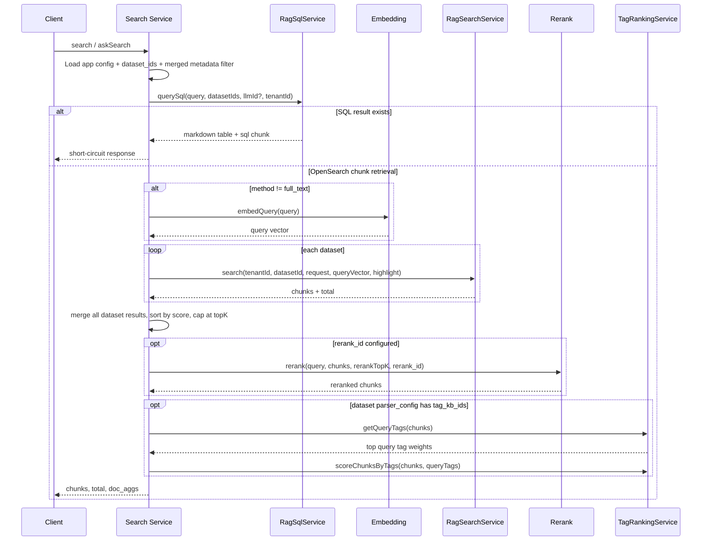

# Search Retrieval Pipeline - Detail Design

> Actual retrieval behavior implemented in `search.service.ts`, `rag-search.service.ts`, and `rag-sql.service.ts` as of 2026-03-25.

## 1. Overview

Search now has a two-stage retrieval path:

1. Try SQL retrieval first for structured datasets that expose `parser_config.field_map`
2. Fall back to chunk retrieval in OpenSearch using `full_text`, `semantic`, or `hybrid`

The chunk path supports:

- Multi-dataset merge
- Search-app metadata filters plus runtime metadata filters
- Server-side highlight snippets
- Optional reranking
- Tag-based score boosting
- Pagination after merged retrieval

## 2. Retrieval Sequence



## 3. SQL Fallback

`RagSqlService.querySql()` runs before normal retrieval in both `executeSearch()` and `askSearch()`.

### Activation conditions

- At least one dataset in the search app has `parser_config.field_map`
- Tenant ID resolves to a valid OpenSearch index name
- Generated SQL passes validation

### Current behavior

- Builds an OpenSearch SQL prompt from `field_map`
- Generates SQL via LLM
- Injects `kb_id` filtering per dataset
- Rejects dangerous SQL keywords
- Retries once with error context if execution fails
- Applies a 15-second timeout per dataset attempt
- Returns a markdown-table answer plus a synthetic `sql_*` chunk when successful

If SQL retrieval fails or returns no rows, the pipeline continues with normal chunk retrieval.

## 4. Chunk Retrieval Methods

### Full-text

- Uses a boosted `multi_match` query
- Applies `minimum_should_match: '30%'`
- Searches readable content and tokenized fields

Current boosted fields:

| Field | Boost |
|-------|-------|
| `content_ltks` | 2 |
| `content_sm_ltks` | default |
| `content_with_weight` | 2 |
| `title_tks` | 10 |
| `title_sm_tks` | 5 |
| `important_kwd` | 30 |
| `important_tks` | 20 |
| `question_tks` | 20 |

### Semantic

- Embeds the query once per request
- Searches the dimension-specific vector field, for example `q_1024_vec`
- Uses the OpenSearch `knn` query

### Hybrid

- Runs both full-text and semantic retrieval
- Combines scores using the configured `vector_similarity_weight`
- Falls back to more relaxed thresholds when the first pass is empty

## 5. Filters and Isolation

### Tenant isolation

OpenSearch isolation is index-based, not document-field-based:

```text
knowledge_{tenantId}
```

### Dataset isolation

Every search includes `kb_id = datasetId`.

### Hidden chunk filtering

Chunks with `available_int < 1` are excluded via `must_not range` logic so documents without the field are not accidentally dropped.

### Metadata filters

Search merges:

- App-level `search_config.metadata_filter`
- Request-time `metadata_filter`

They are combined as a single logical `and` filter before calling the retrieval layer.

## 6. Highlights, Reranking, and Tag Boosting

### Server-side highlights

When highlight mode is enabled, the search layer requests OpenSearch highlights and maps the first readable fragment into `chunk.highlight`.

Preferred highlight source order:

1. `content_with_weight`
2. `content_ltks`
3. `title_tks`

### Reranking

If `search_config.rerank_id` exists, the merged result set is reranked after retrieval and before tag boosting.

### Tag boosting

If any dataset has `parser_config.tag_kb_ids`, the pipeline derives query tags from the current retrieved chunks and boosts scores with cosine similarity plus `pagerank_fea`.

Current implementation detail:

- `getQueryTags()` computes top tags from the current chunk set
- `scoreChunksByTags()` adds `(tagSimilarity * 10) + pagerank_fea` to the existing chunk score

## 7. Pagination and Response Mapping

The service retrieves enough results to satisfy the requested page:

```text
topK = max(requestedTopK, page * pageSize)
```

Pagination happens after merged retrieval so later pages preserve the same filter and ranking pipeline.

For frontend compatibility, returned chunks are mapped with:

- `content = text`
- `content_with_weight = text`

## 8. Key Files

| File | Purpose |
|------|---------|
| `be/src/modules/search/services/search.service.ts` | Orchestration, SQL short-circuit, merge, rerank, tag boosting, pagination |
| `be/src/modules/rag/services/rag-search.service.ts` | OpenSearch full-text, semantic, hybrid, highlight mapping |
| `be/src/modules/rag/services/rag-sql.service.ts` | Structured-data SQL fallback |
| `be/src/shared/services/tag-ranking.service.ts` | Query tag derivation and score boosting |
