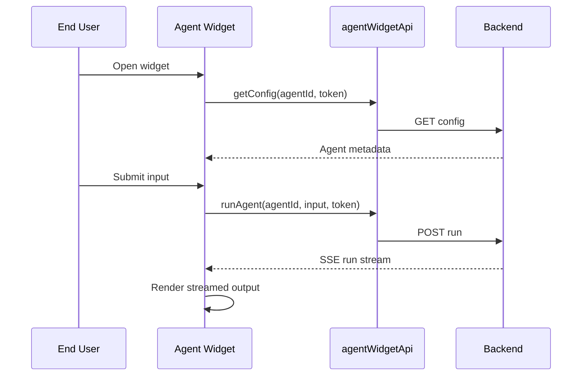

# Agent Widget Client Detail Design

## Overview

The Agent Widget client is the lightweight public frontend launcher for running an agent through embed-token authenticated endpoints. It complements the broader agent embed design by documenting the standalone widget client implementation.

## Responsibilities

| Area | Responsibility |
|------|----------------|
| Launcher UI | Render public entry button |
| Config loading | Fetch agent name, avatar, and description |
| Run submission | Send user input to the public run endpoint |
| Streaming | Consume SSE run output |
| Public mode | Operate without session cookies |

## Backend Surface

| Method | Path | Purpose |
|--------|------|---------|
| `GET` | `/api/agents/embed/:token/:agentId/config` | Load widget header metadata |
| `POST` | `/api/agents/embed/:token/:agentId/run` | Start and stream an embed run |

## Frontend Structure

| File | Purpose |
|------|---------|
| `fe/src/features/agent-widget/components/AgentWidgetButton.tsx` | Launcher button |
| `fe/src/features/agent-widget/api/agentWidgetApi.ts` | Public config + run API client |

## Flow

