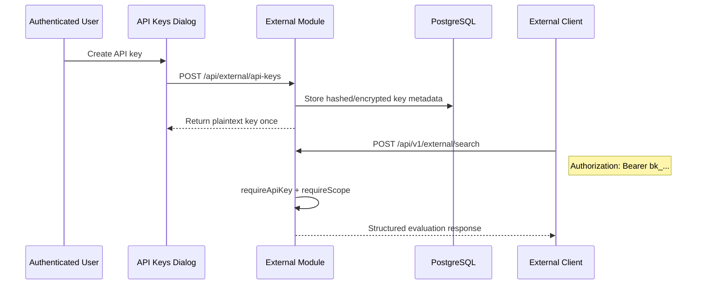

# API Keys Detail Design

## Overview

The API Keys feature lets authenticated users mint and manage long-lived credentials for the external evaluation API. It is separate from embed tokens:

- **API keys** authorize `/api/v1/external/*`
- **Embed tokens** authorize public chat/search/agent embed flows

## Responsibilities

| Area | Responsibility |
|------|----------------|
| Session API | CRUD for user-owned API keys under `/api/external/api-keys` |
| External auth middleware | Bearer key validation and scope enforcement |
| External evaluation API | Uses API-key scopes for `chat`, `search`, and `retrieval` |
| Frontend dialogs | Create, reveal once, list, rotate metadata, disable/delete |

## Backend Endpoints

### User-managed key CRUD

| Method | Path | Purpose |
|--------|------|---------|
| `POST` | `/api/external/api-keys` | Create a key and return the one-time plaintext token |
| `GET` | `/api/external/api-keys` | List current user keys |
| `PATCH` | `/api/external/api-keys/:id` | Update mutable fields such as name, scopes, active status |
| `DELETE` | `/api/external/api-keys/:id` | Permanently remove a key |

### API-key protected evaluation API

| Method | Path | Required Scope | Purpose |
|--------|------|----------------|---------|
| `POST` | `/api/v1/external/chat` | `chat` | RAG chat for evaluation pipelines |
| `POST` | `/api/v1/external/search` | `search` | Search plus answer generation |
| `POST` | `/api/v1/external/retrieval` | `retrieval` | Retrieval-only context evaluation |

## Flow

## Frontend Surface

| File | Purpose |
|------|---------|
| `fe/src/features/api-keys/api/apiKeyApi.ts` | Raw HTTP calls to key CRUD endpoints |
| `fe/src/features/api-keys/api/apiKeyQueries.ts` | TanStack Query hooks |
| `fe/src/features/api-keys/components/ApiKeysDialog.tsx` | Main management dialog |
| `fe/src/features/api-keys/components/CreateApiKeyDialog.tsx` | Create flow with scopes and expiry |
| `fe/src/features/api-keys/components/ApiKeyCreatedDialog.tsx` | One-time plaintext key reveal |
| `fe/src/features/api-keys/components/ApiKeyTable.tsx` | Key list and status actions |

## Key Files

| File | Purpose |
|------|---------|
| `be/src/modules/external/routes/api-key.routes.ts` | Session-authenticated key CRUD |
| `be/src/modules/external/routes/external-api.routes.ts` | API-key protected external endpoints |
| `be/src/modules/external/services/api-key.service.ts` | Key creation, storage, lifecycle logic |
| `be/src/modules/external/services/external-api.service.ts` | External chat/search/retrieval orchestration |
| `be/src/shared/middleware/external-auth.middleware.ts` | API key validation and scope checks |

