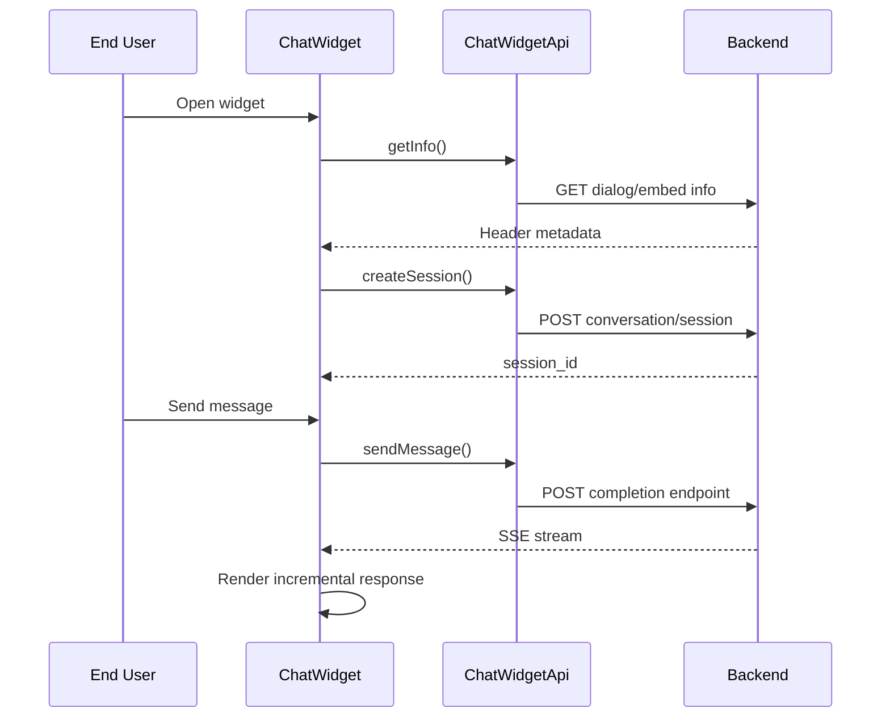

# Chat Widget Client Detail Design

## Overview

The Chat Widget client is the reusable frontend chat surface for both:

- **internal mode** using session-authenticated `/api/chat/*` routes
- **external mode** using token-authenticated `/api/chat/embed/:token/*` routes

It is a standalone frontend feature distinct from the embed API documentation. This page covers the widget client implementation itself.

## Authentication Modes

| Mode | Auth | Backend Surface |
|------|------|-----------------|
| Internal | Session cookie | `/api/chat/conversations`, `/api/chat/dialogs/:id` |
| External | Embed token | `/api/chat/embed/:token/info`, `/api/chat/embed/:token/sessions`, `/api/chat/embed/:token/completions` |

## Client Responsibilities

| Area | Responsibility |
|------|----------------|
| Widget shell | Render launcher button and window |
| Session bootstrap | Create/reuse a chat session |
| Header info | Load assistant name, icon, description, prologue |
| Streaming | Consume SSE completion streams |
| Dual-mode auth | Route requests through session or token mode |

## Flow

## Frontend Structure

| File | Purpose |
|------|---------|
| `fe/src/features/chat-widget/ChatWidget.tsx` | Top-level widget composition |
| `fe/src/features/chat-widget/ChatWidgetButton.tsx` | Launcher button |
| `fe/src/features/chat-widget/ChatWidgetWindow.tsx` | Window shell and conversation UI |
| `fe/src/features/chat-widget/chatWidgetApi.ts` | Dual-mode widget API client |
| `fe/src/lib/widgetAuth.ts` | Shared widget auth and request helpers |

