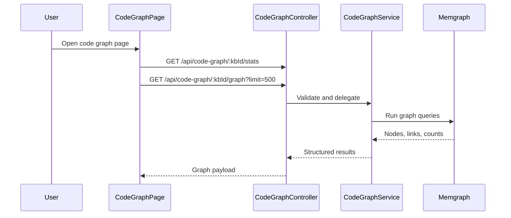

# Code Graph Detail Design

## Overview

The Code Graph feature exposes a Memgraph-backed code knowledge graph for code datasets. It provides graph visualization, symbol lookup, caller/callee analysis, hierarchy inspection, dependency queries, natural-language querying, and admin-only raw Cypher execution.

This is distinct from GraphRAG retrieval. GraphRAG uses graph-enriched retrieval for document QA, while Code Graph is an interactive code-intelligence feature and API surface.

## Backend API

All routes are mounted under `/api/code-graph/:kbId/*` and require authentication. Raw Cypher execution also requires the `admin` role.

| Endpoint | Purpose |
|----------|---------|
| `GET /stats` | Node and relationship counts |
| `GET /graph` | Nodes and links for visualization |
| `GET /schema` | Node labels and edge types |
| `GET /search` | Search code entities by name |
| `GET /callers` | Find inbound callers of a symbol |
| `GET /callees` | Find outbound callees of a symbol |
| `GET /snippet` | Get source snippet for a symbol |
| `GET /hierarchy` | Get inheritance hierarchy |
| `GET /dependencies` | Inspect import/dependency edges |
| `POST /nl-query` | Generate and execute Cypher from natural language |
| `POST /cypher` | Execute raw Cypher directly |

## Frontend Experience

The frontend page renders:

- Stats bar for graph size
- Force-directed graph visualization
- Node limit selector and refresh
- Node detail side panel
- Query/data hooks bound to the current knowledge-base ID

## Flow

## Key Files

| File | Purpose |
|------|---------|
| `be/src/modules/code-graph/code-graph.routes.ts` | Route surface |
| `be/src/modules/code-graph/code-graph.controller.ts` | HTTP handlers |
| `be/src/modules/code-graph/code-graph.service.ts` | Memgraph query orchestration |
| `fe/src/features/code-graph/pages/CodeGraphPage.tsx` | Main graph page |
| `fe/src/features/code-graph/components/ForceGraph.tsx` | Graph renderer |
| `fe/src/features/code-graph/components/NodeDetailPanel.tsx` | Symbol detail panel |
| `fe/src/features/code-graph/api/codeGraphApi.ts` | Frontend API bindings |

