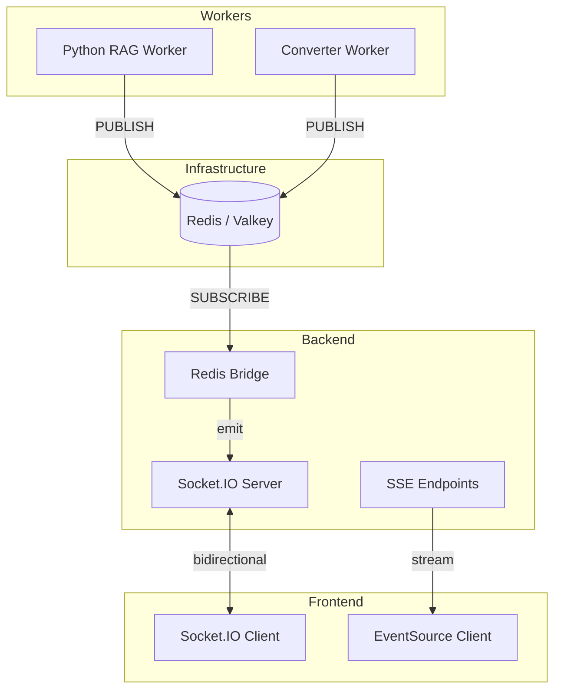
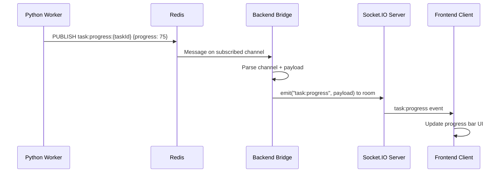
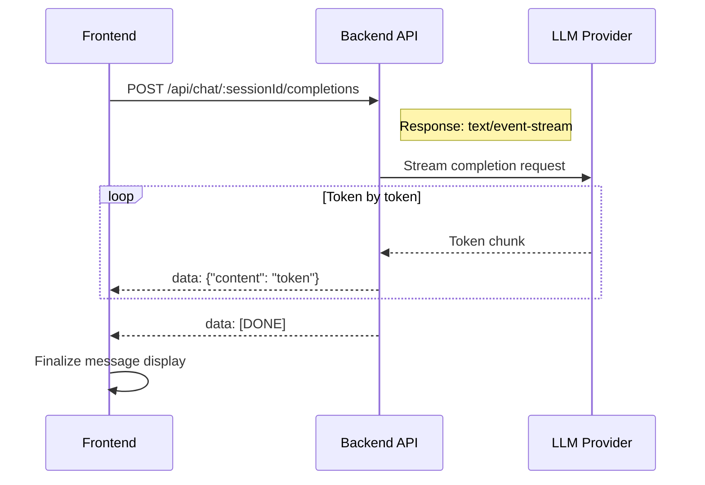

# Real-Time Communication Detail Design

## Overview

B-Knowledge uses two active client-facing realtime patterns:

- **Socket.IO** for notifications and converter status updates
- **SSE (Server-Sent Events)** for chat, search, agent, and document-processing streams

Redis acts as the internal transport between workers and these delivery channels.

## Architecture



## Pattern 1: Socket.IO (Bidirectional Events)

Used for browser notifications and converter status updates.

### Events

| Event | Direction | Payload | Purpose |
|-------|-----------|---------|---------|
| `notification` | Server to Client | `{ type, title, message }` | General push notifications |
| `converter:file:status` | Server to Client | `{ jobId, fileId, fileName, status }` | Per-file converter updates |
| `converter:job:status` | Server to Client | `{ jobId, versionId, status, ... }` | Version/job level converter updates |
| `subscribe` | Client to Server | `room` | Join a named room |
| `unsubscribe` | Client to Server | `room` | Leave a named room |

### Connection Management

- Auto-reconnect from the frontend Socket.IO client
- Room-based subscriptions through `subscribe` / `unsubscribe`
- Browser and external-client auth through Socket.IO handshake auth

## Pattern 2: Redis Bridge

Workers do not talk to browsers directly. They publish progress and run output to Redis, and backend services forward those messages to Socket.IO listeners or SSE streams.

### Channels

| Channel Pattern | Publisher | Description |
|----------------|-----------|-------------|
| `agent:run:{runId}` | Agent executor / worker | Step and final run output |
| Converter channels | Converter worker | File and job status |
| Dataset/document channels | Advance-RAG worker | Parse and indexing progress |

### Bridge Sequence



## Pattern 3: SSE

Used when the server only needs to push ordered status or token streams.

### SSE Endpoints

| Endpoint | Purpose |
|----------|---------|
| `POST /api/chat/:sessionId/completions` | Stream authenticated chat completions |
| `POST /api/chat/embed/:token/completions` | Stream public embed chat |
| `POST /api/search/ask` | Stream authenticated search answer |
| `POST /api/search/embed/:token/ask` | Stream public embed search answer |
| `GET /api/agents/:id/run/:runId/stream` | Stream authenticated agent execution |
| `POST /api/agents/embed/:token/:agentId/run` | Stream public agent execution |
| `GET /api/rag/datasets/:id/documents/:docId/status` | Stream document processing status |

### Chat Streaming Sequence



### SSE Format

```
data: {"id":"msg_1","content":"Hello"}

data: {"id":"msg_1","content":" world"}

data: [DONE]
```

## Scaling Considerations

| Concern | Solution |
|---------|----------|
| Multiple backend instances | Redis-backed worker communication and stateless SSE endpoints |
| Client reconnection | Socket.IO reconnect logic and client-side SSE restart |
| Message ordering | SSE preserves write order per request; socket events include status and timestamps |
| Cleanup | Socket disconnect and SSE `close` handlers unsubscribe listeners |

## Key Files

| File | Purpose |
|------|---------|
| `be/src/shared/services/socket.service.ts` | Backend Socket.IO lifecycle and room/event handling |
| `be/src/shared/services/redis.service.ts` | Shared Redis connection management |
| `be/src/modules/chat/controllers/chat-conversation.controller.ts` | Authenticated chat SSE |
| `be/src/modules/chat/controllers/chat-embed.controller.ts` | Public embed chat SSE |
| `be/src/modules/search/controllers/search.controller.ts` | Authenticated search SSE |
| `be/src/modules/search/controllers/search-embed.controller.ts` | Public embed search SSE |
| `be/src/modules/agents/services/agent-executor.service.ts` | Agent run SSE orchestration |
| `be/src/modules/rag/controllers/rag.controller.ts` | Dataset/document status SSE |
| `fe/src/lib/socket.ts` | Socket.IO client setup |
| `fe/src/features/system/hooks/useConverterSocket.ts` | Converter status subscription hook |
| `fe/src/features/chat/hooks/useChatStream.ts` | Chat streaming client logic |
| `fe/src/features/search/hooks/useSearchStream.ts` | Search streaming client logic |
