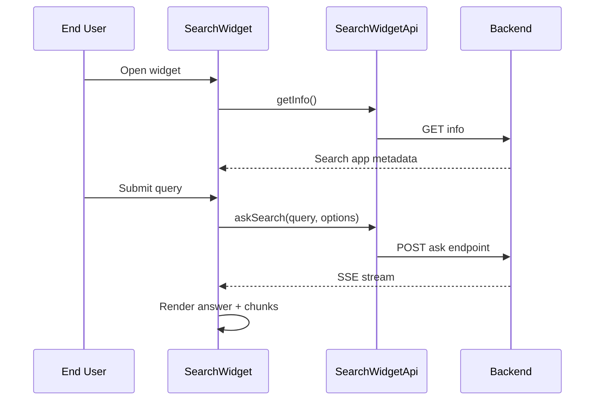

# Search Widget Client Detail Design

## Overview

The Search Widget client is the reusable frontend search surface for both:

- **internal mode** using authenticated search app endpoints
- **external mode** using token-authenticated embed endpoints

This page documents the widget client feature, not just the underlying embed API.

## Authentication Modes

| Mode | Auth | Backend Surface |
|------|------|-----------------|
| Internal | Session cookie | `/api/search/apps/:id/*` style widget-authenticated access via shared widget client |
| External | Embed token | `/api/search/embed/:token/info`, `/api/search/embed/:token/ask` |

## Client Responsibilities

| Area | Responsibility |
|------|----------------|
| Widget shell | Render compact search interface |
| Header info | Load search app name/description |
| Search controls | Submit query and optional retrieval parameters |
| Streaming | Consume search SSE answer stream |
| Results rendering | Show answer and retrieval results in widget layout |

## Frontend Structure

| File | Purpose |
|------|---------|
| `fe/src/features/search-widget/SearchWidget.tsx` | Top-level widget composition |
| `fe/src/features/search-widget/SearchWidgetBar.tsx` | Query entry UI |
| `fe/src/features/search-widget/SearchWidgetResults.tsx` | Result list and answer rendering |
| `fe/src/features/search-widget/searchWidgetApi.ts` | Dual-mode search widget API client |
| `fe/src/lib/widgetAuth.ts` | Shared widget auth and request helpers |

## Flow

