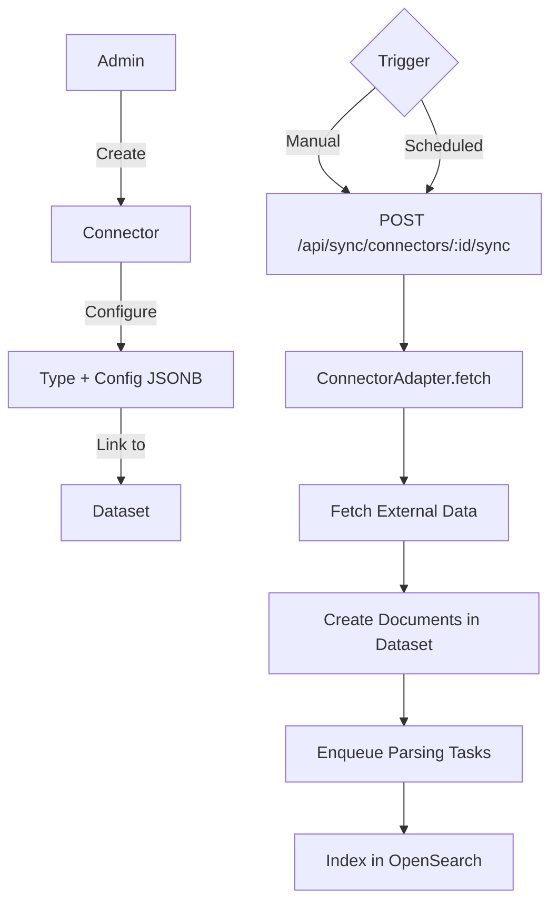
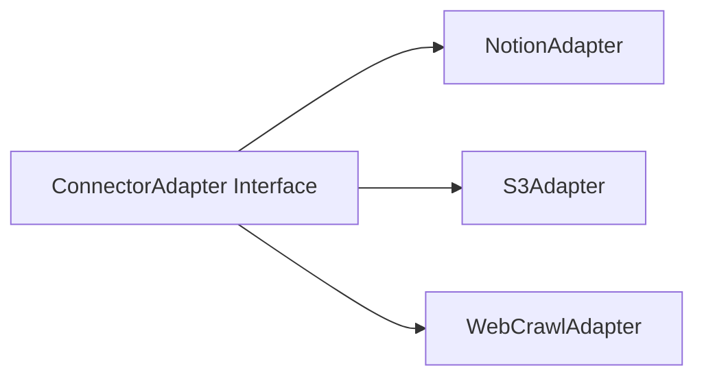
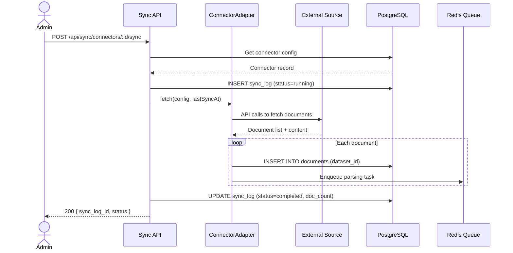

# Sync Connectors Detail Design

## Overview

The Sync module enables B-Knowledge to pull documents from external sources into datasets. Connectors follow an adapter pattern and are exposed through the `/api/sync/connectors*` route family.

## Architecture

## Adapter Pattern

### ConnectorAdapter Interface

Each adapter implements:

| Method | Description |
|--------|-------------|
| `testConnection(config)` | Validate credentials and connectivity |
| `fetch(config, lastSyncAt)` | Retrieve documents since last sync |
| `getMetadata(config)` | List available resources when supported |

### Type-Specific Configuration

| Connector Type | Config Fields |
|----------------|--------------|
| Notion | `api_token`, `database_id` or source identifiers |
| S3 | `endpoint`, `bucket`, `access_key`, `secret_key`, object filters |
| Web Crawl | `start_url`, `max_depth`, `url_patterns`, `exclude_patterns` |

## API Endpoints

### Connector CRUD

| Method | Path | Description |
|--------|------|-------------|
| POST | `/api/sync/connectors` | Create connector |
| GET | `/api/sync/connectors` | List connectors for tenant |
| GET | `/api/sync/connectors/:id` | Get connector details |
| PUT | `/api/sync/connectors/:id` | Update connector config |
| DELETE | `/api/sync/connectors/:id` | Delete connector |

### Operations

| Method | Path | Description |
|--------|------|-------------|
| POST | `/api/sync/connectors/:id/sync` | Trigger manual sync |
| GET | `/api/sync/connectors/:id/logs` | Paginated sync execution history |

## Sync Execution Flow

## Sync Log

Each sync execution produces a log record:

| Field | Type | Description |
|-------|------|-------------|
| id | UUID | Primary key |
| connector_id | UUID | Parent connector |
| status | enum | `running`, `completed`, `failed` |
| documents_created | number | New documents added |
| documents_updated | number | Existing documents refreshed |
| documents_skipped | number | Unchanged documents |
| error_message | text | Failure details (if any) |
| started_at | timestamp | Execution start |
| completed_at | timestamp | Execution end |

## Incremental Sync

Connectors track `last_sync_at` on the connector record. When `fetch()` is called, the adapter only retrieves documents modified after `last_sync_at`. This minimizes API calls and processing time for recurring syncs.

## Key Files

| File | Purpose |
|------|---------|
| `be/src/modules/sync/` | Module root |
| `be/src/modules/sync/controllers/sync.controller.ts` | Route handlers |
| `be/src/modules/sync/services/sync.service.ts` | Orchestration logic |
| `be/src/modules/sync/adapters/` | Adapter implementations |
| `be/src/modules/sync/models/` | Knex models |
