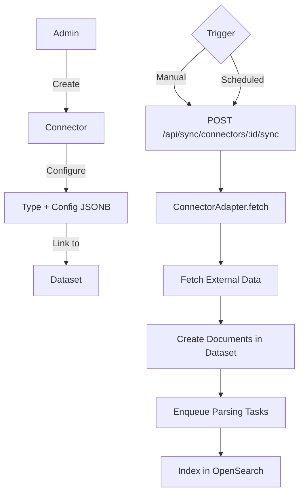
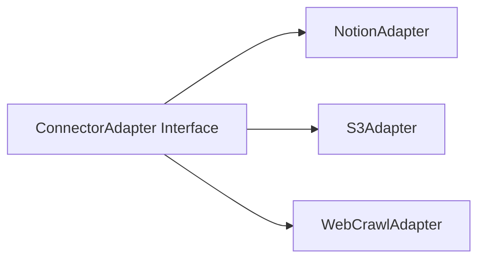
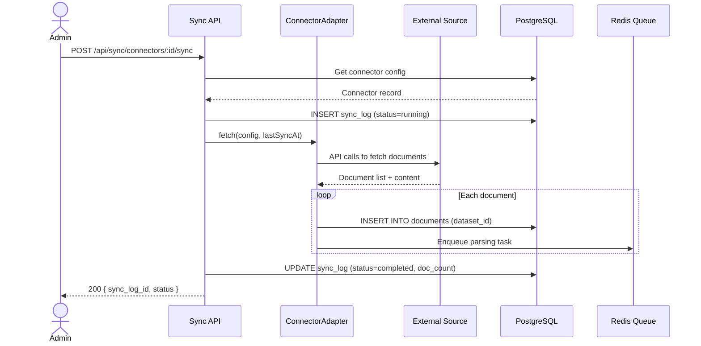
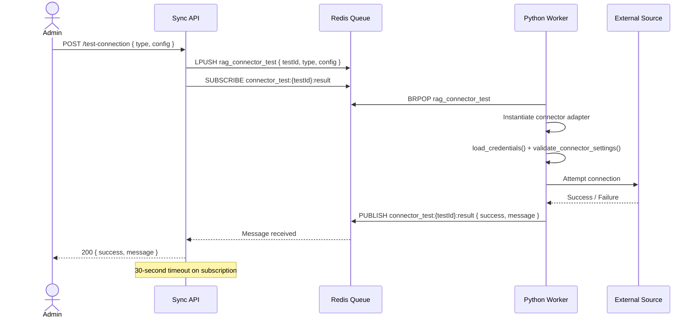
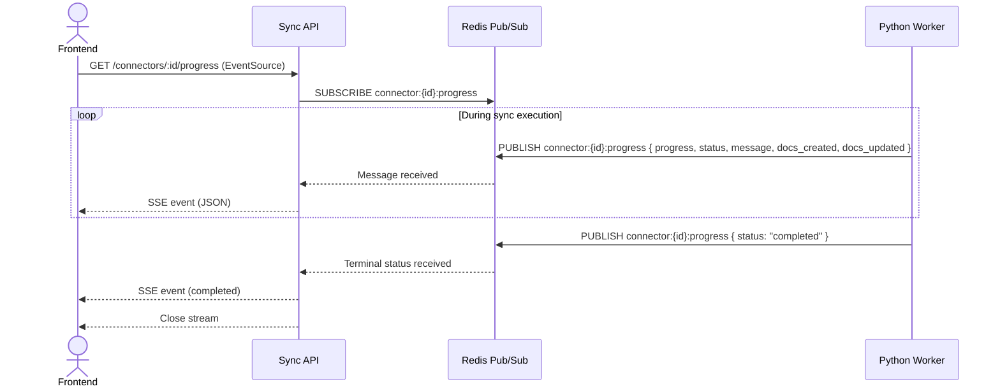

# Sync Connectors Detail Design

## Overview

The Sync module enables B-Knowledge to pull documents from external sources into datasets. Connectors follow an adapter pattern and are exposed through the `/api/sync/connectors*` route family.

## Architecture

## Adapter Pattern

### ConnectorAdapter Interface

Each adapter implements:

| Method | Description |
|--------|-------------|
| `testConnection(config)` | Validate credentials and connectivity |
| `fetch(config, lastSyncAt)` | Retrieve documents since last sync |
| `getMetadata(config)` | List available resources when supported |

### Type-Specific Configuration

| Connector Type | Config Fields |
|----------------|--------------|
| Notion | `api_token`, `database_id` or source identifiers |
| S3 | `endpoint`, `bucket`, `access_key`, `secret_key`, object filters |
| Web Crawl | `start_url`, `max_depth`, `url_patterns`, `exclude_patterns` |

## API Endpoints

### Connector CRUD

| Method | Path | Description |
|--------|------|-------------|
| POST | `/api/sync/connectors` | Create connector |
| GET | `/api/sync/connectors` | List connectors for tenant |
| GET | `/api/sync/connectors/:id` | Get connector details |
| PUT | `/api/sync/connectors/:id` | Update connector config |
| DELETE | `/api/sync/connectors/:id` | Delete connector |

### Operations

| Method | Path | Description |
|--------|------|-------------|
| POST | `/api/sync/connectors/:id/sync` | Trigger manual sync |
| GET | `/api/sync/connectors/:id/logs` | Paginated sync execution history |

## Sync Execution Flow

## Sync Log

Each sync execution produces a log record:

| Field | Type | Description |
|-------|------|-------------|
| id | UUID | Primary key |
| connector_id | UUID | Parent connector |
| status | enum | `running`, `completed`, `failed` |
| documents_created | number | New documents added |
| documents_updated | number | Existing documents refreshed |
| documents_skipped | number | Unchanged documents |
| error_message | text | Failure details (if any) |
| started_at | timestamp | Execution start |
| completed_at | timestamp | Execution end |

## Incremental Sync

Connectors track `last_sync_at` on the connector record. When `fetch()` is called, the adapter only retrieves documents modified after `last_sync_at`. This minimizes API calls and processing time for recurring syncs.

## Key Files

| File | Purpose |
|------|---------|
| `be/src/modules/sync/` | Module root |
| `be/src/modules/sync/controllers/sync.controller.ts` | Route handlers |
| `be/src/modules/sync/services/sync.service.ts` | Orchestration logic |
| `be/src/modules/sync/adapters/` | Adapter implementations |
| `be/src/modules/sync/models/` | Knex models |

## Credential Encryption (SYN-FR-05)

Connector credentials are encrypted at rest using AES-256-CBC via the shared `cryptoService`.

### Wire Format

The encrypted payload follows the RAGF wire format:

| Segment | Size | Description |
|---------|------|-------------|
| Magic bytes | 4 bytes | `RAGF` identifier |
| IV | 16 bytes | Initialization vector for AES-256-CBC |
| Ciphertext | variable | Encrypted config JSON |

The entire binary payload is then Base64-encoded for storage in the PostgreSQL `config` JSONB column.

### Encryption Lifecycle

- **Create / Update:** The connector config object is JSON-serialized and encrypted before being persisted.
- **Read:** The encrypted config is decrypted on the backend when needed for sync execution or adapter instantiation.
- **API Responses:** Sensitive keys (tokens, passwords, secret keys) are masked with `********` before being returned to the client. The full encrypted value is never exposed via the API.

### Python Compatibility

The same RAGF wire format is shared with the Python RAG worker via `advance-rag/common/crypto_utils.py`, ensuring both Node.js and Python services can encrypt and decrypt connector credentials interchangeably.

## Concurrent Sync Prevention (SYN-BR-06)

To prevent duplicate documents caused by overlapping sync executions, the system acquires a Redis distributed lock before starting any sync.

### Lock Mechanism

- **Acquire:** `SET connector_sync_lock:{connectorId} <value> NX EX 3600` (1-hour TTL)
- **Key pattern:** `connector_sync_lock:{connectorId}`
- **Behavior on conflict:** If the lock is already held, the API returns `409 Conflict` immediately.
- **Release:** The lock is released on sync completion or failure via the `subscribeToSyncProgress` handler.
- **TTL safety:** The 1-hour TTL acts as a fallback to prevent permanent lock retention if the worker crashes without releasing.

## Test Connection (SYN-FR-31)

The test connection flow validates adapter credentials before saving a connector.

### Endpoint

`POST /api/sync/connectors/test-connection`

### Flow

### Timeout

The backend waits up to 30 seconds for the worker to publish a result on the `connector_test:{testId}:result` pub/sub channel. If no response is received within this window, the API returns a timeout error to the client.

## SSE Progress Streaming

Real-time sync progress is streamed to the frontend via Server-Sent Events (SSE).

### Endpoint

`GET /api/sync/connectors/:id/progress`

### Flow

### Event Payload

| Field | Type | Description |
|-------|------|-------------|
| progress | number | Percentage complete (0–100) |
| status | string | `running`, `completed`, `failed` |
| message | string | Human-readable status message |
| docs_created | number | Documents created so far |
| docs_updated | number | Documents updated so far |

### Lifecycle

- The frontend opens an `EventSource` connection to the progress endpoint.
- The backend subscribes to the `connector:{id}:progress` Redis pub/sub channel and forwards each message as a JSON SSE event.
- When a terminal status (`completed` or `failed`) is received, the backend sends the final event and closes the stream.
- The frontend handles stream closure and updates the UI to reflect the final sync state.
