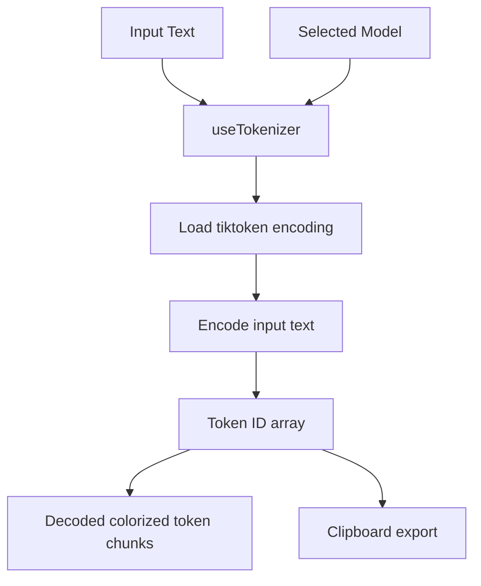

# Tokenizer Playground Detail Design

## Overview

The Tokenizer Playground is a frontend-only utility page used to visualize tokenization behavior for different model families. It does not call the backend. Tokenization happens entirely in the browser through `js-tiktoken`.

## Supported Models

The current page supports:

- `gpt-4`
- `gpt-3.5-turbo`
- `text-embedding-ada-002`
- `text-davinci-003`
- `text-davinci-002`
- Generic fallback modes for `ollama` and `vllm`

Fallback encoding for non-explicit models uses `cl100k_base`.

## UI Behavior

| Area | Behavior |
|------|----------|
| Model selector | Switches tokenizer encoding |
| Input textarea | Accepts raw text |
| Output panel | Shows tokenized chunks with alternating colors |
| Counters | Display token count and character count |
| Copy action | Copies token ID array to clipboard |
| Clear action | Resets input and token list |

## State Flow

## Key Files

| File | Purpose |
|------|---------|
| `fe/src/features/ai/pages/TokenizerPage.tsx` | Tokenizer playground page |
| `fe/src/features/ai/hooks/useTokenizer.ts` | Encoding selection, token computation, clipboard actions |

