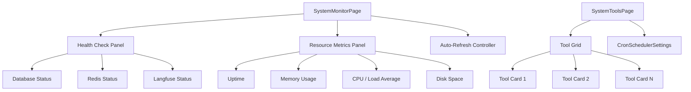
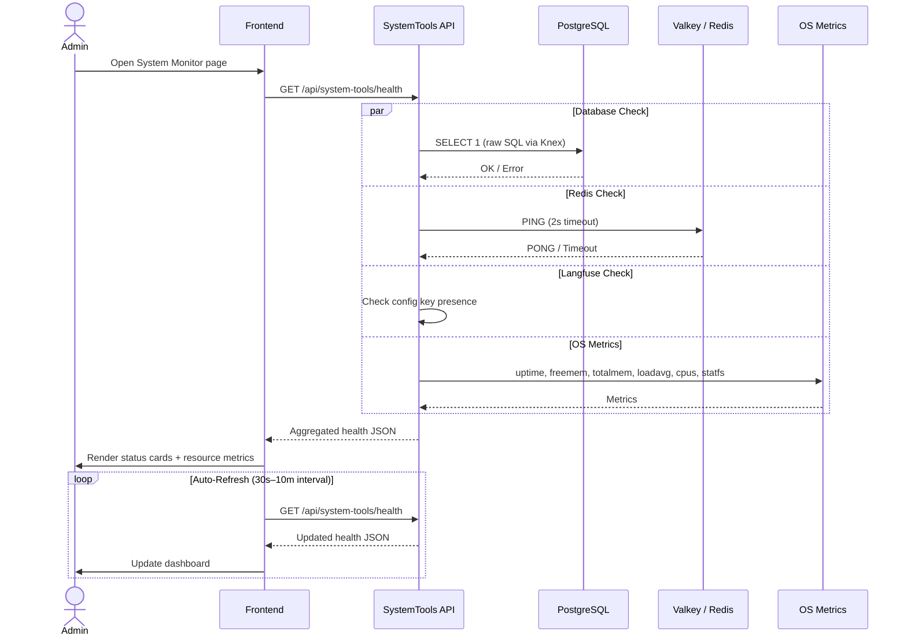
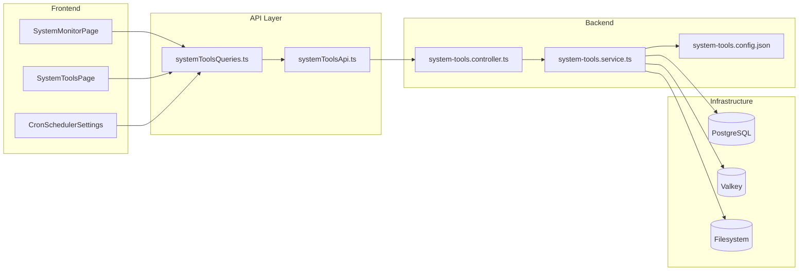

# System Tools & Health Monitoring Detail Design

## Overview

Provides system health monitoring, tool management, and cron scheduler configuration for administrators. Aggregates multi-service health checks and serves a configurable tool launcher grid.

## Component Architecture



## API Endpoints

| Method | Path | Permission | Description |
|--------|------|------------|-------------|
| GET | `/api/system-tools` | `view_system_tools` | List enabled tools sorted by display order |
| GET | `/api/system-tools/health` | `view_system_tools` | Aggregated system health check |
| POST | `/api/system-tools/:id/run` | `manage_system` | Execute tool by ID |

### GET /api/system-tools

**Response:**

```json
[
  {
    "id": "langfuse",
    "name": "Langfuse",
    "description": "LLM observability and analytics",
    "icon": "chart-bar",
    "url": "https://langfuse.example.com",
    "order": 1,
    "enabled": true
  }
]
```

### GET /api/system-tools/health

**Response:**

```json
{
  "database": { "status": "healthy", "latencyMs": 3 },
  "redis": { "status": "healthy", "latencyMs": 1 },
  "langfuse": { "status": "disabled" },
  "os": {
    "uptime": 864000,
    "memory": { "total": 16777216, "free": 8388608, "usedPercent": 50 },
    "loadAverage": [0.5, 0.7, 0.6],
    "cpuCount": 4,
    "disk": { "total": 107374182400, "free": 53687091200, "usedPercent": 50 }
  }
}
```

### POST /api/system-tools/:id/run

Extensible framework for future tool execution. Currently returns acknowledgement.

**Response:**

```json
{ "success": true, "toolId": "langfuse", "message": "Tool launched" }
```

## Health Check Flow



## System Monitor Architecture



## Tool Configuration

Tool metadata is loaded from `system-tools.config.json`, resolved in order:

1. `SYSTEM_TOOLS_CONFIG` environment variable path
2. Docker mount path (`/app/config/system-tools.config.json`)
3. Fallback path relative to project root

Each tool entry:

| Field | Type | Description |
|-------|------|-------------|
| `id` | string | Unique tool identifier |
| `name` | string | Display name |
| `description` | string | Short description |
| `icon` | string | Icon identifier for the UI |
| `url` | string | Target URL opened in new tab |
| `order` | number | Display sort order |
| `enabled` | boolean | Whether tool appears in the grid |

## Permission Restrictions

| Endpoint | Required Permission |
|----------|-------------------|
| `GET /api/system-tools` | `view_system_tools` |
| `GET /api/system-tools/health` | `view_system_tools` |
| `POST /api/system-tools/:id/run` | `manage_system` |

Non-authorized users receive `403 Forbidden`.

## Frontend Behavior

### SystemMonitorPage

- Fetches health data on mount and auto-refreshes at configurable interval (30s to 10m)
- Renders service status cards with healthy / unhealthy / disabled states
- Displays OS resource metrics: uptime, memory bar, CPU load, disk usage

### SystemToolsPage

- Fetches enabled tools and renders as a clickable card grid
- Each card opens the tool URL in a new browser tab
- Includes `CronSchedulerSettings` component for configuring parsing task schedules

### CronSchedulerSettings

- Allows admins to view and update cron expressions for scheduled parsing tasks
- Validates cron syntax before saving

## Key Files

| File | Purpose |
|------|---------|
| `be/src/modules/system-tools/system-tools.controller.ts` | Route handlers for health and tool endpoints |
| `be/src/modules/system-tools/system-tools.service.ts` | Health aggregation and tool config loading |
| `be/src/modules/system-tools/system-tools.routes.ts` | Route definitions with permission middleware |
| `fe/src/features/system/pages/SystemMonitorPage.tsx` | Health dashboard with auto-refresh |
| `fe/src/features/system/pages/SystemToolsPage.tsx` | Tool launcher grid page |
| `fe/src/features/system/api/systemToolsApi.ts` | Raw HTTP calls to system-tools API |
| `fe/src/features/system/components/CronSchedulerSettings.tsx` | Cron schedule configuration UI |
