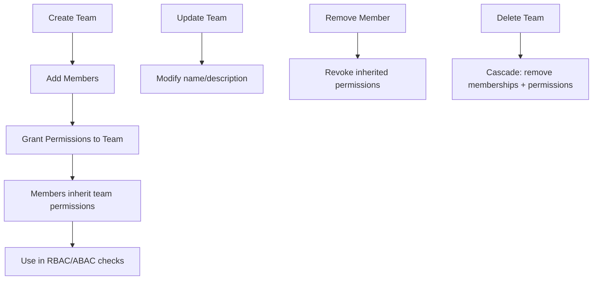
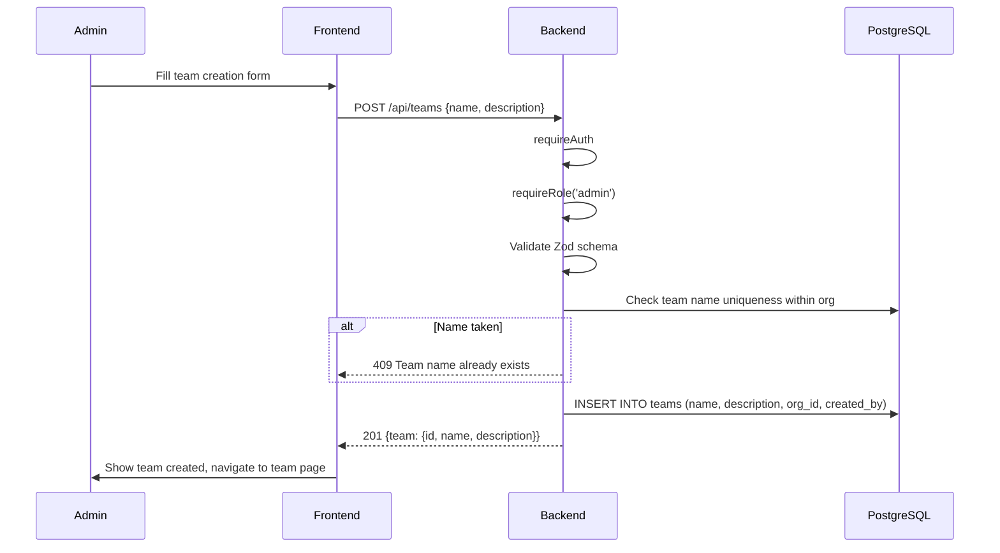
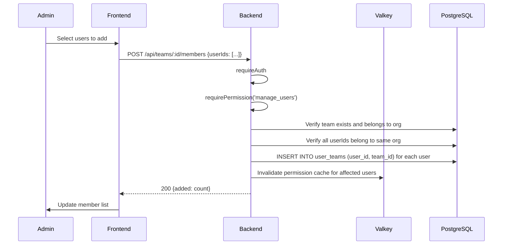
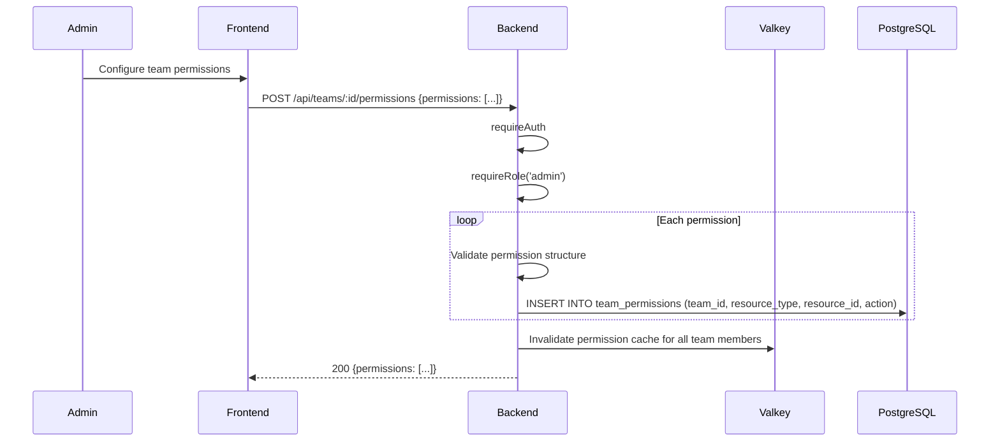
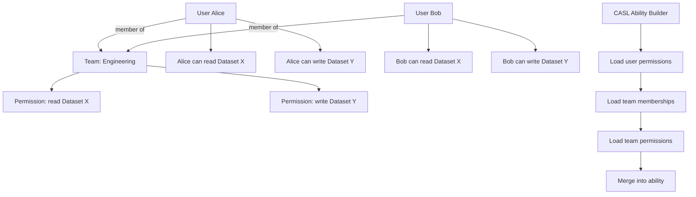
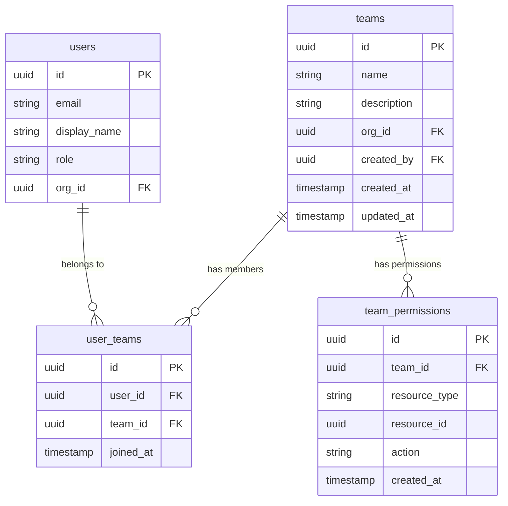
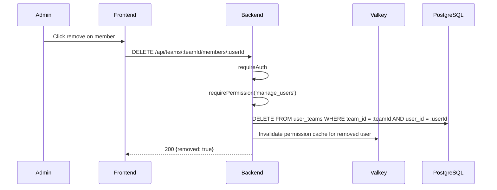
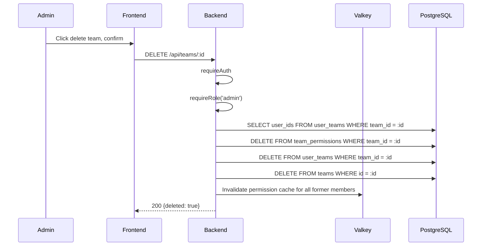

# Team Management: Step-by-Step Detail

## Overview

Teams group users together for shared permission management. Permissions granted to a team cascade to all team members, simplifying access control for datasets and other resources.

## Team Operations Flow

## Create Team

## Add Members

## Grant Team Permissions

### Permission Structure

| Field | Type | Description |
|-------|------|-------------|
| `resource_type` | string | `dataset`, `project`, `model_provider` |
| `resource_id` | UUID | Specific resource or `*` for all |
| `action` | string | `read`, `write`, `manage` |

## Permission Cascade to Members

## Entity Relationship

## Remove Member

## Delete Team (Cascade)

### Cascade Deletion Order

| Step | Table | Action |
|------|-------|--------|
| 1 | `team_permissions` | Remove all team permission grants |
| 2 | `user_teams` | Remove all membership records |
| 3 | `teams` | Delete team record |
| 4 | Valkey | Invalidate cached permissions for former members |

## Team CRUD Summary

| Operation | Method | Endpoint | Auth |
|-----------|--------|----------|------|
| List teams | GET | `/api/teams` | requireAuth |
| Create team | POST | `/api/teams` | requireRole('admin') |
| Get team | GET | `/api/teams/:id` | requireAuth |
| Update team | PUT | `/api/teams/:id` | requireRole('admin') |
| Delete team | DELETE | `/api/teams/:id` | requireRole('admin') |
| List members | GET | `/api/teams/:id/members` | requireAuth |
| Add members | POST | `/api/teams/:id/members` | requirePermission('manage_users') |
| Remove member | DELETE | `/api/teams/:id/members/:userId` | requirePermission('manage_users') |
| Set permissions | POST | `/api/teams/:id/permissions` | requireRole('admin') |

## Key Files

| File | Purpose |
|------|---------|
| `be/src/modules/teams/teams.controller.ts` | Route handlers for team endpoints |
| `be/src/modules/teams/teams.service.ts` | Business logic: CRUD, membership, permissions |
| `be/src/modules/teams/teams.routes.ts` | Route definitions with middleware chains |
| `be/src/modules/auth/auth.service.ts` | CASL ability builder (loads team permissions) |
