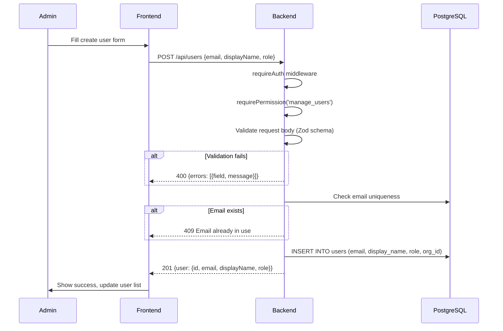
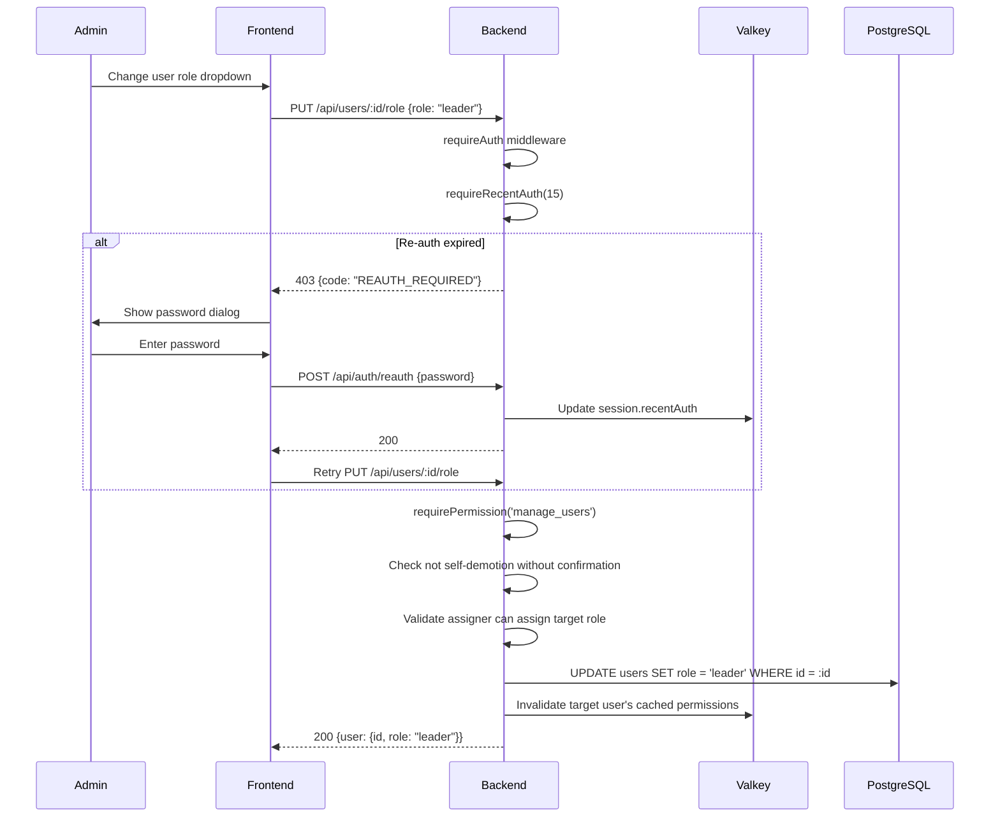
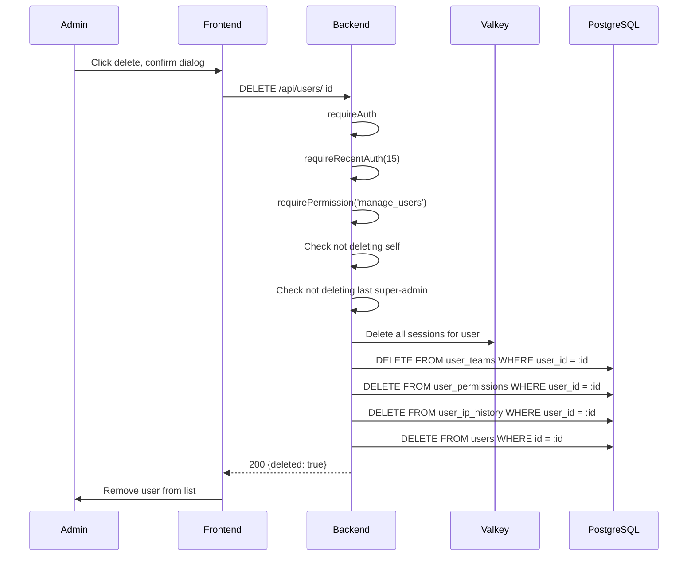
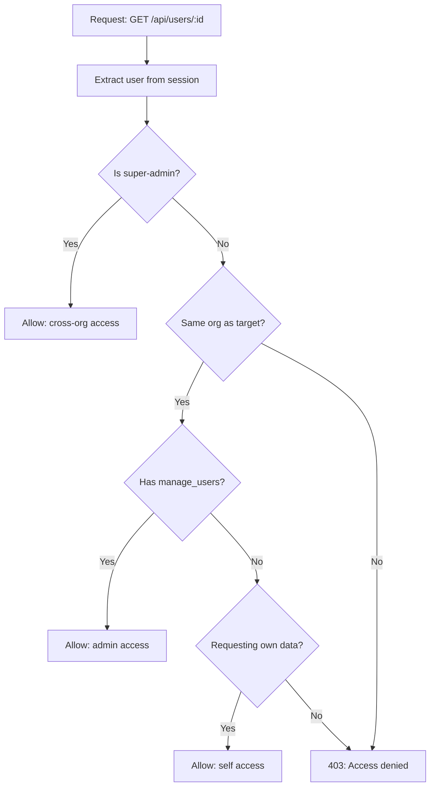
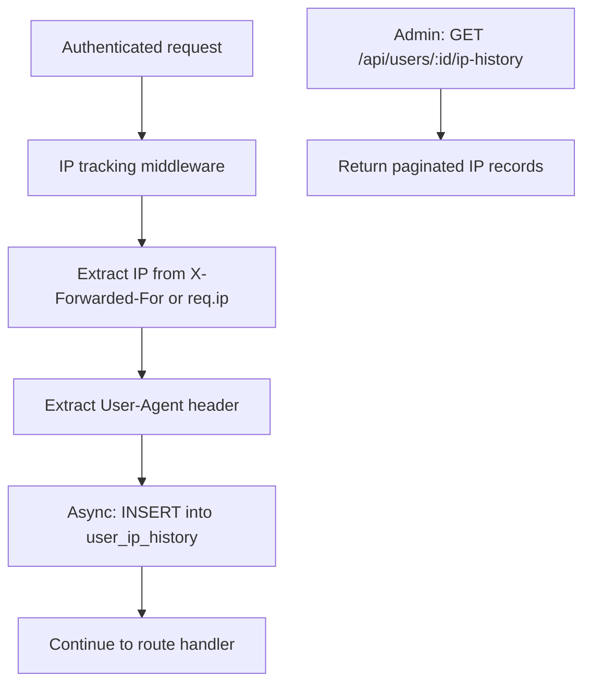
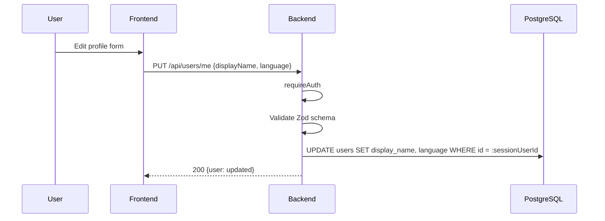

# User Management: Step-by-Step Detail

## Overview

Detailed sequence flows for user CRUD operations, role management, and security measures including IDOR prevention and IP tracking.

## Create User

### Zod Validation Schema

| Field | Type | Rules |
|-------|------|-------|
| `email` | string | Required, valid email format |
| `displayName` | string | Required, 1-255 characters |
| `role` | enum | One of: member, leader, admin |
| `language` | enum | Optional, one of: en, vi, ja |

## Update User Role

## Delete User

### Cascade Deletion Order

| Step | Table | Action |
|------|-------|--------|
| 1 | Valkey sessions | Delete all active sessions |
| 2 | `user_teams` | Remove all team memberships |
| 3 | `user_permissions` | Remove all explicit permissions |
| 4 | `user_ip_history` | Remove IP audit trail |
| 5 | `users` | Delete user record |

## IDOR Prevention

All user endpoints enforce tenant isolation:

- **List users**: Filtered by `org_id = session.activeOrg`
- **Get user**: Verify target user belongs to same org
- **Update user**: Same-org check + permission check
- **Delete user**: Same-org check + re-auth + permission check

## IP History Tracking

### IP History Record

| Field | Type | Description |
|-------|------|-------------|
| `user_id` | UUID | Reference to users table |
| `ip_address` | string | IPv4 or IPv6 address |
| `user_agent` | string | Browser/client identifier |
| `timestamp` | datetime | When the request was made |

## Update Profile

Users can only edit their own profile fields. Email changes require admin action.

## Key Files

| File | Purpose |
|------|---------|
| `be/src/modules/users/users.controller.ts` | Route handlers for all user endpoints |
| `be/src/modules/users/users.service.ts` | Business logic: create, update, delete, list |
| `be/src/modules/users/users.routes.ts` | Route definitions with middleware chains |
| `be/src/shared/middleware/auth.middleware.ts` | requireAuth, requireRecentAuth, IP tracking |
