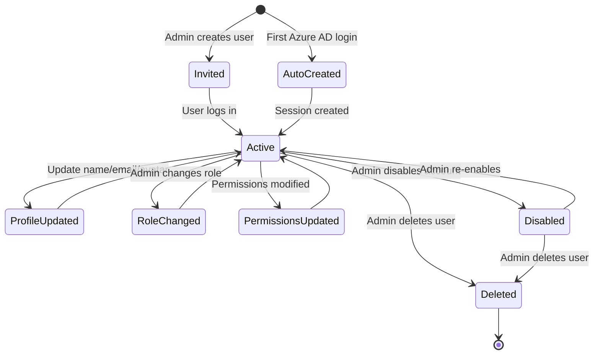
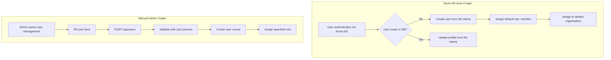
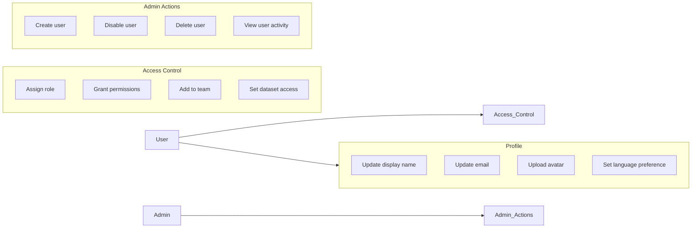
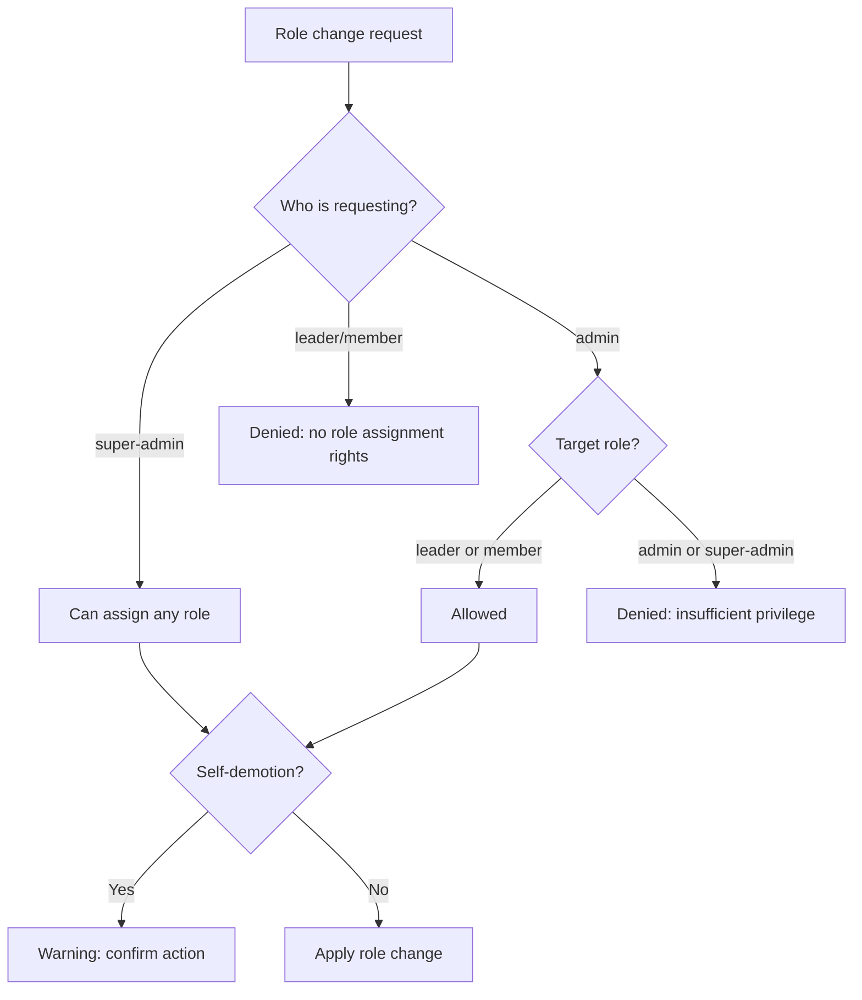
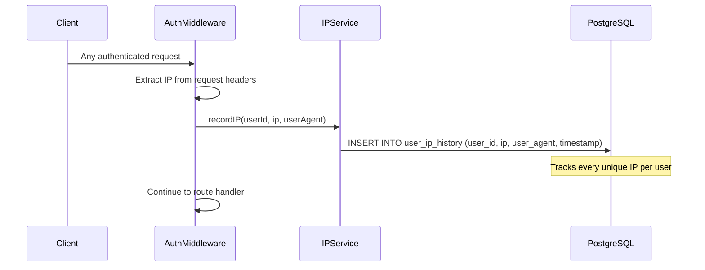

# User Management Overview

## Overview

User management covers the full lifecycle of user accounts in B-Knowledge, from creation through role assignment, profile updates, and deletion. Users can be created via Azure AD auto-provisioning or manual admin creation.

## User Lifecycle

## User Creation Paths

## User Actions Overview

## Profile Management

| Field | Editable By | Sync Source | Notes |
|-------|-------------|------------|-------|
| `display_name` | Self, Admin | Azure AD (on login) | AD value takes precedence if SSO |
| `email` | Admin only | Azure AD (on login) | Used as fallback match key |
| `avatar` | Self | Manual upload | Stored in RustFS |
| `language` | Self | - | `en`, `vi`, `ja` |
| `azure_ad_id` | System | Azure AD | Immutable after link |

## Role Assignment Rules

| Assigner Role | Can Assign |
|---------------|-----------|
| super-admin | super-admin, admin, leader, member |
| admin | leader, member |
| leader | - |
| member | - |

## Permission Grant Model

Permissions can be granted at three levels:

| Level | Mechanism | Example |
|-------|-----------|---------|
| **Role** | Inherited from assigned role | admin gets `manage_users` |
| **User** | Explicit per-user grant | User X gets `manage_datasets` |
| **Team** | Inherited from team membership | Team Y members get dataset access |

## IP History Tracking

- IP is extracted from `X-Forwarded-For` or `req.ip`
- Stored in `user_ip_history` table with timestamp and user agent
- Admins can view IP history for audit purposes
- Used for security monitoring and anomaly detection

## Key Files

| File | Purpose |
|------|---------|
| `be/src/modules/users/` | User module (controller, service, routes) |
| `be/src/modules/auth/auth.service.ts` | User creation during Azure AD flow |
| `be/src/shared/middleware/auth.middleware.ts` | IP tracking middleware |
| `be/src/shared/config/rbac.js` | Role hierarchy and permission map |
