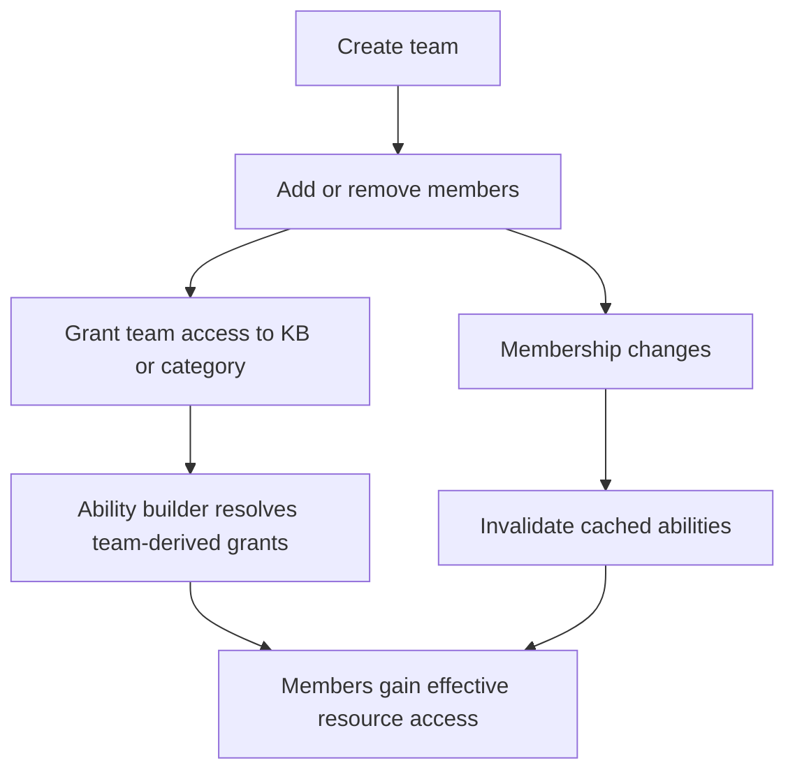
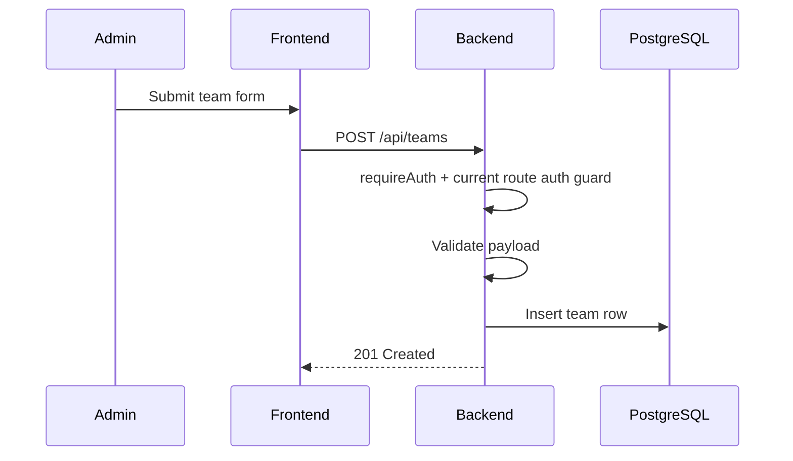
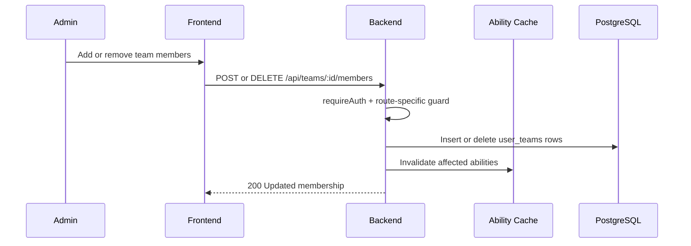
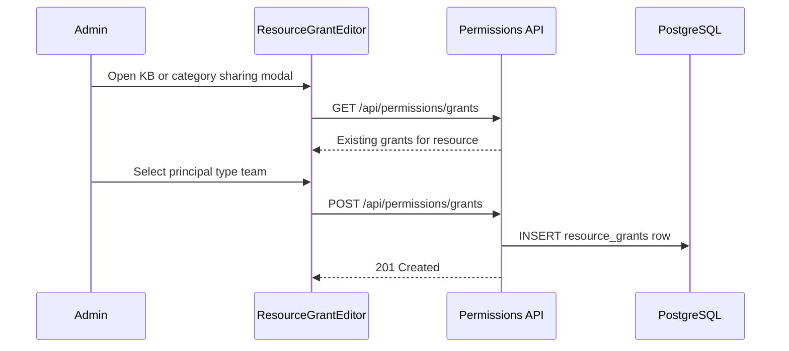
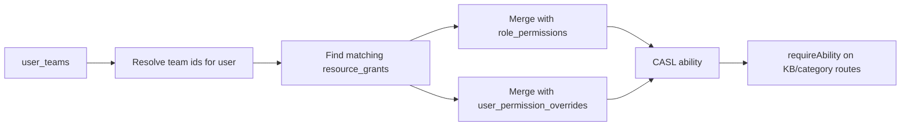

# Team Management: Step-by-Step Detail

> Detailed map of how teams affect access in the current system: membership remains a core entity, while shared access is primarily expressed through resource grants rather than standalone team-permission tables.

## 1. Overview

Teams still group users operationally, but the live permission model has changed. The canonical way for a team to influence access is now:

1. manage `user_teams` membership
2. create `resource_grants` whose grantee is that team
3. let the ability builder merge those grants into the effective access of team members

This means team management must distinguish between:

- team CRUD and membership administration
- team-derived resource access
- remaining compatibility gates on older routes

## 2. Team Lifecycle

## 3. Create Team

Team CRUD still exists independently of the permissions module because teams are business entities, not just permission containers.

## 4. Manage Membership

Membership matters because a later team-targeted `resource_grants` row can flow through to every current team user without creating duplicate user-specific rows.

## 5. Grant Team Access to Resources

Important current-state details:

- the shared FE editor is `ResourceGrantEditor`
- the grant can target a team principal, not only a single user
- the main documented scopes are knowledge base and document category
- the ability builder later resolves those grants into access for team users

## 6. Effective Access Inheritance

The important correction to older documentation is that team-derived access is no longer modeled as a standalone legacy team-grant table. The maintained path is team principal plus `resource_grants`.

## 7. When Team Access Is the Right Tool

Use a team-based grant when:

- multiple users need the same scoped access
- access should follow membership changes automatically
- the scope is a knowledge base or document category rather than a flat feature flag

Do not use team-derived grants when:

- the need is one person's unique exception
- the permission is global and not tied to one resource
- the problem should really be solved by changing the role baseline in `PermissionMatrix`

## 8. Compatibility Notes

Some team-management endpoints still use older auth patterns, including role-based guards on route entry. Those compatibility guards are live, but they are not the recommended place to extend the permission system.

Documentation should therefore distinguish:

- canonical permission maintenance: registry, overrides, `resource_grants`
- surrounding operational route protection: still partly compatibility-oriented

## 9. Team CRUD Summary

| Concern | Canonical surface |
|---------|-------------------|
| Create, update, delete teams | `be/src/modules/teams/` |
| Add or remove members | `be/src/modules/teams/` |
| Grant team access to KB/category | `be/src/modules/permissions/routes/permissions.routes.ts` and `ResourceGrantEditor` |
| Inspect merged access | `EffectiveAccessPage` plus the user detail permissions tab |

## 10. Key Files

| File | Purpose |
|------|---------|
| `be/src/modules/teams/teams.routes.ts` | Team CRUD and membership endpoints |
| `be/src/modules/permissions/routes/permissions.routes.ts` | Grant-management endpoints |
| `be/src/shared/services/ability.service.ts` | Grant resolution and effective access assembly |
| `fe/src/features/permissions/components/ResourceGrantEditor.tsx` | Shared grant editor used by KB/category sharing UIs |
| `fe/src/features/permissions/pages/EffectiveAccessPage.tsx` | Effective-access inspection UI |
| `fe/src/features/users/pages/PermissionManagementPage.tsx` | Role baseline editor for team-adjacent admin work |
