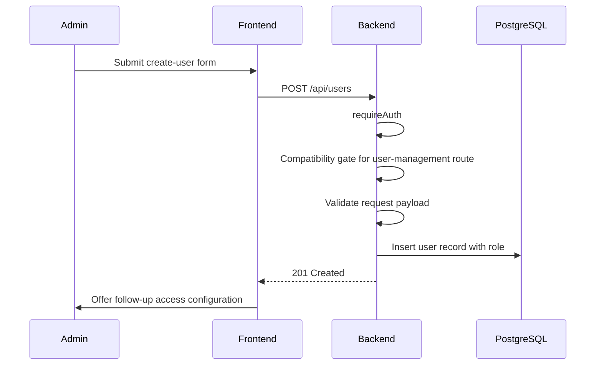
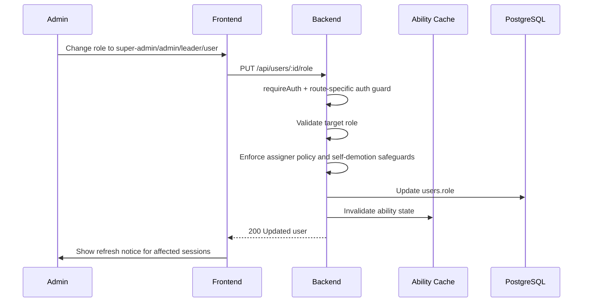
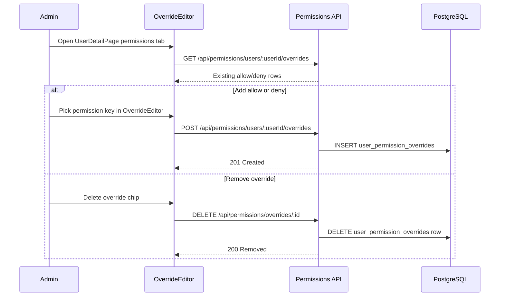
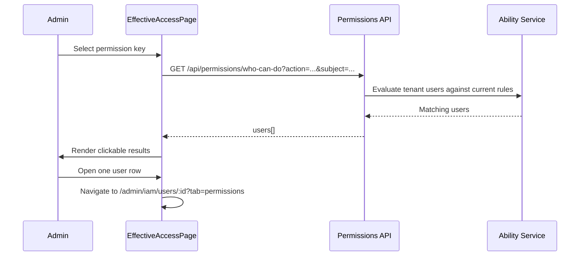

# User Management: Step-by-Step Detail

> Detailed flow for user role changes, per-user overrides, effective-access inspection, and cache visibility in the current permission architecture.

## 1. Overview

This page documents the live user-permission workflow. The maintained path is no longer a legacy per-user permission table or endpoint. Instead, user access changes are made through:

- role assignment on the user record
- `/api/permissions/users/:userId/overrides` for explicit allow or deny exceptions
- `/api/permissions/who-can-do` for inspection
- `resource_grants` updates when the change is really a resource-sharing problem

## 2. Create User

The follow-up access configuration happens in separate admin surfaces:

- update role-wide defaults in `PermissionManagementPage` only when the change should affect everyone with that role
- open the user's permissions tab when the change is specific to one user
- use `ResourceGrantEditor` when the real requirement is scoped access to a knowledge base or document category

## 3. Update User Role

Role changes update the user's baseline permission set from `role_permissions`. They do not remove or rewrite per-user overrides automatically.

## 4. Manage Per-User Overrides

Override semantics:

| Effect | Meaning |
|--------|---------|
| allow | Add a permission even if the role baseline does not grant it |
| deny | Remove a permission even if the role baseline grants it |

`OverrideEditor` also renders an effective-permissions panel so an admin can see the merged result against the current user role.

## 5. Inspect Effective Access

Use this flow when debugging the merged result of role defaults, overrides, and grants. It is more reliable than reasoning from role labels alone.

## 6. When to Use Resource Grants Instead of Overrides

Do not use a user override when the requirement is "user X should access knowledge base Y" or "team Z should access category Q". That is a resource-sharing concern, not a flat permission-key concern.

Use `resource_grants` through `ResourceGrantEditor` when:

- access must be limited to one knowledge base or one document category
- the grantee is a team rather than one user
- the permission should follow team membership changes automatically

Use overrides when:

- the exception is about a flat capability such as entering an admin feature
- the permission is not tied to one resource instance
- the exception is intentionally user-specific

## 7. Session Invalidation and Cache Behavior

The backend rebuilds abilities from the latest `role_permissions`, `user_permission_overrides`, and `resource_grants`, but active sessions may not all observe the change at the exact same instant. The current operational behavior is:

- permission admin mutations trigger ability invalidation logic
- frontend admin surfaces display a refresh notice after successful edits
- affected users see the new result on the next guarded request or after refresh

Document this as cache invalidation plus next-request visibility, not as guaranteed real-time propagation.

## 8. Compatibility Notes

Some surrounding user CRUD routes still use legacy compatibility keys for authorization. That does not change the maintained permission-authoring path:

- new permission definitions still start in the backend registry
- per-user exceptions still belong in the permissions module
- this page should not teach legacy per-user permission storage as an active maintenance surface

## 9. Key Files

| File | Purpose |
|------|---------|
| `be/src/modules/users/users.routes.ts` | User CRUD and role-update routes |
| `be/src/modules/permissions/routes/permissions.routes.ts` | Override and effective-access endpoints |
| `be/src/shared/services/ability.service.ts` | Ability merge logic for role defaults, overrides, and grants |
| `fe/src/features/users/pages/UserDetailPage.tsx` | User detail page with permissions tab |
| `fe/src/features/permissions/components/OverrideEditor.tsx` | Per-user allow/deny editor |
| `fe/src/features/permissions/pages/EffectiveAccessPage.tsx` | Effective-access inspection page |
| `fe/src/features/permissions/components/ResourceGrantEditor.tsx` | Resource-sharing editor used when access is resource-scoped |
