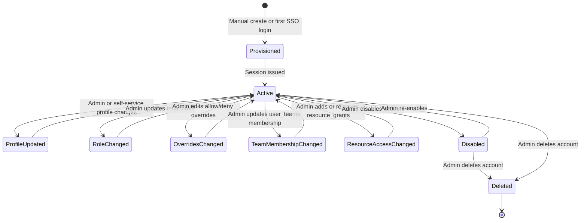
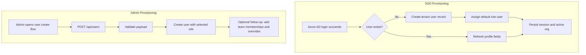
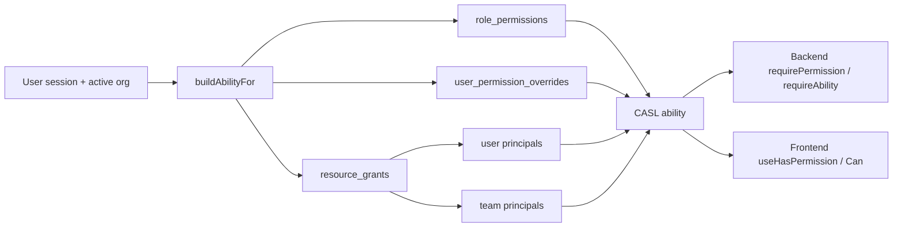

# User Management Overview

> High-level map of how user lifecycle, role assignment, per-user overrides, and team-derived access work in the current permission system.

## 1. Overview

User management now sits on top of the permission-system milestone rather than a standalone role matrix. A user's effective access is composed from:

1. one tenant role from the active four-role model: `super-admin`, `admin`, `leader`, `user`
2. tenant-scoped role defaults from `role_permissions`
3. explicit per-user allow or deny rows from `user_permission_overrides`
4. row-scoped access inherited through `resource_grants`, including grants addressed to teams

This page summarizes the lifecycle and the operational surfaces. For backend and frontend extension work, continue to the auth detail docs and the permission maintainer guide.

## 2. User Lifecycle

## 3. Provisioning Paths

The default tenant role is `user`. Older documentation that treated another label as the default role is historical only.

## 4. Current Role Model

| Role | Purpose | Notes |
|------|---------|-------|
| `super-admin` | Platform-wide operator | Cross-tenant operator role; still short-circuits many checks |
| `admin` | Tenant administrator | Can manage the permissions admin module |
| `leader` | Tenant operator | Broader operational access than standard users |
| `user` | Baseline authenticated user | Gains more access only through role updates, overrides, or grants |

The role itself is only the baseline. It is no longer sufficient to document user access as "role equals permission set" because overrides and grants can change the result per user and per resource.

## 5. Effective Access Composition

Key consequences for user-management documentation:

- role changes affect the baseline permission catalog for the user
- overrides are the canonical exception mechanism for one user
- team membership matters because grants can target a team principal
- resource sharing is no longer documented as a separate user-permission table

## 6. Admin Surfaces

| Surface | Purpose | Current file |
|---------|---------|--------------|
| Role matrix | Edit baseline role permissions | `PermissionManagementPage` and `PermissionMatrix` |
| Per-user detail | Inspect a single user and open the permissions tab | `fe/src/features/users/pages/UserDetailPage.tsx` |
| Override editor | Add allow or deny exceptions for one user | `OverrideEditor` |
| Effective access | Ask who can perform an action and drill into a user | `EffectiveAccessPage` |
| Resource sharing modal | Maintain KB or category grants that later affect users | `ResourceGrantEditor` |

The FE admin workflow is intentionally split. `PermissionManagementPage` owns role-wide changes, while the user detail page owns per-user exceptions.

## 7. Invalidation and Visibility of Changes

Permission mutations are persisted immediately, but the system does not promise an instant push refresh to every active browser tab. Current behavior is:

- role and grant mutations invalidate cached ability state centrally
- user-specific mutations may still rely on broad invalidation rather than a targeted per-user session purge
- FE admin surfaces show a session-refresh notice after successful permission changes
- users reliably observe the new result on their next request or after refreshing the app

This means user-management operations should be documented as eventually visible within the active session, not as live websocket-driven updates.

## 8. Compatibility Notes

The canonical maintenance model is registry plus overrides plus grants, but some user-management routes still use legacy permission keys such as `manage_users`. Those routes remain part of the live system. Documentation should therefore say:

- use the permissions module for new role, override, and grant maintenance
- expect some surrounding CRUD endpoints to still be protected by compatibility keys while the broader cleanup continues

## 9. Key Files

| File | Purpose |
|------|---------|
| `be/src/modules/users/` | User CRUD and profile endpoints |
| `be/src/modules/permissions/routes/permissions.routes.ts` | Role, override, grant, and effective-access APIs |
| `be/src/shared/services/ability.service.ts` | Effective access composition |
| `be/src/shared/middleware/auth.middleware.ts` | `requirePermission` and `requireAbility` enforcement |
| `fe/src/features/users/pages/PermissionManagementPage.tsx` | Entry page for the role matrix |
| `fe/src/features/permissions/components/PermissionMatrix.tsx` | Role-by-role permission editing UI |
| `fe/src/features/permissions/components/OverrideEditor.tsx` | Per-user overrides UI |
| `fe/src/features/permissions/pages/EffectiveAccessPage.tsx` | "Who can do X?" inspection UI |
