# B-Knowledge RAG Pipeline — Deep Dive Report

> **Đối tượng:** Developer mới tìm hiểu về RAG
> **Phiên bản:** B-Knowledge (March 2026)
> **Mục tiêu:** Giải thích chi tiết phương pháp và thuật toán RAG từ tổng quan đến chi tiết

---

## Mục lục

1. [RAG là gì?](#1-rag-là-gì)
2. [Kiến trúc tổng quan](#2-kiến-trúc-tổng-quan)
3. [Pipeline xử lý tài liệu (Indexing)](#3-pipeline-xử-lý-tài-liệu-indexing)
4. [Pipeline truy vấn (Retrieval + Generation)](#4-pipeline-truy-vấn-retrieval--generation)
5. [Các thuật toán tìm kiếm chi tiết](#5-các-thuật-toán-tìm-kiếm-chi-tiết)
6. [Re-ranking — Xếp hạng lại kết quả](#6-re-ranking--xếp-hạng-lại-kết-quả)
7. [GraphRAG — Knowledge Graph nâng cao](#7-graphrag--knowledge-graph-nâng-cao)
8. [Citation — Trích dẫn tự động](#8-citation--trích-dẫn-tự-động)
9. [Tính năng nâng cao](#9-tính-năng-nâng-cao)
10. [Ưu điểm và nhược điểm](#10-ưu-điểm-và-nhược-điểm)
11. [Cách cải thiện nhược điểm](#11-cách-cải-thiện-nhược-điểm)
12. [Bảng tham chiếu file](#12-bảng-tham-chiếu-file)

---

## 1. RAG là gì?

**RAG (Retrieval-Augmented Generation)** là phương pháp kết hợp:
- **Retrieval (Truy vấn):** Tìm kiếm thông tin liên quan từ kho tài liệu
- **Augmented (Bổ sung):** Đưa thông tin tìm được vào prompt
- **Generation (Sinh câu trả lời):** LLM tạo câu trả lời dựa trên thông tin đã tìm

### Tại sao cần RAG?

```
┌─────────────────────────────────────────────────────┐
│  LLM thuần túy (không có RAG)                       │
│  ❌ Không biết tài liệu nội bộ công ty              │
│  ❌ Thông tin có thể lỗi thời                       │
│  ❌ "Hallucination" — bịa ra thông tin              │
│                                                     │
│  LLM + RAG                                          │
│  ✅ Truy cập tài liệu nội bộ thời gian thực        │
│  ✅ Câu trả lời dựa trên dữ liệu thực              │
│  ✅ Có trích dẫn nguồn cụ thể                       │
└─────────────────────────────────────────────────────┘
```

---

## 2. Kiến trúc tổng quan

### 2.1 Các thành phần chính

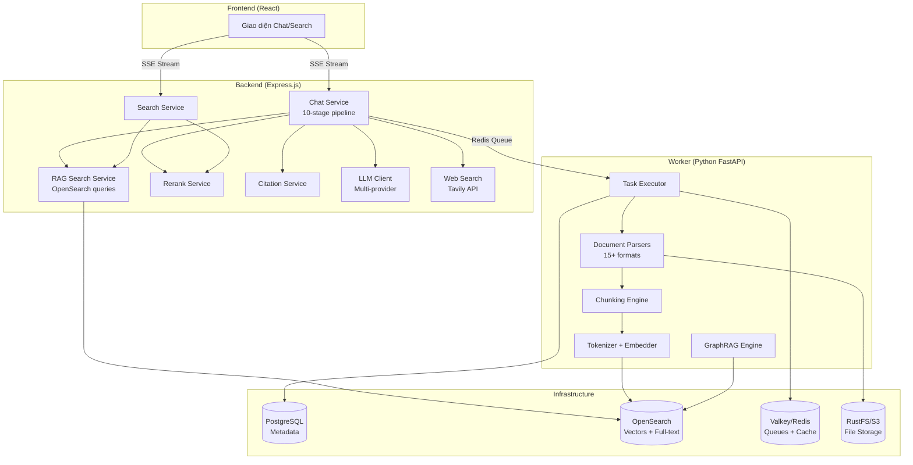

### 2.2 Hai giai đoạn chính của RAG

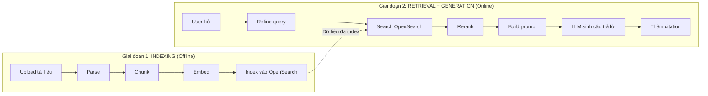

---

## 3. Pipeline xử lý tài liệu (Indexing)

### 3.1 Tổng quan pipeline

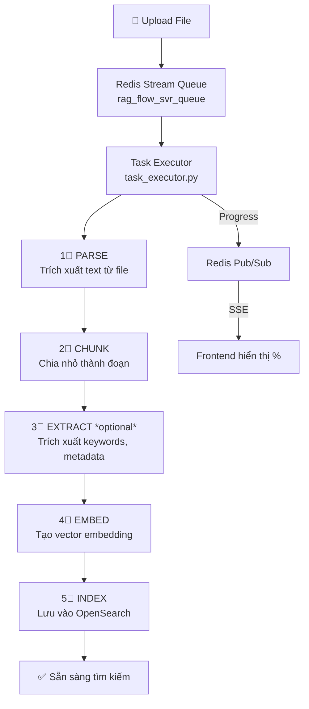

### 3.2 Bước 1: Parsing — Trích xuất văn bản

B-Knowledge hỗ trợ **15+ loại tài liệu** với parser chuyên biệt:

| Parser | File types | Đặc điểm |
|--------|-----------|-----------|
| **Naive** | PDF, DOCX, TXT, MD, HTML, CSV, JSON, Excel | Parser mặc định, nhiều PDF backend |
| **Book** | PDF (sách) | Phân tích layout, mục lục |
| **Paper** | PDF (bài nghiên cứu) | Trích xuất metadata học thuật |
| **Laws** | PDF (văn bản pháp luật) | Cấu trúc điều khoản |
| **Manual** | PDF (hướng dẫn kỹ thuật) | Cấu trúc manual |
| **Table** | Excel, CSV | Bảo toàn cấu trúc bảng |
| **Presentation** | PPT, PPTX | Slide-by-slide |
| **QA** | Tài liệu Q&A | Cặp hỏi-đáp |
| **Resume** | CV/Resume | Trích entity (tên, kỹ năng,...) |
| **Picture** | PNG, JPG | OCR + Vision LLM |
| **Email** | EML, MSG | Parse email thread |
| **Audio** | MP3, WAV | Speech-to-text |

**PDF backends được hỗ trợ:**
- DeepDOC — Layout analysis + OCR
- MinerU — PDF extraction
- Docling — Document understanding
- PaddleOCR — OCR cho tiếng Trung/Á
- VLM (Vision Language Model) — Dùng LLM nhìn hình ảnh

> **File:** `advance-rag/rag/app/naive.py` (parser chính)
> **File:** `advance-rag/rag/flow/parser/parser.py` (flow component)

### 3.3 Bước 2: Chunking — Chia nhỏ văn bản

Chunking là bước **quan trọng nhất** ảnh hưởng đến chất lượng RAG.

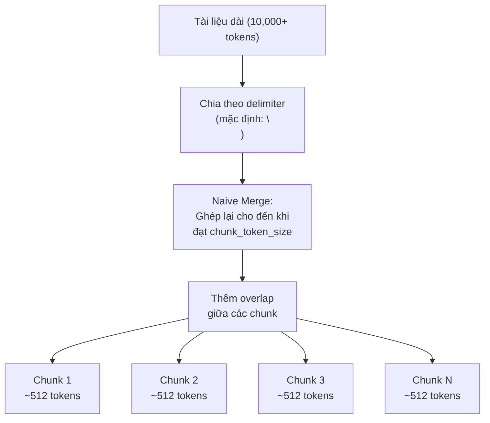

**Thuật toán Naive Merge:**

```
Input: danh sách đoạn văn bản đã split
Config: chunk_token_size = 512, overlap = 15%

1. Khởi tạo chunk hiện tại = rỗng
2. Với mỗi đoạn văn bản:
   a. Nếu chunk hiện tại + đoạn mới ≤ chunk_token_size:
      → Ghép vào chunk hiện tại
   b. Nếu vượt quá:
      → Lưu chunk hiện tại
      → Bắt đầu chunk mới (có overlap từ chunk trước)
3. Lưu chunk cuối cùng
```

**Các tham số cấu hình:**

| Tham số | Mặc định | Ý nghĩa |
|---------|----------|---------|
| `chunk_token_size` | 512 | Số token tối đa mỗi chunk |
| `delimiters` | `["\n"]` | Ký tự chia đoạn |
| `children_delimiters` | `[]` | Chia nhỏ hơn trong mỗi chunk |
| `overlapped_percent` | 0.15 | % overlap giữa các chunk (15%) |
| `table_context_size` | — | Chunk xung quanh bảng |
| `image_context_size` | — | Chunk xung quanh hình ảnh |

> **File:** `advance-rag/rag/flow/splitter/splitter.py`
> **File:** `advance-rag/rag/nlp/__init__.py` (hàm `naive_merge`)

### 3.4 Bước 3: Embedding — Tạo vector

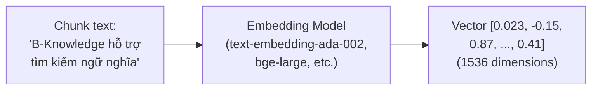

**Quy trình embedding:**

1. **Full-text tokenization** — Tách từ cho BM25 search:
   - `content_ltks`: Token gốc (có loại bỏ stopword)
   - `content_sm_ltks`: Token nhỏ (fine-grained tokenization)
   - `title_tks`, `title_sm_tks`: Token tiêu đề
   - `question_tks`, `important_tks`: Token câu hỏi/keyword

2. **Dense vector embedding** — Tạo vector cho semantic search:
   - Kết hợp vector filename và content: `title_w × name_vec + (1 - title_w) × content_vec`
   - Lưu vào field `q_{dim}_vec` (ví dụ: `q_1536_vec`)
   - Batch processing với rate limiting

**Providers hỗ trợ:** OpenAI, Azure OpenAI, Ollama, Gemini, OpenAI-compatible APIs

> **File:** `advance-rag/rag/flow/tokenizer/tokenizer.py`
> **File:** `advance-rag/rag/llm/embedding_model.py`

### 3.5 Bước 4: Indexing — Lưu trữ vào OpenSearch

Mỗi chunk được lưu với các field:

```json
{
  "kb_id": "dataset-uuid",
  "doc_id": "document-uuid",
  "docnm_kwd": "report.pdf",
  "content_with_weight": "Nội dung chunk với trọng số",
  "content_ltks": "token hóa nội dung",
  "content_sm_ltks": "token hóa chi tiết",
  "title_tks": "token tiêu đề",
  "q_1536_vec": [0.023, -0.15, ...],
  "important_kwd": ["keyword1", "keyword2"],
  "question_kwd": ["câu hỏi liên quan"],
  "page_num_int": [1, 2],
  "position_int": [[1, 100, 200, 50, 80]],
  "img_id": "image-reference",
  "available_int": 1
}
```

> **File:** `advance-rag/rag/utils/opensearch_conn.py`
> **File:** `advance-rag/conf/os_mapping.json`

---

## 4. Pipeline truy vấn (Retrieval + Generation) — FULL FLOW

Đây là full flow chi tiết khi **TẤT CẢ config đều được bật** (multi-turn, cross-language, keyword, hybrid search, SQL, web search, GraphRAG, deep research, rerank, citation). Flow được trích từ source code thực tế.

### 4.1 Full Flow Diagram — Chat Pipeline (14 Steps)

```mermaid
flowchart TD
    User["👤 User nhập prompt:<br/>'Chính sách nghỉ phép<br/>của công ty như thế nào?'"]

    User --> Step1["STEP 1: Lưu user message<br/>→ PostgreSQL chat_messages"]
    Step1 --> Step2["STEP 2: Load assistant config<br/>→ prompt_config, kb_ids, llm_id<br/>→ Apply per-request overrides"]
    Step2 --> Step3["STEP 3: Load conversation history<br/>→ Lấy 20 messages gần nhất<br/>→ Sắp xếp theo timestamp ASC"]

    Step3 --> Step4["STEP 4: Multi-turn Refinement<br/>refine_multiturn = true<br/>──────────────────────<br/>LLM kết hợp history + query mới<br/>→ 'Còn ở Nhật thì sao?'<br/>→ 'Chính sách nghỉ phép tại<br/>văn phòng Nhật Bản?'"]

    Step4 --> Step5["STEP 5: Cross-language Expansion<br/>cross_languages = ['en','vi','ja']<br/>──────────────────────<br/>LLM dịch query sang các ngôn ngữ<br/>→ searchQuery bổ sung bản dịch"]

    Step5 --> Step6["STEP 6: Keyword Extraction<br/>keyword = true<br/>──────────────────────<br/>LLM trích top-8 keywords<br/>→ ['nghỉ phép', 'chính sách', ...]<br/>→ Nối keywords vào searchQuery"]

    Step6 --> Step6b{"STEP 6.5: SQL Retrieval<br/>KB có field_map?"}
    Step6b -->|Có| SQLPath["LLM generate SQL<br/>→ Execute trên OpenSearch SQL plugin<br/>→ Trả markdown table<br/>→ Stream SSE + DONE<br/>→ Lưu message → KẾT THÚC"]
    Step6b -->|Không| Step7

    Step7["STEP 7: Hybrid Retrieval<br/>──────────────────────<br/>7a. Embed searchQuery → vector<br/>7b. Search N knowledge bases<br/>     song song (Promise.all)<br/>7c. Merge + sort by score DESC"]

    Step7 --> Step7Detail

    subgraph Step7Detail["Chi tiết Step 7: Hybrid Search trên mỗi KB"]
        direction TB
        FT["Full-text Search (BM25)<br/>content_with_weight field<br/>minimum_should_match: 30%<br/>Filter: available_int = 1"]
        VS["Semantic Search (KNN)<br/>q_vec field<br/>Cosine similarity<br/>Filter: available_int = 1"]
        FT --> Norm["Normalize scores<br/>textScore / maxTextScore<br/>vecScore / maxVecScore"]
        VS --> Norm
        Norm --> Blend["Weighted Blend:<br/>score = (1-w) × textNorm<br/>+ w × vecNorm<br/>w = vector_similarity_weight"]
        Blend --> Filter["Filter: score ≥<br/>similarity_threshold (0.2)"]
    end

    Step7Detail --> Step8["STEP 8: Web Search (Tavily)<br/>tavily_api_key configured<br/>──────────────────────<br/>POST api.tavily.com/search<br/>search_depth: 'advanced'<br/>max_results: 3<br/>→ Convert thành ChunkResult<br/>→ Push vào allChunks"]

    Step8 --> Step8a["STEP 8a: Knowledge Graph<br/>use_kg = true<br/>──────────────────────<br/>1. Query Rewrite → extract types + entities<br/>2. Search entities by keywords (boost 3x)<br/>3. Search entities by type (sort pagerank)<br/>4. Search relations by question text<br/>5. N-hop traversal (score decay: sim/(2+hop))<br/>6. Score boost 2x cho keyword+type overlap<br/>7. Format context within token budget"]

    Step8a --> Step8b["STEP 8b: Deep Research<br/>reasoning = true<br/>──────────────────────<br/>Recursive loop (max depth 3):<br/>1. Retrieve from KBs (hybrid)<br/>2. Web search (Tavily)<br/>3. KG retrieval<br/>4. Sufficiency check (LLM)<br/>5. Nếu chưa đủ → generate follow-up queries<br/>6. Lặp lại với follow-up queries<br/>→ Merge deduplicated chunks"]

    Step8b --> Step9["STEP 9: Reranking<br/>──────────────────────<br/>Nếu chunks > topN:<br/>  A) rerank_id configured:<br/>     → Call Jina/Cohere/OpenAI rerank API<br/>     → Min-max normalize scores<br/>  B) Không có rerank_id:<br/>     → LLM-based reranking<br/>     → Prompt: 'rank top-N relevant indices'<br/>→ Lấy topN chunks (mặc định 6)"]

    Step9 --> Step10{"STEP 10: Empty check<br/>allChunks = 0?"}
    Step10 -->|Có + empty_response| EmptyResp["Stream empty_response<br/>→ [DONE] → Lưu message<br/>→ KẾT THÚC"]
    Step10 -->|Không| Step11

    Step11["STEP 11: Build Prompt<br/>──────────────────────<br/>1. systemPrompt + KG context (nếu có)<br/>2. Format chunks: [ID:0] [doc.pdf] (p.1,2)<br/>   chunk_text...<br/>3. Thêm citation instructions<br/>4. Variable substitution: {key} → value<br/>5. Assemble: system + history + user message"]

    Step11 --> Step12["STEP 12: LLM Streaming (SSE)<br/>──────────────────────<br/>1. Send reference data ngay (sources panel)<br/>2. Stream tokens: data: {delta: 'token'}<br/>3. Accumulate fullAnswer<br/>4. Params: temperature, top_p, max_tokens"]

    Step12 --> Step13["STEP 13: Citation Insertion<br/>──────────────────────<br/>Ưu tiên embedding-based:<br/>1. Split answer → sentences<br/>2. Embed sentences + chunks<br/>3. Hybrid similarity: 0.9×cosine + 0.1×jaccard<br/>4. Adaptive threshold: 0.63 → ×0.8 → min 0.30<br/>5. Insert ##ID:n$$ markers<br/>Fallback: regex-based (##ID:n$$, [ID:n])"]

    Step13 --> Step14["STEP 14: Finalize<br/>──────────────────────<br/>1. Send final answer + reference + metrics<br/>2. data: [DONE]<br/>3. Persist assistant message → PostgreSQL<br/>4. Auto-generate session title (nếu msg ≤ 2)<br/>5. Update Langfuse trace<br/>6. Flush Langfuse"]

    Step14 --> Done["✅ HOÀN THÀNH<br/>Client nhận:<br/>- Câu trả lời có citation<br/>- Reference (sources panel)<br/>- Metrics (timing + counts)"]

    style Step7Detail fill:#e3f2fd,stroke:#1565c0
    style SQLPath fill:#fff3e0,stroke:#e65100
    style EmptyResp fill:#fce4ec,stroke:#c62828
    style Done fill:#e8f5e9,stroke:#2e7d32
```

### 4.2 Chi tiết từng Step

#### Step 1: Lưu User Message
```
→ Tạo UUID cho message
→ INSERT vào chat_messages: { session_id, role: 'user', content, created_by }
```
> **Line:** `chat-conversation.service.ts:664-672`

#### Step 2: Load Assistant Config
```typescript
// Config fields được load từ chat_assistants table:
interface PromptConfig {
  system: string              // System prompt
  refine_multiturn: boolean   // Bật multi-turn refinement
  cross_languages: string[]   // VD: ['en', 'vi', 'ja']
  keyword: boolean            // Bật keyword extraction
  quote: boolean              // Bật citation (mặc định true)
  tavily_api_key: string      // Web search API key
  use_kg: boolean             // Bật Knowledge Graph
  reasoning: boolean          // Bật Deep Research
  rerank_id: string           // Rerank model provider ID
  top_n: number               // Số chunks trả về (mặc định 6)
  similarity_threshold: number // Ngưỡng similarity (mặc định 0.2)
  vector_similarity_weight: number // Trọng số vector vs text
  temperature: number         // LLM temperature
  top_p: number               // LLM top_p
  max_tokens: number          // LLM max tokens
  empty_response: string      // Trả khi không tìm thấy gì
  prologue: string            // Greeting message đầu tiên
}
```
> **Line:** `chat-conversation.service.ts:674-696`

#### Step 3: Load Conversation History
```
→ SELECT * FROM chat_messages
  WHERE session_id = ? AND id != userMsgId
  ORDER BY timestamp ASC LIMIT 20
```
> **Line:** `chat-conversation.service.ts:698-703`

#### Step 4: Multi-turn Refinement (`refine_multiturn = true`)

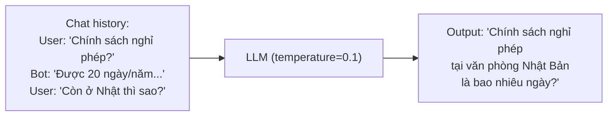

**Prompt xử lý:**
- Giải quyết ngày tương đối: "hôm qua" → ngày cụ thể
- Hoàn thiện đại từ: "nó" → thực thể cụ thể từ context
- Nếu câu hỏi đã đầy đủ → giữ nguyên

> **File:** `be/src/shared/prompts/full-question.prompt.ts`
> **Line:** `chat-conversation.service.ts:705-728`

#### Step 5: Cross-language Expansion (`cross_languages = ['en','vi','ja']`)
```
Input:  "Chính sách nghỉ phép tại Nhật?"
Output: "Chính sách nghỉ phép tại Nhật? Leave policy in Japan? 日本の休暇ポリシー?"
```
Mục đích: Tìm tài liệu viết bằng ngôn ngữ khác với ngôn ngữ câu hỏi.

> **Line:** `chat-conversation.service.ts:730-742`

#### Step 6: Keyword Extraction (`keyword = true`)
```
Input:  "Chính sách nghỉ phép tại Nhật?"
LLM:   "nghỉ phép, chính sách, Nhật Bản, leave policy, ..."
Output: searchQuery = "Chính sách nghỉ phép tại Nhật? nghỉ phép chính sách Nhật Bản"
```
> **Line:** `chat-conversation.service.ts:744-761`

#### Step 6.5: SQL Retrieval (short-circuit nếu KB có structured data)
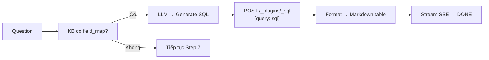
Nếu KB có `parser_config.field_map` (VD: bảng Excel đã map fields), hệ thống tạo SQL query trực tiếp thay vì dùng RAG. **Đây là short-circuit — nếu thành công, pipeline kết thúc tại đây.**

> **File:** `be/src/modules/rag/services/rag-sql.service.ts`
> **Line:** `chat-conversation.service.ts:765-787`

#### Step 7: Hybrid Retrieval — Chi tiết OpenSearch queries

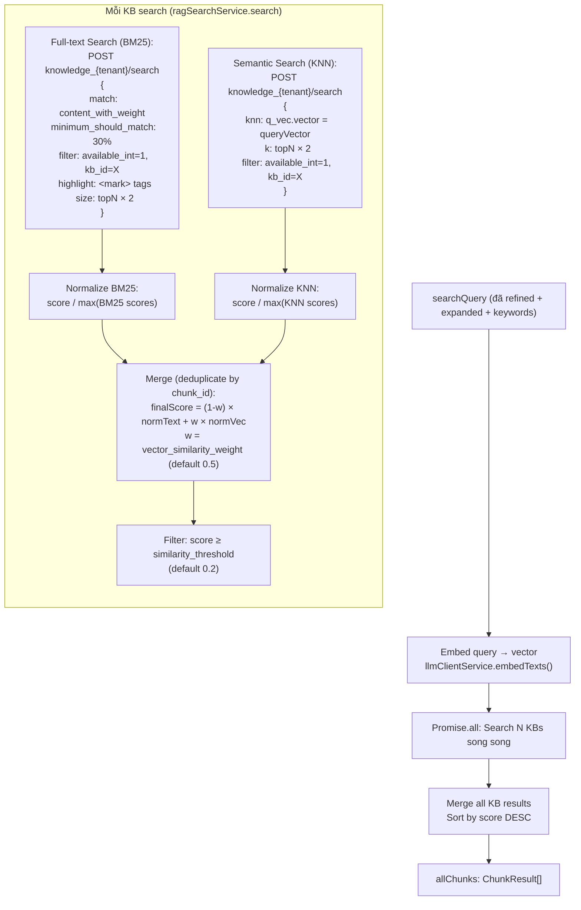

**Mỗi ChunkResult chứa:**
```typescript
{
  chunk_id: string       // OpenSearch document _id
  text: string           // content_with_weight
  doc_id: string         // Document UUID
  doc_name: string       // Tên file gốc
  page_num: number[]     // Trang chứa chunk
  positions: number[][]  // Vị trí trên trang
  score: number          // Final weighted score
  vector_similarity: number  // Normalized vector score
  term_similarity: number    // Normalized BM25 score
  available: boolean
  important_kwd: string[]
  question_kwd: string[]
  highlight: string      // Highlighted snippet (<mark>)
  img_id: string         // Nếu chunk có hình
  token_count: number    // Estimated: len/4
}
```

> **File:** `be/src/modules/rag/services/rag-search.service.ts`
> **Line:** `chat-conversation.service.ts:789-841`

#### Step 8: Web Search — Tavily (`tavily_api_key` configured)

```
POST https://api.tavily.com/search
{
  "api_key": "tvly-xxx",
  "query": searchQuery,
  "search_depth": "advanced",
  "max_results": 3,
  "include_answer": false
}

→ Convert mỗi result thành ChunkResult:
  {
    chunk_id: "web_0",
    text: result.content,
    doc_name: result.title,
    score: result.score,
    method: "web_search"
  }
→ Push vào allChunks
```

> **File:** `be/src/shared/services/web-search.service.ts`
> **Line:** `chat-conversation.service.ts:843-848`

#### Step 8a: Knowledge Graph Retrieval (`use_kg = true`)

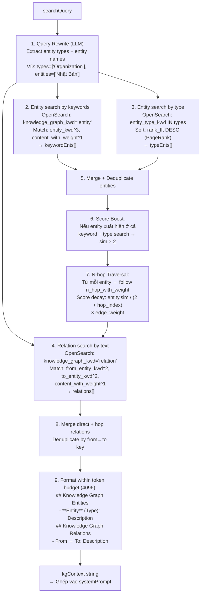

> **File:** `be/src/modules/rag/services/rag-graphrag.service.ts`
> **Line:** `chat-conversation.service.ts:850-859`

#### Step 8b: Deep Research (`reasoning = true`)

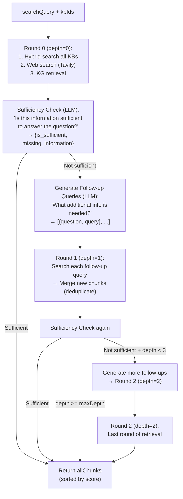

**Deduplication:** Chunks được track bằng `Map<chunk_id, ChunkResult>`, mỗi chunk chỉ giữ 1 bản.

> **File:** `be/src/modules/rag/services/rag-deep-research.service.ts`
> **Line:** `chat-conversation.service.ts:861-890`

#### Step 9: Reranking

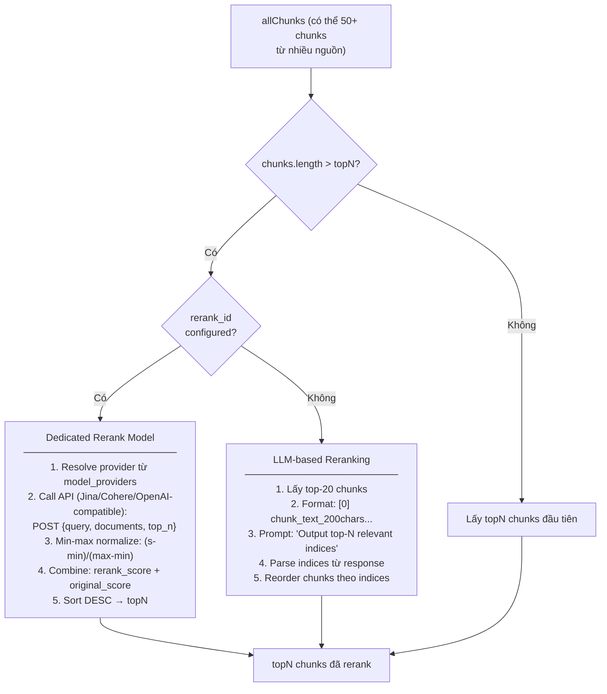

> **File:** `be/src/modules/rag/services/rag-rerank.service.ts`
> **Line:** `chat-conversation.service.ts:897-920`

#### Step 10: Empty Results Check
```
Nếu allChunks = 0 VÀ empty_response configured VÀ có kbIds:
  → Stream empty_response → [DONE] → Lưu message → KẾT THÚC
Nếu không → tiếp Step 11
```
> **Line:** `chat-conversation.service.ts:925-941`

#### Step 11: Prompt Assembly

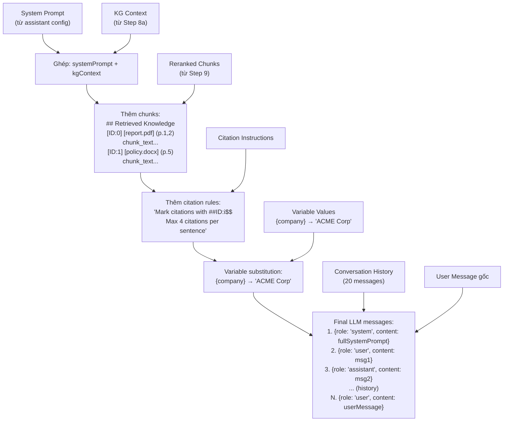

> **Line:** `chat-conversation.service.ts:943-973`

#### Step 12: LLM Streaming (SSE)

```
1. GỬI reference data trước (sources panel hiện ngay):
   data: {"reference": {"chunks": [...], "doc_aggs": [...]}}

2. STREAM tokens (delta, KHÔNG accumulated):
   data: {"delta": "Chính"}
   data: {"delta": " sách"}
   data: {"delta": " nghỉ"}
   data: {"delta": " phép"}
   ...

3. ACCUMULATE fullAnswer phía server để dùng cho citation
```

**LLM params:** `temperature`, `top_p`, `max_tokens` từ config hoặc overrides.

> **Line:** `chat-conversation.service.ts:975-1006`

#### Step 13: Citation Insertion

```mermaid
flowchart TD
    Answer["fullAnswer từ LLM"]

    Answer --> HasEmbed{"Có embedding<br/>model?"}

    HasEmbed -->|Có| EmbCitation["Embedding-based Citation<br/>──────────────────────<br/>1. Split answer → sentences (multi-lang)<br/>   Regex: CJK, Arabic, Vietnamese, English<br/>   Skip code blocks, filter < 5 chars<br/><br/>2. Embed sentences + chunks (parallel)<br/>   Promise.all([embedSentences, embedChunks])<br/><br/>3. Với mỗi sentence:<br/>   Tính hybrid sim vs mỗi chunk:<br/>   sim = 0.9 × cosine(sentVec, chunkVec)<br/>       + 0.1 × jaccard(sentTokens, chunkTokens)<br/><br/>4. Adaptive threshold:<br/>   thr = 0.63<br/>   while thr > 0.30:<br/>     matches = chunks with sim ≥ thr (max 4)<br/>     if matches: break<br/>     thr × 0.8<br/><br/>5. Insert: 'sentence text ##ID:0$$ ##ID:3$$'"]

    HasEmbed -->|Không| RegexCitation["Regex-based Citation<br/>──────────────────────<br/>1. Tìm existing citations trong answer:<br/>   ##ID:n$$ format<br/>   [ID:n] format<br/>   (ID:n) format<br/>   ref N format<br/><br/>2. Normalize tất cả → ##ID:n$$"]

    EmbCitation --> Rebuild["Rebuild reference:<br/>Mark cited chunks: cited=true<br/>Update doc_aggs"]
    RegexCitation --> Rebuild
```

**Jaccard similarity:**
```
jaccard(A, B) = |A ∩ B| / |A ∪ B|
A, B = sets of lowercase word tokens (length > 1)
```

> **File:** `be/src/modules/rag/services/rag-citation.service.ts`
> **Line:** `chat-conversation.service.ts:1010-1034`

#### Step 14: Finalize

```
1. Send final SSE event:
   data: {
     "answer": "processedAnswer with ##ID:0$$ citations",
     "reference": {
       "chunks": [{chunk_id, content, doc_id, docnm_kwd, score, cited: true/false}],
       "doc_aggs": [{doc_id, doc_name, count}]
     },
     "metrics": {
       "refinement_ms": 1200,
       "retrieval_ms": 850,
       "generation_ms": 3400,
       "total_ms": 5800,
       "chunks_retrieved": 12,
       "chunks_cited": 3
     }
   }

2. data: [DONE]

3. INSERT chat_messages: { role: 'assistant', content, citations: JSON }

4. Nếu ≤ 2 messages → auto-generate session title từ user message

5. Update Langfuse trace → flush()
```

> **Line:** `chat-conversation.service.ts:1036-1094`

### 4.3 Full Flow — SSE Events Timeline

```
Client nhận các SSE events theo thứ tự:

  data: {"status": "refining_question"}           ← Step 4
  data: {"status": "retrieving"}                  ← Step 7
  data: {"status": "searching_web"}               ← Step 8
  data: {"status": "searching_knowledge_graph"}   ← Step 8a
  data: {"status": "deep_research"}               ← Step 8b
  data: {"status": "deep_research", "message": "Initial search: \"query\""}
  data: {"status": "deep_research", "message": "Web search: \"query\""}
  data: {"status": "deep_research", "message": "Checking information completeness..."}
  data: {"status": "deep_research", "message": "Missing information detected: ..."}
  data: {"status": "deep_research", "message": "Follow-up search: \"sub-query\""}
  data: {"status": "reranking"}                   ← Step 9
  data: {"reference": {...}}                      ← Step 12 (sources panel)
  data: {"delta": "token1"}                       ← Step 12 (streaming)
  data: {"delta": "token2"}
  data: {"delta": "..."}
  data: {"answer": "...", "reference": {...}, "metrics": {...}}  ← Step 14
  data: [DONE]                                    ← End
```

### 4.4 Search Pipeline (Full Flow)

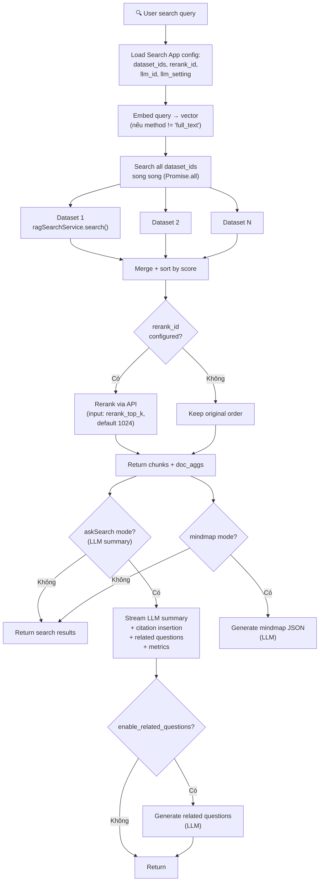

> **File:** `be/src/modules/search/services/search.service.ts`

---

## 5. Các thuật toán tìm kiếm chi tiết

B-Knowledge hỗ trợ **3 phương pháp tìm kiếm**, có thể chọn khi cấu hình:

### 5.1 Full-text Search (BM25)

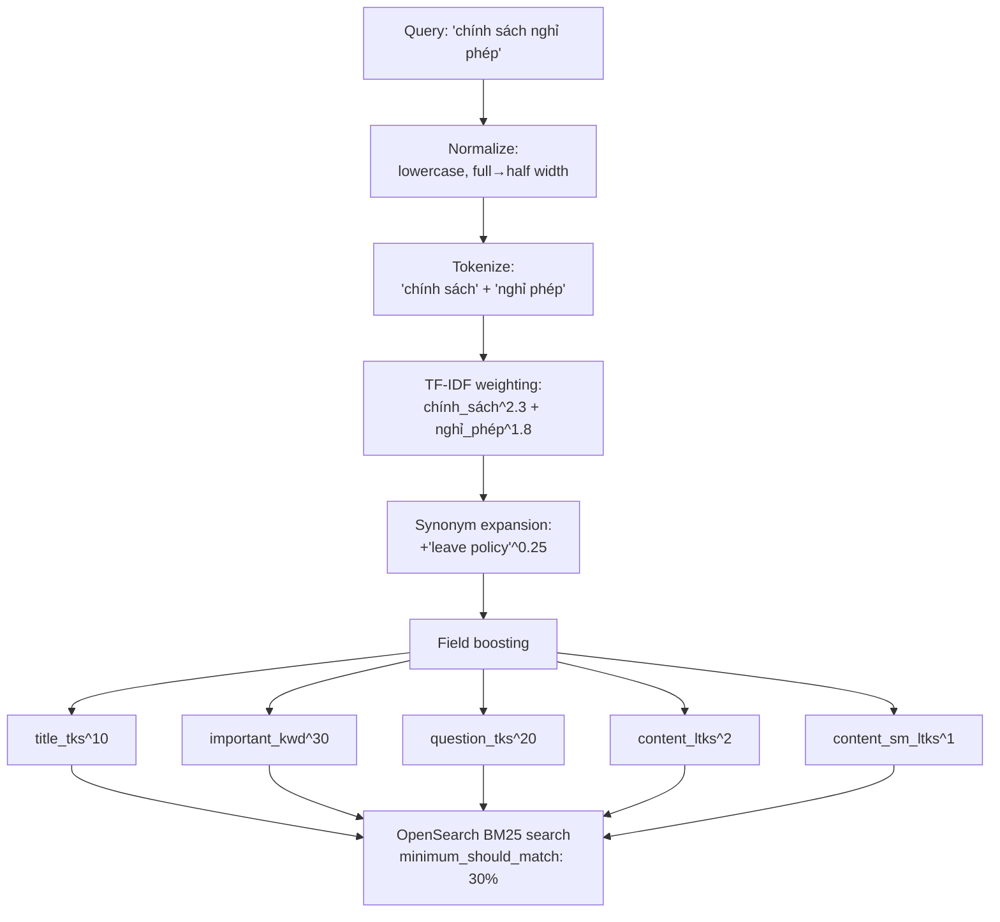

**Thuật toán chi tiết:**

1. **Tiền xử lý query:**
   - Thêm khoảng trắng giữa ký tự Anh/Trung
   - Chuyển full-width → half-width
   - Lowercase hóa

2. **Tokenization:**
   - Dùng `rag_tokenizer.tokenize()` để tách từ
   - Hỗ trợ tiếng Trung: `tw.split()` cho term-weight splitting

3. **TF-IDF weighting:**
   - Tính trọng số mỗi term dựa trên tần suất
   - Giới hạn 256 tokens

4. **Synonym expansion:**
   - Tra bảng đồng nghĩa: `syn.lookup()`
   - Trọng số synonym = 25% trọng số gốc

5. **Phrase boosting:**
   - Bigram phrase: `"token1 token2"^(max_weight × 2)`
   - Tăng điểm khi 2 từ xuất hiện cạnh nhau

6. **Field boosting:**

| Field | Boost | Ý nghĩa |
|-------|-------|---------|
| `important_kwd` | ×30 | Keyword quan trọng nhất |
| `important_tks` | ×20 | Token keyword quan trọng |
| `question_tks` | ×20 | Câu hỏi liên quan |
| `title_tks` | ×10 | Tiêu đề |
| `title_sm_tks` | ×5 | Token tiêu đề chi tiết |
| `content_ltks` | ×2 | Nội dung chính |
| `content_sm_ltks` | ×1 | Nội dung chi tiết |

> **File:** `advance-rag/rag/nlp/query.py` (class `FulltextQueryer`)

### 5.2 Semantic Search (Vector/KNN)

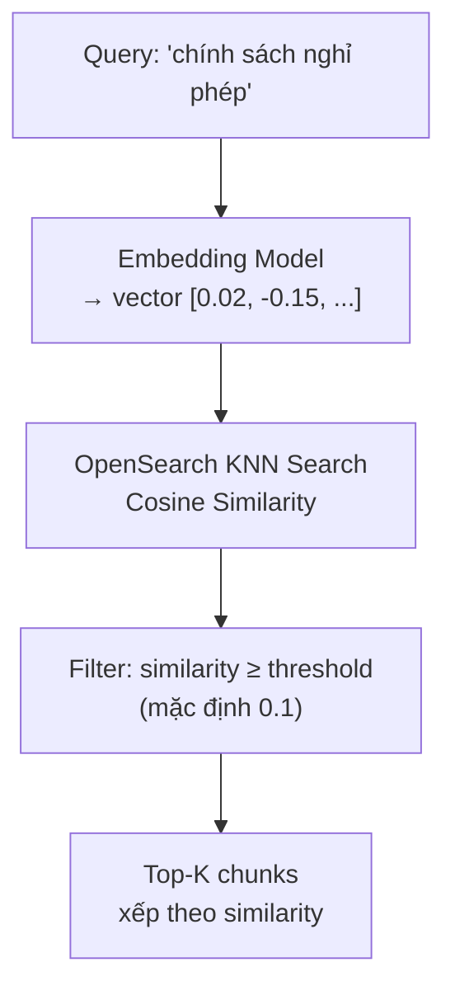

**Cách hoạt động:**

1. Query được chuyển thành vector bằng cùng embedding model dùng khi index
2. OpenSearch tính **cosine similarity** giữa query vector và tất cả chunk vectors
3. Trả về top-K chunks có similarity cao nhất

**Cosine Similarity:**
```
similarity(A, B) = (A · B) / (||A|| × ||B||)

Ví dụ:
  Query vector:  [0.5, 0.3, 0.8]
  Chunk vector:  [0.4, 0.35, 0.75]
  Similarity = 0.99 → Rất liên quan!
```

> **File:** `be/src/modules/rag/services/rag-search.service.ts` (method `semanticSearch`)

### 5.3 Hybrid Search (Kết hợp)

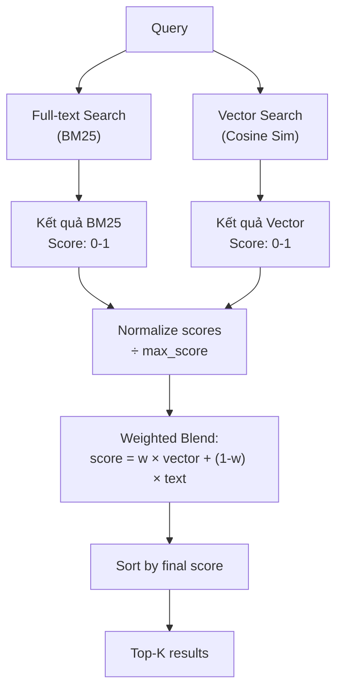

**Công thức:**

```
final_score = vector_weight × normalized_vector_score
            + (1 - vector_weight) × normalized_text_score

Trong đó:
  vector_weight: 0.0 → 1.0 (cấu hình được, mặc định 0.3)
  normalized_score = score / max_score_in_category
```

**Ở phía Python worker (advance-rag):**
- Mặc định: 5% text + 95% dense (`FusionExpr`)
- Fallback: Nếu không có kết quả → giảm `min_match` xuống 10% và `similarity_threshold` xuống 0.17

> **File Backend:** `be/src/modules/rag/services/rag-search.service.ts` (method `hybridSearch`)
> **File Worker:** `advance-rag/rag/nlp/search.py` (class `Dealer`)

### 5.4 So sánh 3 phương pháp

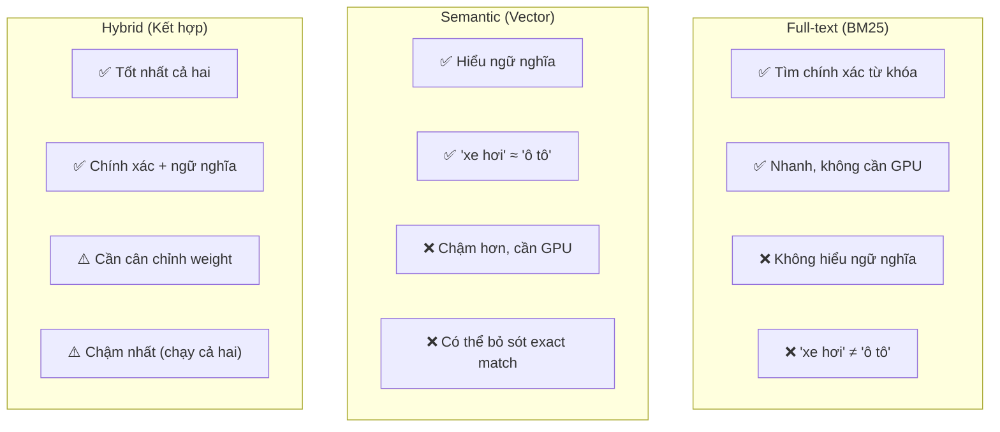

---

## 6. Re-ranking — Xếp hạng lại kết quả

### 6.1 Tại sao cần Re-ranking?

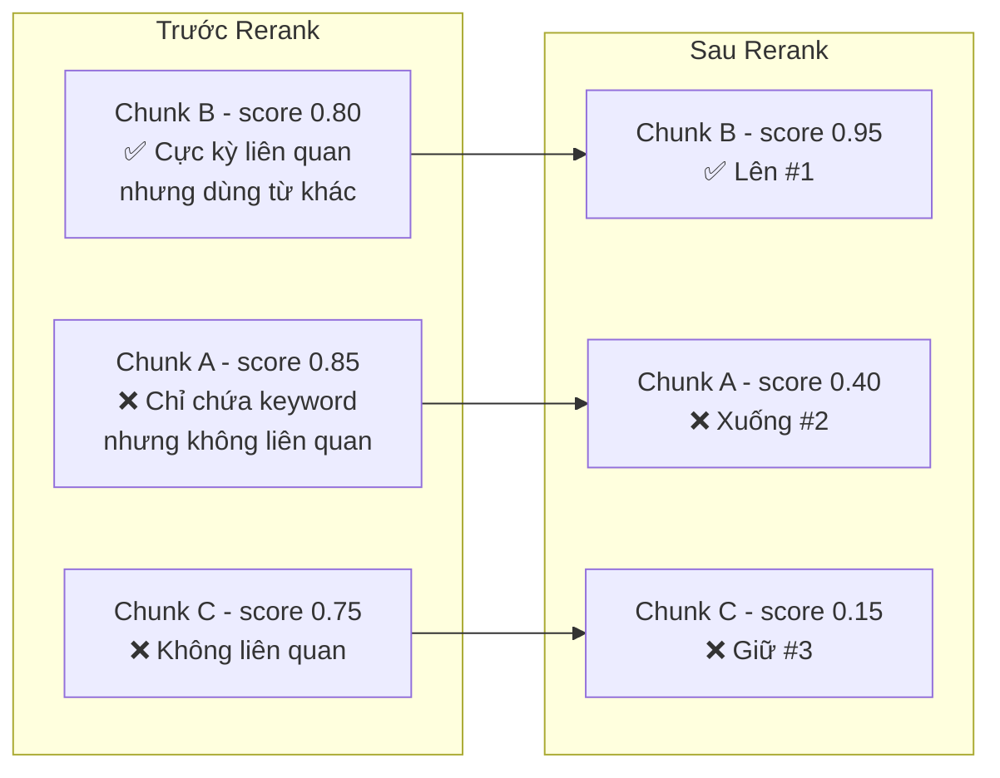

### 6.2 Cách hoạt động

1. **Input:** Query + top-K chunks từ retrieval
2. **Rerank model** đánh giá mức độ liên quan (query, chunk) → điểm 0-1
3. **Normalization:** Min-max normalize: `(score - min) / (max - min)`
4. **Kết hợp:** Hybrid score = rerank_score + original_search_score
5. **Output:** Top-N chunks xếp lại theo hybrid score

**Rerank providers được hỗ trợ:**
- Jina AI (`api.jina.ai/v1/rerank`)
- Cohere (`rerank-v3.5`)
- Bất kỳ OpenAI-compatible rerank API

> **File Backend:** `be/src/modules/rag/services/rag-rerank.service.ts`
> **File Worker:** `advance-rag/rag/llm/rerank_model.py`

---

## 7. GraphRAG — Knowledge Graph nâng cao

### 7.1 GraphRAG là gì?

GraphRAG xây dựng **đồ thị tri thức (Knowledge Graph)** từ tài liệu, cho phép:
- Truy vấn quan hệ giữa các thực thể
- Tóm tắt chủ đề ở mức cộng đồng (community)
- Trả lời câu hỏi tổng hợp mà vector search khó xử lý

### 7.2 Pipeline xây dựng Knowledge Graph

```mermaid
flowchart TD
    Chunks["Chunks (~4096 tokens/block)"]
    Chunks --> Extract["1⃣ Entity Extraction<br/>LLM trích xuất thực thể<br/>& quan hệ"]
    Extract --> SubGraph["Subgraph<br/>(nodes + edges)"]
    SubGraph --> Merge["2⃣ Merge Subgraph<br/>Ghép vào đồ thị chung<br/>+ tính PageRank"]
    Merge --> Resolve["3⃣ Entity Resolution<br/>Gỡ trùng thực thể<br/>(edit distance + LLM)"]
    Resolve --> Community["4⃣ Community Detection<br/>Leiden algorithm<br/>Phát hiện nhóm"]
    Community --> Report["5⃣ Community Reports<br/>LLM tóm tắt mỗi cộng đồng"]
    Report --> Index2["Index vào OpenSearch"]
```

### 7.3 Entity Extraction (Trích xuất thực thể)

**Hai chế độ:**

| Mode | Mô tả | Use case |
|------|--------|----------|
| **General** | Microsoft GraphRAG-style, gleaning 2 vòng | Tài liệu phức tạp |
| **Light** | LightRAG-style, nhẹ hơn | Tài liệu đơn giản |

**Thuật toán Gleaning (General mode):**
```
1. Gửi chunk text → LLM với GRAPH_EXTRACTION_PROMPT
2. LLM trả về: entities + relationships dạng tuple
   Ví dụ: ("entity"<|>Công ty ABC<|>ORG<|>Công ty CNTT hàng đầu)##
          ("relationship"<|>Nguyễn Văn A<|>Công ty ABC<|>là CEO<|>9)##
3. Hỏi LLM: "Còn entity nào bỏ sót không?" (CONTINUE_PROMPT)
4. Lặp 2 vòng (gleaning) để tối đa hóa entity recall
5. Parse kết quả: tách entity vs relationship bằng delimiter
```

**Delimiters:**
- Tuple: `<|>` (ngăn cách fields trong tuple)
- Record: `##` (ngăn cách các records)
- Complete: `<|COMPLETE|>` (đánh dấu kết thúc)

> **File:** `advance-rag/rag/graphrag/general/graph_extractor.py`

### 7.4 Entity Resolution (Gỡ trùng thực thể)

```mermaid
flowchart TD
    Candidates["Cặp thực thể tiềm năng trùng"]
    Candidates --> PreFilter["Pre-filter:<br/>Edit distance hoặc<br/>Jaccard similarity"]
    PreFilter -->|Pass| LLM["LLM so sánh:<br/>'Nguyễn Văn A' = 'NV A'?<br/>→ yes/no"]
    PreFilter -->|Fail| Skip["Bỏ qua"]
    LLM --> Connect["Connected component<br/>analysis"]
    Connect --> MergeN["Merge nodes:<br/>Gộp mô tả<br/>Chuyển edges"]
    MergeN --> PR["Tính lại PageRank"]
```

**Thuật toán pre-filter:**

| Ngôn ngữ | Phương pháp | Ngưỡng |
|-----------|------------|--------|
| English | Edit distance | ≤ min(len(a), len(b)) // 2 |
| Non-English | Jaccard (ký tự) | ≥ 0.8 |
| Tất cả | Digit heuristic | Reject nếu bigram chứa số khác nhau |

> **File:** `advance-rag/rag/graphrag/entity_resolution.py`

### 7.5 Community Detection (Leiden Algorithm)

```mermaid
graph TD
    subgraph "Knowledge Graph"
        A((Entity A)) --- B((Entity B))
        B --- C((Entity C))
        A --- C
        D((Entity D)) --- E((Entity E))
        E --- F((Entity F))
        D --- F
        C --- D
    end

    subgraph "Sau Leiden Detection"
        subgraph "Community 1"
            A2((A)) --- B2((B))
            B2 --- C2((C))
            A2 --- C2
        end
        subgraph "Community 2"
            D2((D)) --- E2((E))
            E2 --- F2((F))
            D2 --- F2
        end
    end
```

**Cách hoạt động:**
1. Dùng thư viện `graspologic` cho hierarchical Leiden
2. `max_cluster_size = 12` nodes/cluster
3. Seed `0xDEADBEEF` cho reproducibility
4. Trọng số community = `Σ(node.rank × node.weight)` → normalize max = 1.0

> **File:** `advance-rag/rag/graphrag/general/leiden.py`

### 7.6 KG Search (Truy vấn Knowledge Graph)

```mermaid
flowchart TD
    Q["Query"]
    Q --> Rewrite["Query Rewrite:<br/>Trích xuất entity type<br/>+ entity mentions"]

    Rewrite --> S1["Source 1:<br/>Vector similarity<br/>trên keyword embeddings"]
    Rewrite --> S2["Source 2:<br/>Filter by entity type<br/>rank by pagerank"]
    Rewrite --> S3["Source 3:<br/>N-hop expansion<br/>từ entity tìm được"]

    S1 --> Score["Hybrid Scoring"]
    S2 --> Score
    S3 --> Score

    Score --> Formula["score = pagerank × similarity<br/>× type_boost (2x) × nhop_boost"]
    Formula --> TopN["Top-N entities<br/>+ relationships"]
    TopN --> CR["Community Reports<br/>liên quan"]
    CR --> Context["Context cho LLM"]
```

**Scoring formula:**

```
base_score = pagerank × cosine_similarity

Nếu entity match cả keyword search VÀ type search:
  → score × 2 (type-keyword boost)

Nếu relationship nằm trên N-hop path:
  → score × (s + 1), s ∈ {0, 1, 2}
```

> **File:** `advance-rag/rag/graphrag/search.py` (class `KGSearch`)

---

## 8. Citation — Trích dẫn tự động

### 8.1 Thuật toán citation

```mermaid
flowchart TD
    Answer["Câu trả lời từ LLM"]
    Answer --> Split["Tách thành câu<br/>(hỗ trợ CJK, Arabic, Vietnamese)"]
    Split --> EmbedS["Embed mỗi câu<br/>thành vector"]
    EmbedS --> Sim["Tính hybrid similarity<br/>với mỗi chunk"]
    Sim --> Threshold["Adaptive threshold:<br/>0.63 → giảm 20% → min 0.30"]
    Threshold --> Insert["Chèn ##ID:n$$<br/>cuối mỗi câu"]
    Insert --> Result["'Chính sách nghỉ phép cho phép<br/>20 ngày/năm. ##ID:0$$ ##ID:2$$'"]
```

**Hybrid similarity formula:**

```
similarity = 0.1 × token_jaccard + 0.9 × vector_cosine

token_jaccard = |tokens_sentence ∩ tokens_chunk| / |tokens_sentence ∪ tokens_chunk|
vector_cosine = cosine(embed(sentence), embed(chunk))
```

**Adaptive threshold:**
- Bắt đầu: 0.63
- Nếu không tìm thấy citation nào → giảm 20% (×0.8)
- Lặp cho đến khi tìm được hoặc threshold < 0.30

> **File Backend:** `be/src/modules/rag/services/rag-citation.service.ts`
> **File Worker:** `advance-rag/rag/nlp/search.py` (method `insert_citations`)

---

## 9. Tính năng nâng cao

### 9.1 Deep Research Mode

```mermaid
flowchart TD
    Q["Query phức tạp"]
    Q --> Check["Sufficiency Check:<br/>Kết quả retrieval đủ chưa?"]
    Check -->|Đủ| Answer["Sinh câu trả lời"]
    Check -->|Chưa đủ| MultiQ["Multi-query Generation:<br/>Tạo 2-3 câu hỏi bổ sung"]
    MultiQ --> Search2["Tìm kiếm lần 2<br/>với câu hỏi bổ sung"]
    Search2 --> Check
```

> **File:** `be/src/shared/prompts/sufficiency-check.prompt.ts`
> **File:** `be/src/shared/prompts/multi-queries.prompt.ts`

### 9.2 Metadata Filtering

```
User: "Tìm tài liệu về AI được upload tháng 3"
→ LLM trích xuất filter:
  {
    "logic": "and",
    "conditions": [
      {"name": "topic", "comparison_operator": "contains", "value": "AI"},
      {"name": "upload_date", "comparison_operator": "range", "value": ["2026-03-01", "2026-03-31"]}
    ]
  }
```

> **File:** `be/src/shared/prompts/meta-filter.prompt.ts`

### 9.3 Related Questions

Sau khi trả lời, hệ thống tự động gợi ý câu hỏi liên quan:

> **File:** `be/src/shared/prompts/related-question.prompt.ts`

### 9.4 Mindmap Generation

Tạo mindmap JSON từ kết quả search:

> **File:** `be/src/modules/search/services/search.service.ts` (method `mindmap`)

### 9.5 RAPTOR Summarization

- Recursive Abstractive Processing for Tree-Organized Retrieval
- Tóm tắt đệ quy theo cây cho retrieval theo chủ đề

---

## 10. Ưu điểm và nhược điểm

### 10.1 Ưu điểm

| # | Ưu điểm | Chi tiết |
|---|---------|---------|
| 1 | **Hybrid Search** | Kết hợp BM25 + Vector, tối ưu cả exact match và semantic |
| 2 | **15+ document parsers** | Hỗ trợ nhiều định dạng: PDF, Word, Excel, PPT, hình ảnh, audio |
| 3 | **Multi-provider LLM** | OpenAI, Azure, Ollama, Gemini — dễ thay đổi |
| 4 | **GraphRAG** | Knowledge Graph cho câu hỏi phức tạp, quan hệ giữa entities |
| 5 | **Reranking** | 2 lớp xếp hạng (retrieval + rerank model) tăng accuracy |
| 6 | **Auto citation** | Trích dẫn tự động với adaptive threshold |
| 7 | **Multi-language** | Cross-language expansion hỗ trợ đa ngôn ngữ |
| 8 | **Real-time progress** | Redis pub/sub + SSE streaming cho UX tốt |
| 9 | **Web search fallback** | Tavily integration mở rộng nguồn tri thức |
| 10 | **Configurable pipeline** | 10 giai đoạn bật/tắt được, linh hoạt theo use case |

### 10.2 Nhược điểm

| # | Nhược điểm | Ảnh hưởng |
|---|-----------|-----------|
| 1 | **Chunking cố định** | Naive merge có thể cắt giữa ngữ cảnh quan trọng |
| 2 | **Embedding model dependency** | Chất lượng phụ thuộc hoàn toàn vào embedding model |
| 3 | **GraphRAG cost** | LLM calls cho entity extraction + resolution rất tốn kém |
| 4 | **Single-tenant index** | `knowledge_{tenant_id}` — không partition theo dataset |
| 5 | **Cold start** | Tài liệu mới cần parse + embed mới search được |
| 6 | **Token limit** | Chunk lớn hơn model context → bị truncate |
| 7 | **Synonym table** | Full-text search phụ thuộc vào bảng đồng nghĩa có sẵn |
| 8 | **Rerank latency** | Thêm 1 API call external → tăng latency |
| 9 | **No incremental update** | Thay đổi tài liệu → phải re-parse toàn bộ |
| 10 | **Memory pressure** | Parsing file lớn (>100MB) tiêu tốn RAM |

---

## 11. Cách cải thiện nhược điểm

### 11.1 Chunking thông minh hơn

```mermaid
flowchart LR
    subgraph "Hiện tại: Naive Merge"
        N1["Chia theo delimiter<br/>+ token size cố định"]
    end

    subgraph "Cải thiện"
        I1["Semantic Chunking:<br/>Chia theo ngữ nghĩa<br/>(cosine similarity giữa câu)"]
        I2["Agentic Chunking:<br/>LLM quyết định<br/>ranh giới chunk"]
        I3["Parent-child chunks:<br/>Chunk nhỏ để search<br/>chunk lớn để trả lời"]
    end

    N1 --> I1
    N1 --> I2
    N1 --> I3
```

**Giải pháp cụ thể:**
- **Semantic chunking:** Tính cosine similarity giữa các câu liên tiếp, cắt khi similarity giảm đột ngột
- **Sliding window + parent retrieval:** Chunk nhỏ (128 tokens) cho precision, trả về parent chunk (1024 tokens) cho context
- **Document-structure-aware:** Tôn trọng heading hierarchy khi chunk

### 11.2 Giảm chi phí GraphRAG

| Giải pháp | Chi tiết |
|-----------|---------|
| **Batch extraction** | Gộp nhiều chunk vào 1 LLM call |
| **Cache entities** | Lưu cache entity đã extract, chỉ process chunk mới |
| **Local models** | Dùng Ollama với model nhỏ (Mistral, Llama) cho extraction |
| **Incremental update** | Chỉ extract entity từ chunk mới, merge vào graph cũ |

### 11.3 Tối ưu latency

| Giải pháp | Chi tiết |
|-----------|---------|
| **Pre-compute rerank** | Cache rerank results cho query phổ biến |
| **Async rerank** | Stream partial results trước khi rerank xong |
| **Local rerank model** | Deploy BAAI/bge-reranker-v2 tại chỗ |
| **Tiered retrieval** | Lọc nhanh bằng BM25, chỉ rerank top-50 |

### 11.4 Incremental indexing

```mermaid
flowchart TD
    Change["Tài liệu thay đổi"]
    Change --> Diff["Tính diff<br/>(so sánh hash chunk cũ/mới)"]
    Diff --> Add["Thêm chunk mới"]
    Diff --> Update["Cập nhật chunk thay đổi"]
    Diff --> Delete["Xóa chunk đã bỏ"]
```

### 11.5 Cải thiện embedding

| Giải pháp | Chi tiết |
|-----------|---------|
| **Fine-tune embedding** | Train trên domain-specific data |
| **Instruction embedding** | Dùng model hỗ trợ instruction prefix |
| **Multi-vector** | ColBERT-style: nhiều vector/chunk cho token-level matching |
| **Matryoshka embedding** | Dùng embedding có thể truncate (256→128 dims) cho tốc độ |

### 11.6 Cải thiện retrieval

| Giải pháp | Chi tiết |
|-----------|---------|
| **Query decomposition** | Chia câu hỏi phức tạp thành sub-queries |
| **HyDE** | Hypothetical Document Embedding — tạo document giả từ query |
| **Contextual retrieval** | Thêm context tài liệu vào mỗi chunk trước khi embed |
| **Self-RAG** | LLM tự đánh giá retrieval results, retry nếu chưa đủ |

---

## 12. Bảng tham chiếu file

### Core Pipeline

| File | Vai trò |
|------|---------|
| `advance-rag/rag/svr/task_executor.py` | Orchestrator chính, quản lý task queue |
| `advance-rag/rag/flow/pipeline.py` | DSL-based pipeline execution |
| `advance-rag/executor_wrapper.py` | Wrapper với progress hooks |

### Document Processing

| File | Vai trò |
|------|---------|
| `advance-rag/rag/flow/parser/parser.py` | Flow component parse file |
| `advance-rag/rag/app/naive.py` | Parser mặc định (47KB+) |
| `advance-rag/rag/flow/splitter/splitter.py` | Chunking engine |
| `advance-rag/rag/flow/tokenizer/tokenizer.py` | Tokenization + embedding |
| `advance-rag/rag/llm/embedding_model.py` | Embedding providers |

### Search & Retrieval

| File | Vai trò |
|------|---------|
| `advance-rag/rag/nlp/search.py` | Hybrid search dealer |
| `advance-rag/rag/nlp/query.py` | Full-text query builder |
| `advance-rag/rag/utils/opensearch_conn.py` | OpenSearch connection |
| `be/src/modules/rag/services/rag-search.service.ts` | Backend search service |

### Chat & Search Features

| File | Vai trò |
|------|---------|
| `be/src/modules/chat/services/chat-conversation.service.ts` | Chat 10-stage pipeline |
| `be/src/modules/search/services/search.service.ts` | Search pipeline |
| `be/src/modules/rag/services/rag-rerank.service.ts` | Rerank service |
| `be/src/modules/rag/services/rag-citation.service.ts` | Citation insertion |
| `be/src/modules/rag/services/rag-redis.service.ts` | Task queue communication |

### GraphRAG

| File | Vai trò |
|------|---------|
| `advance-rag/rag/graphrag/general/index.py` | GraphRAG orchestrator |
| `advance-rag/rag/graphrag/general/graph_extractor.py` | Entity extraction (General) |
| `advance-rag/rag/graphrag/light/graph_extractor.py` | Entity extraction (Light) |
| `advance-rag/rag/graphrag/entity_resolution.py` | Entity deduplication |
| `advance-rag/rag/graphrag/general/leiden.py` | Community detection |
| `advance-rag/rag/graphrag/search.py` | KG search |

### Prompts

| File | Vai trò |
|------|---------|
| `be/src/shared/prompts/ask-summary.prompt.ts` | RAG answer generation |
| `be/src/shared/prompts/full-question.prompt.ts` | Multi-turn refinement |
| `be/src/shared/prompts/cross-language.prompt.ts` | Cross-language expansion |
| `be/src/shared/prompts/keyword.prompt.ts` | Keyword extraction |
| `be/src/shared/prompts/citation.prompt.ts` | Citation rules |
| `be/src/shared/prompts/sufficiency-check.prompt.ts` | Retrieval adequacy |
| `be/src/shared/prompts/multi-queries.prompt.ts` | Query expansion |
| `be/src/shared/prompts/meta-filter.prompt.ts` | Metadata filter extraction |

### Infrastructure

| File | Vai trò |
|------|---------|
| `be/src/shared/services/llm-client.service.ts` | Multi-provider LLM client |
| `be/src/shared/services/web-search.service.ts` | Tavily web search |
| `be/src/shared/services/redis.service.ts` | Redis connection |
| `advance-rag/config.py` | Worker configuration |
| `advance-rag/conf/os_mapping.json` | OpenSearch index mapping |

---

> **Tài liệu này được tạo tự động từ phân tích mã nguồn B-Knowledge.**
> **Cập nhật lần cuối:** 2026-03-17
