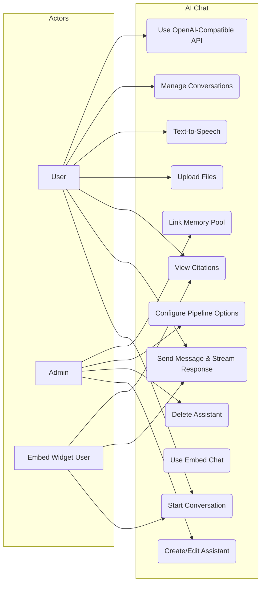
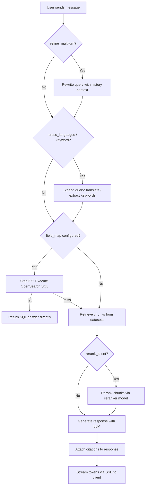

# FR-AI-CHAT: AI Chat Functional Requirements

> Version 1.2 | Updated 2026-04-14

## 1. Overview

AI Chat provides multi-turn RAG-powered conversations with configurable retrieval pipelines, citation support, file upload, embed flows, TTS, memory integration, and streaming responses. Users can interact through the internal web UI, token-based embed endpoints, or the OpenAI-compatible API.

## 2. Use Case Diagram

## 3. Functional Requirements

| ID | Requirement | Priority | Description |
|----|-------------|----------|-------------|
| CHAT-01 | Assistant CRUD | Must | Create, read, update, delete chat assistants with name, prompt, and pipeline config |
| CHAT-02 | Assistant Configuration | Must | Configure retrieval pipeline options, linked datasets, and LLM model per assistant |
| CHAT-03 | Conversation Create | Must | Start a new conversation scoped to an assistant |
| CHAT-04 | Conversation List/Delete | Must | List user conversations with pagination; delete conversations and their messages |
| CHAT-05 | Message Streaming | Must | Stream assistant responses via SSE as tokens are generated |
| CHAT-06 | Citation Display | Must | Return source chunk references with each response; link to original documents |
| CHAT-07 | File Upload | Should | Accept image and PDF uploads within a conversation for inline context (max 5 files per conversation) |
| CHAT-08 | Text-to-Speech | Should | Convert assistant text responses to audio via configured TTS model |
| CHAT-09 | OpenAI-Compatible API | Should | Expose `/api/v1/chat/completions` endpoint accepting standard OpenAI request format with stream support |
| CHAT-10 | Embed Chat | Should | Expose token-based embed info, session creation, and completion endpoints |
| CHAT-11 | Conversation Rename | Could | Allow users to rename conversations |
| CHAT-12 | Message Feedback | Should | Users can thumbs-up/down individual messages for quality tracking |
| CHAT-13 | Deep Research Mode | Could | Multi-step iterative research with extended token budget |
| CHAT-14 | Memory Integration | Should | Link assistant to a memory pool via `memory_id` for automatic knowledge extraction from conversations |
| CHAT-15 | Response Language Control | Should | Control response language instruction via `prompt_config.language` field; frontend sends detected language |

## 4. API Endpoints

### 4.1 Assistant CRUD

| Method | Path | Description |
|--------|------|-------------|
| POST | `/api/chat/assistants` | Create assistant |
| GET | `/api/chat/assistants` | List assistants |
| GET | `/api/chat/assistants/:id` | Get assistant details |
| PUT | `/api/chat/assistants/:id` | Update assistant |
| DELETE | `/api/chat/assistants/:id` | Delete assistant |

### 4.2 Conversations

| Method | Path | Description |
|--------|------|-------------|
| POST | `/api/chat/conversations` | Create conversation |
| GET | `/api/chat/conversations` | List conversations |
| PUT | `/api/chat/conversations/:id` | Update conversation (rename) |
| DELETE | `/api/chat/conversations/:id` | Delete conversation |

### 4.3 Completions & Messages

| Method | Path | Description |
|--------|------|-------------|
| POST | `/api/chat/completions` | Send message and stream response (SSE) |

### 4.4 File Upload

| Method | Path | Description |
|--------|------|-------------|
| POST | `/api/chat/conversations/:id/files` | Upload files to conversation (max 5 files, multer) |
| GET | `/api/chat/files/:fileId/content` | Retrieve uploaded file content |

### 4.5 Text-to-Speech

| Method | Path | Description |
|--------|------|-------------|
| POST | `/api/chat/tts` | Convert text to speech audio |

### 4.6 OpenAI-Compatible API

| Method | Path | Description |
|--------|------|-------------|
| POST | `/api/v1/chat/completions` | OpenAI-compatible completions (supports `stream=true` with SSE format translation) |
| GET | `/api/v1/models` | List available models in OpenAI format |

### 4.7 Embed Widget

| Method | Path | Description |
|--------|------|-------------|
| POST | `/api/chat/dialogs/:id/embed-tokens` | Create embed token for assistant |
| GET | `/api/chat/dialogs/:id/embed-tokens` | List embed tokens for assistant |
| DELETE | `/api/chat/embed-tokens/:tokenId` | Delete embed token |
| GET | `/api/chat/embed/:token/info` | Get public assistant info via token |
| POST | `/api/chat/embed/:token/sessions` | Create public session via token |
| POST | `/api/chat/embed/:token/completions` | Send message and stream response via token (public) |

## 5. Configurable Pipeline Steps

| Step | Config Key | Type | Default | Description |
|------|-----------|------|---------|-------------|
| Multi-turn Refinement | `refine_multiturn` | boolean [OPTIONAL] | false | Rewrite user query using conversation history for standalone clarity |
| Cross-Language Expansion | `cross_languages` | boolean [OPTIONAL] | false | Translate query into additional languages for multilingual retrieval |
| Keyword Extraction | `keyword` | boolean [OPTIONAL] | false | Extract keywords from query for BM25 boosting |
| Knowledge Graph | `use_kg` | boolean [OPTIONAL] | false | Enrich retrieval with knowledge graph entity lookups |
| Reasoning Mode | `reasoning` | boolean [OPTIONAL] | false | Enable chain-of-thought reasoning in generation |
| Web Search | `tavily_api_key` | string [OPTIONAL] | null | Enable Tavily web search augmentation when API key is provided |
| Reranking | `rerank_id` | string [OPTIONAL] | null | Rerank retrieved chunks using specified reranker model |
| RBAC Datasets | `allow_rbac_datasets` | boolean [OPTIONAL] | false | Restrict retrieval to datasets the user has explicit access to |
| Empty Response | `empty_response` | string [OPTIONAL] | "" | Custom fallback message when no relevant chunks are found |
| Response Language | `prompt_config.language` | string [OPTIONAL] | null | Language instruction appended to system prompt; frontend sends detected user language |

## 6. High-Level Message Flow

### Step 6.5: SQL Retrieval

When a knowledge base has `field_map` configured (structured data), the system executes an OpenSearch SQL query before the standard retrieval pipeline. If the SQL query returns results, it **short-circuits** the entire vector/BM25 retrieval pipeline and returns the SQL answer directly.

## 7. SSE Event Types

The completion endpoint streams the following event types:

| Event Data | Description |
|-----------|-------------|
| `{ status: "refining_question" }` | Multi-turn query refinement in progress |
| `{ status: "retrieving" }` | Chunk retrieval in progress |
| `{ status: "reranking" }` | Reranking retrieved chunks |
| `{ status: "deep_research" }` | Deep research iteration in progress |
| `{ delta: "..." }` | Incremental token from LLM generation |
| `{ reference: {...} }` | Citation/reference metadata for current response |
| `{ answer: "...", reference: {...} }` | Final complete answer with references |
| `[DONE]` | Stream termination signal |

## 8. Business Rules

| ID | Rule |
|----|------|
| BR-01 | All assistant responses MUST be streamed via Server-Sent Events (SSE); no buffered responses |
| BR-02 | Conversation history loads the last **20 messages** but limits LLM context to the last **6 user-assistant message pairs** (12 messages) |
| BR-03 | Deep Research mode budget: max **50,000 tokens**, **15 LLM calls**, and **3 levels** of iterative depth |
| BR-04 | Assistants are scoped to a tenant; users can only access assistants within their tenant |
| BR-05 | File uploads are limited to images (PNG, JPG, GIF, WebP) and PDFs; max **5 files** per conversation (multer) |
| BR-06 | The OpenAI-compatible API authenticates via API token and maps to an existing assistant; supports `stream=true` with SSE format translation to OpenAI delta format |
| BR-07 | When `empty_response` is set and retrieval returns zero chunks, the system returns the configured fallback instead of calling the LLM |
| BR-08 | Citations reference specific chunk IDs, document names, and page numbers where available |
| BR-09 | Conversations and messages are soft-deleted to support admin and user history viewing |
| BR-10 | Public embed chat uses token-based session creation and completion routes instead of browser sessions |
| BR-11 | The `chat_assistants.memory_id` column links an assistant to a memory pool; when set, conversation turns are automatically processed for memory extraction |
| BR-12 | The `prompt_config.language` field controls the response language instruction appended to the system prompt |
| BR-13 | When a knowledge base has `field_map` configured, OpenSearch SQL is executed first and can short-circuit the entire retrieval pipeline |
