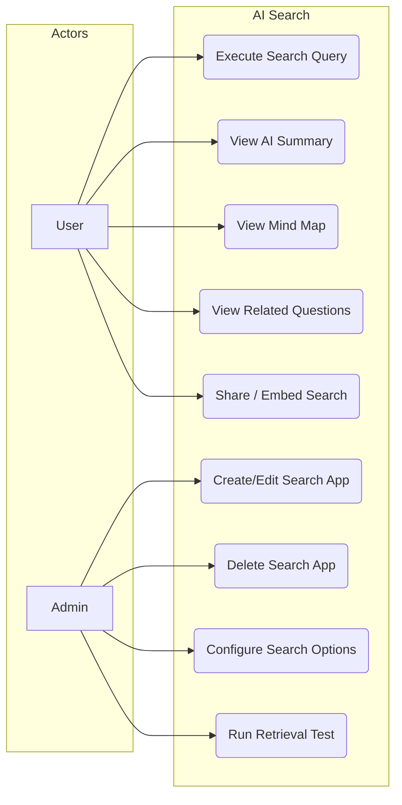
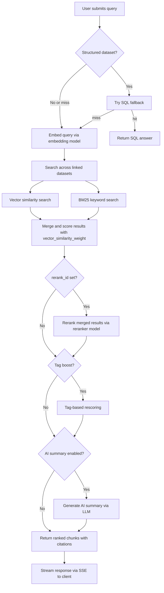

# FR-AI-SEARCH: AI Search Functional Requirements

> Version 1.2 | Updated 2026-04-14

## 1. Overview

AI Search provides app-scoped retrieval across one or more datasets, with optional streamed AI summaries, mind maps, related questions, retrieval testing, server-side highlights, SQL fallback for structured data, and token-based public share/embed flows.

## 2. Use Case Diagram



## 3. Functional Requirements

| ID | Requirement | Priority | Description |
|----|-------------|----------|-------------|
| SRCH-01 | Search App CRUD | Must | Create, read, update, delete search applications with name, linked datasets, and config |
| SRCH-02 | Search App Configuration | Must | Configure LLM, reranker, similarity threshold, and retrieval strategy per app |
| SRCH-03 | Full-Text Search | Must | BM25-based keyword search across OpenSearch indices |
| SRCH-04 | Semantic Search | Must | Vector similarity search using embedded query against chunk embeddings |
| SRCH-05 | Hybrid Search | Must | Combine vector and BM25 scores with configurable weight for ranking |
| SRCH-06 | AI Summary Streaming | Should | Generate and stream an AI summary of top results via SSE |
| SRCH-07 | Mind Map Generation | Should | Produce a hierarchical JSON mind map structure from search results via LLM |
| SRCH-08 | Related Questions | Should | Suggest follow-up questions based on query and retrieved content via LLM |
| SRCH-09 | Public Share / Embed | Should | Expose token-based public search via share page and embed endpoints |
| SRCH-10 | Retrieval Test | Must | Admin tool to test retrieval quality: run query, inspect chunks, scores, and ranking |
| SRCH-11 | Metadata Filtering | Could | Filter results by document metadata (tags, source, date) before ranking |
| SRCH-12 | Search History / Logging | Could | Persist user search queries for analytics and re-execution |
| SRCH-13 | SQL Fallback | Should | Answer structured-data queries through OpenSearch SQL when `field_map` exists |
| SRCH-14 | Tag-Based Boosting | Could | Re-score chunk results using tag similarity for tag-enabled datasets |
| SRCH-15 | Search App Branding | Should | Support `avatar` and `empty_response` presentation settings (added in migration 20260325) |
| SRCH-16 | Search Feedback | Should | Users can submit feedback on search results for quality tracking |
| SRCH-17 | OpenAI-Compatible API | Should | Expose `/api/v1/search/completions` for programmatic access |
| SRCH-18 | Access Control | Must | Per-app access control for read/write permissions |

## 4. API Endpoints

### 4.1 Search App CRUD

| Method | Path | Description |
|--------|------|-------------|
| POST | `/api/search/apps` | Create search app |
| GET | `/api/search/apps` | List search apps |
| GET | `/api/search/apps/:id` | Get search app details |
| PUT | `/api/search/apps/:id` | Update search app |
| DELETE | `/api/search/apps/:id` | Delete search app |

### 4.2 Access Control

| Method | Path | Description |
|--------|------|-------------|
| GET | `/api/search/apps/:id/access` | Get app access settings |
| PUT | `/api/search/apps/:id/access` | Update app access settings |

### 4.3 Retrieval Test

| Method | Path | Description |
|--------|------|-------------|
| POST | `/api/search/apps/:id/retrieval-test` | Run retrieval test query (admin) |

### 4.4 Search Execution

| Method | Path | Description |
|--------|------|-------------|
| POST | `/api/search/apps/:id/search` | Execute search query (non-streaming chunk retrieval) |
| POST | `/api/search/apps/:id/ask` | Ask with AI summary (SSE streaming) |
| POST | `/api/search/apps/:id/related-questions` | Generate follow-up questions via LLM |
| POST | `/api/search/apps/:id/mindmap` | Generate structured JSON mind map via LLM |
| POST | `/api/search/apps/:id/feedback` | Submit search result feedback |

### 4.5 OpenAI-Compatible API

| Method | Path | Description |
|--------|------|-------------|
| POST | `/api/v1/search/completions` | OpenAI-compatible search completions |

### 4.6 Embed Widget

| Method | Path | Description |
|--------|------|-------------|
| POST | `/api/search/apps/:id/embed-tokens` | Create embed token for search app |
| GET | `/api/search/apps/:id/embed-tokens` | List embed tokens for search app |
| DELETE | `/api/search/embed-tokens/:tokenId` | Delete embed token |
| GET | `/api/search/embed/:token/info` | Get public search app info via token |
| POST | `/api/search/embed/:token/search` | Public search via token |
| POST | `/api/search/embed/:token/ask` | Public ask (AI summary) via token |
| POST | `/api/search/embed/:token/related-questions` | Public related questions via token |
| POST | `/api/search/embed/:token/mindmap` | Public mind map via token |

## 5. Configurable Options

| Option | Config Key | Type | Required | Description |
|--------|-----------|------|----------|-------------|
| LLM Model | `llm_id` | string | Yes | Model used for AI summary generation |
| Similarity Threshold | `similarity_threshold` | float [OPTIONAL] | No | Minimum similarity score to include a chunk (default 0.2) |
| Top K | `top_k` | integer [OPTIONAL] | No | Maximum number of chunks to retrieve |
| Reranker | `rerank_id` | string [OPTIONAL] | No | Reranker model for result re-scoring |
| Rerank Top K | `rerank_top_k` | integer [OPTIONAL] | No | Number of top results to keep after reranking |
| Related Questions | `enable_related_questions` | boolean [OPTIONAL] | No | Toggle related question suggestions |
| Mind Map | `enable_mindmap` | boolean [OPTIONAL] | No | Toggle mind map generation |
| Highlight | `highlight` | boolean [OPTIONAL] | No | Request server-side highlight snippets |
| Metadata Filter | `metadata_filter` | object [OPTIONAL] | No | Pre-filter documents by metadata before retrieval |
| Vector Weight | `vector_similarity_weight` | float [OPTIONAL] | No | Weight of vector score in hybrid ranking (0.0-1.0, default 0.3) |

## 6. Search Execution Flow



### Score Formula

Hybrid scoring formula:

```
weightedScore = vector_similarity_weight * vectorScore + (1 - vector_similarity_weight) * bm25Score
```

Where `vector_similarity_weight` defaults to 0.3 if not configured.

## 7. Data Model

### search_apps Table

Key columns:

| Column | Type | Description |
|--------|------|-------------|
| `id` | UUID | Primary key |
| `name` | string | App display name |
| `avatar` | string | App avatar/icon (added migration 20260325) |
| `empty_response` | string | Custom empty result message (added migration 20260325) |
| `llm_id` | UUID | Linked LLM model |
| `dataset_ids` | UUID[] | Linked knowledge bases |
| `config` | JSONB | Search configuration options |
| `tenant_id` | UUID | Tenant scope |

## 8. Business Rules

| ID | Rule |
|----|------|
| BR-01 | A search app can link a maximum of **20 knowledge base datasets** |
| BR-02 | Title field matches receive a **10x boost** factor in BM25 scoring |
| BR-03 | Important keyword matches receive a **30x boost** factor in BM25 scoring |
| BR-04 | AI summaries are streamed via SSE; the client renders tokens incrementally |
| BR-05 | Search apps are tenant-scoped; users only see apps within their tenant |
| BR-06 | The retrieval test tool is restricted to admin and leader roles |
| BR-07 | Public share/embed access is token-based and exposes only allowlisted app config fields |
| BR-08 | When `similarity_threshold` is set, chunks scoring below the threshold are excluded before reranking |
| BR-09 | Hybrid scoring formula: `final = vector_similarity_weight * vector_score + (1 - vector_similarity_weight) * bm25_score` |
| BR-10 | Search apps may define `avatar` and `empty_response` for presentation in internal and shared UI |
| BR-11 | The `/search` endpoint returns chunks non-streaming; the `/ask` endpoint streams AI summary via SSE |
| BR-12 | Related questions endpoint generates follow-up questions via LLM based on query and retrieved context |
| BR-13 | Mind map endpoint generates a structured JSON hierarchical map from search results via LLM |
