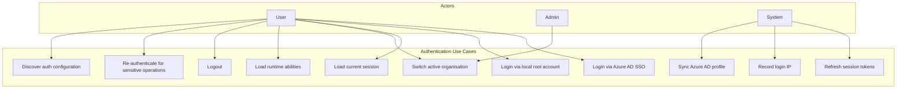
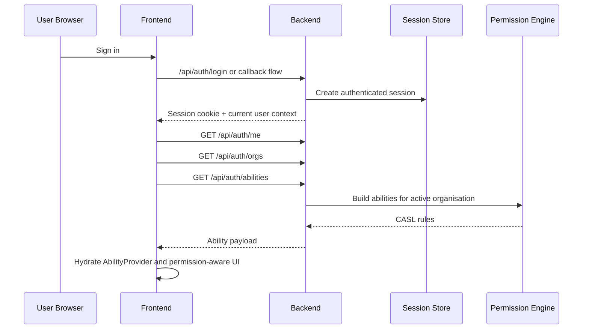
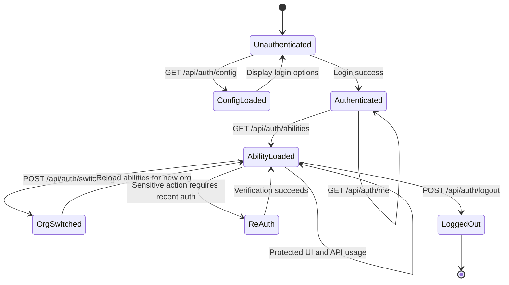

# SRS — Authentication

| Field   | Value      |
|---------|------------|
| Parent  | [SRS Index](./index.md) |
| Version | 1.2        |
| Date    | 2026-04-14 |

## 1. Overview

B-Knowledge authenticates users through Azure AD SSO as the primary path and a controlled local root login as a fallback. Authentication is session-based. After authentication succeeds, the session becomes the input to tenant selection and permission evaluation.

Authentication is therefore not a standalone concern in the current system. The authenticated session feeds:

- `GET /api/auth/config` for auth configuration discovery (Azure AD enabled, local login enabled) — public endpoint
- `GET /api/auth/me` for current identity and tenant context
- `GET /api/auth/orgs` for available organisations
- `POST /api/auth/switch-org` for active-organisation changes
- `GET /api/auth/abilities` for the CASL rules used by frontend and backend authorization surfaces
- `POST /api/auth/refresh-token` and `GET /api/auth/token-status` for provider token/session health flows where configured
- `POST /api/auth/reauth` for sensitive-operation re-authentication

This page defines the requirements for that auth-to-permission flow. Detailed design references live in [Auth Overview](/detail-design/auth/overview), [Azure AD Flow](/detail-design/auth/azure-ad-flow), [Auth: RBAC & ABAC Permission Model](/detail-design/auth/rbac-abac), and [RBAC & ABAC: Comprehensive Authorization Reference](/detail-design/auth/rbac-abac-comprehensive).

## 2. Use Case Diagram

## 3. Functional Requirements

| ID       | Requirement | Description | Priority |
|----------|-------------|-------------|----------|
| AUTH-001 | Azure AD SSO login | Users authenticate through the configured Azure AD authorization-code flow. | Must |
| AUTH-002 | Local root login | A local root login path exists only when explicitly enabled for fallback or recovery scenarios. | Must |
| AUTH-003 | Session creation | Successful authentication creates a server-side session with secure cookie transport and the initial active-organisation context. | Must |
| AUTH-004 | Session persistence | Sessions survive backend restarts because session state is stored outside process memory. | Must |
| AUTH-005 | Session termination | Logout destroys the authenticated session and clears client state that depends on it. | Must |
| AUTH-006 | Organisation discovery | Authenticated users can retrieve the list of organisations available to their account. | Must |
| AUTH-007 | Active-organisation switching | Authenticated users can switch the active organisation without performing a fresh login. | Must |
| AUTH-008 | Ability loading | Authenticated clients can request `/api/auth/abilities` to obtain the current CASL rule set for the active session and organisation. | Must |
| AUTH-009 | Re-authentication | Sensitive operations can require recent re-authentication before execution. Endpoint: `POST /api/auth/reauth` — supports root password (env `ROOT_PASSWORD`), test password (env `TEST_PASSWORD`), and bcrypt-hashed local passwords. Uses constant-time comparison. | Should |
| AUTH-010 | Token/session refresh | The system can refresh auth-related token state without forcing a full sign-in when the configured provider supports it. Endpoints: `POST /api/auth/refresh-token` (refresh provider tokens) and `GET /api/auth/token-status` (check token health). | Must |
| AUTH-011 | Authentication auditability | Login, logout, organisation switching, and other security-relevant auth events must be auditable. | Must |
| AUTH-012 | Fail-closed permission bootstrap | If authenticated ability data cannot be loaded, the frontend must default to a no-access state rather than rendering privileged UI optimistically. | Must |
| AUTH-013 | Login IP recording | System records user IP on login with 60-second throttle to prevent DB spam. Stored in `user_ip_history` table. | Must |
| AUTH-014 | Password security | Local passwords hashed with bcrypt (12 salt rounds). Three login paths: root (env `ROOT_PASSWORD`), test (env `TEST_PASSWORD`), and local bcrypt. | Must |
| AUTH-015 | Azure AD profile sync | On Azure AD login, system syncs `display_name`, `email`, `department`, `job_title`, `mobile_phone`. Photo fetched as base64 data URL with fallback to generated avatar. | Must |
| AUTH-016 | Token expiry buffer | 5-minute (300s) safety buffer applied before declaring tokens expired, preventing premature session invalidation during normal operation. | Should |

## 4. Authentication To Permission Flow

## 5. Session And Organisation Requirements

| ID        | Requirement | Description | Priority |
|-----------|-------------|-------------|----------|
| AUTH-ORG-001 | One active organisation per session context | The session must carry an active organisation so downstream permission evaluation is tenant-aware. | Must |
| AUTH-ORG-002 | Switch-org recalculates authorization state | After `/api/auth/switch-org`, the next ability evaluation must reflect the new tenant context rather than the previous organisation. | Must |
| AUTH-ORG-003 | Ability endpoint reflects live session context | `/api/auth/abilities` must derive rules from the authenticated user and current active organisation, not from a detached frontend cache. | Must |
| AUTH-ORG-004 | Permission changes invalidate cached abilities | Role changes, overrides, and resource-grant mutations must invalidate cached authorization state so existing sessions do not continue with obsolete abilities. | Must |
| AUTH-ORG-005 | Session loss clears permission state | When the session disappears, frontend ability and permission-catalog consumers must reset to a safe default. | Must |

## 6. Permission Evaluation Boundaries

Authentication establishes identity. Authorization is handled in two additional layers that consume the authenticated session:

| Layer | Purpose | Example surfaces |
|-------|---------|------------------|
| Flat permission checks | Evaluate whether the user has a named capability from the registry-backed catalog. | `requirePermission('permissions.view')`, frontend `useHasPermission(PERMISSION_KEYS.X)` |
| Row-scoped ability checks | Evaluate whether the user can perform an action on a specific subject instance in the active tenant. | `requireAbility('read', 'KnowledgeBase', id)`, frontend `<Can I="read" a="KnowledgeBase">` |

### Boundary Rules

| Rule | Description |
|------|-------------|
| BR-AUTH-01 | Authentication alone does not authorize access to a protected feature; the request must still pass flat permission checks and, where applicable, row-scoped ability checks. |
| BR-AUTH-02 | Ability rules returned by `/api/auth/abilities` are session-derived authorization data, not an alternative login mechanism. |
| BR-AUTH-03 | Switching organisation changes the tenant input used by authorization checks and can change the effective permissions returned to the same authenticated user. |
| BR-AUTH-04 | Frontend permission gating must consume the runtime auth outputs (`/api/auth/abilities` and the permission catalog) instead of inferring access from role names alone. |

## 7. Session Lifecycle

## 8. Business Rules

| Rule | Description |
|------|-------------|
| BR-AUTH-05 | Session cookies must be transported securely and handled server-side; the frontend must not become the source of truth for authentication state. |
| BR-AUTH-06 | `/api/auth/abilities` must be available only to authenticated callers because it exposes the current authorization shape for the session. |
| BR-AUTH-07 | The system must separate identity establishment, permission catalog lookup, and row-scoped ability evaluation so maintainers can change one layer without misdescribing the others. |
| BR-AUTH-08 | Logout and session invalidation must also remove or invalidate cached permission state consumed by the frontend. |
| BR-AUTH-09 | Authentication docs must point maintainers to the auth detail-design pages for flow specifics rather than duplicating low-level implementation detail inside the SRS. |

## 9. Security Considerations

- All production authentication traffic must use HTTPS.
- Local root login remains a restricted fallback path and must be disabled unless explicitly needed.
- Session-backed authentication must preserve tenant isolation when switching organisations or rebuilding abilities.
- Permission bootstrap must fail closed: missing or stale ability data must hide protected actions instead of exposing them.
- Local passwords must be hashed with bcrypt (12 salt rounds); plaintext comparison is forbidden except for the root/test env-var paths which use constant-time comparison.
- Login IP recording is throttled (60s) to prevent database write amplification from rapid reconnects.
- `GET /api/auth/config` is intentionally public so the frontend can render the correct login form before authentication; it must not expose secrets or internal state beyond feature flags.
- Token expiry checks must include the 300-second buffer to avoid premature session drops during normal latency.
