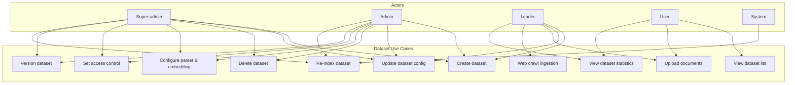
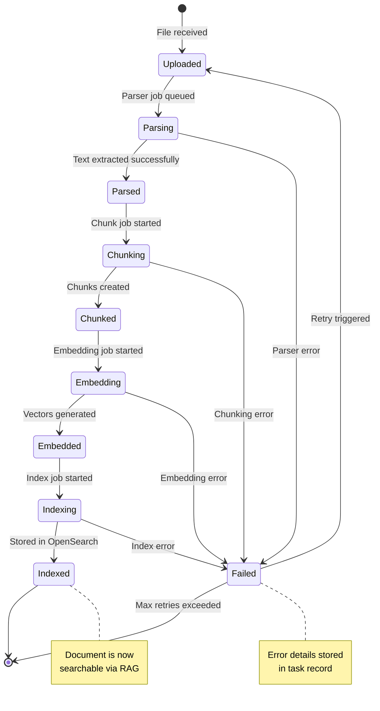
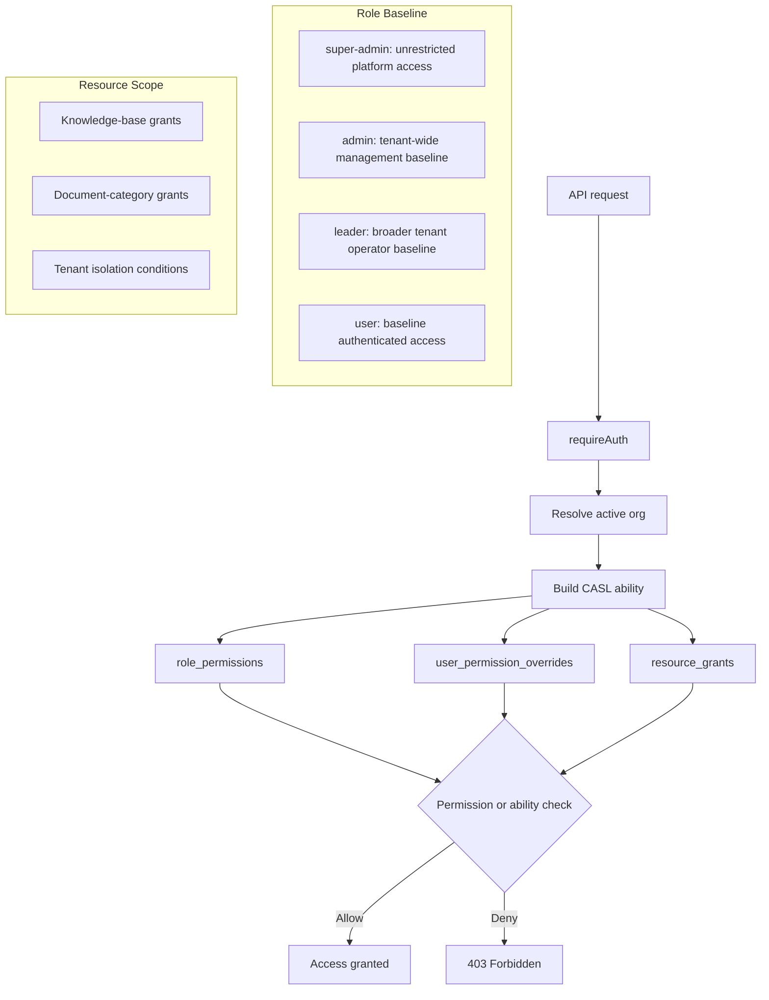

# SRS — Dataset (Knowledge Base) Management

| Field   | Value      |
|---------|------------|
| Parent  | [SRS Index](./index.md) |
| Version | 1.0        |
| Date    | 2026-03-25 |

## 1. Overview

A **Dataset** in B-Knowledge is a Knowledge Base — a collection of documents sharing parser configuration, embedding settings, enrichment options, and access control policies. Datasets are tenant-scoped and support version uploads, parser overrides, web crawl ingestion, retrieval testing, graph tasks, and structured-data field maps.

## 2. Use Case Diagram

## 3. Functional Requirements

| ID       | Requirement                | Description                                                                                      | Priority |
|----------|----------------------------|--------------------------------------------------------------------------------------------------|----------|
| DS-001   | Create dataset             | User creates a dataset with name, description, language, and initial parser/embedding config       | Must     |
| DS-002   | Update dataset config      | Admin updates parser type, chunk strategy, embedding model, and retrieval settings                 | Must     |
| DS-003   | Delete dataset             | Admin deletes a dataset, removing all documents, chunks, and vectors from OpenSearch               | Must     |
| DS-004   | List datasets              | Paginated, searchable list of datasets the user has access to                                     | Must     |
| DS-005   | Upload documents           | Users upload files (single or batch) to a dataset; max 100 files per batch                        | Must     |
| DS-006   | Web crawl ingestion        | Admin configures a URL + depth; system crawls and ingests pages as documents                      | Should   |
| DS-007   | Parser configuration       | Select from 18 parser types per document or set a dataset-wide default                            | Must     |
| DS-008   | Embedding configuration    | Select embedding model and dimension; applies to all new documents in the dataset                 | Must     |
| DS-009   | Chunk strategy config      | Configure chunking method (fixed, recursive, semantic, layout-aware), size, and overlap            | Must     |
| DS-010   | Dataset version uploads    | Upload new document versions and list dataset version groups                                       | Should   |
| DS-011   | Permission-based access control | Resolve dataset access from the registry-backed permission catalog, user overrides, and resource grants | Must     |
| DS-012   | Row-scoped access policies | Enforce tenant-scoped CASL checks and resource grants for dataset-related access paths            | Should   |
| DS-013   | Dataset statistics         | Display document count, chunk count, total size, last updated, indexing status                    | Must     |
| DS-014   | Re-index dataset           | Admin triggers full re-indexing of all documents (re-parse, re-chunk, re-embed)                   | Must     |
| DS-015   | Duplicate dataset          | Clone dataset config (without documents) into a new dataset                                      | Could    |
| DS-016   | Export dataset metadata    | Export dataset configuration and document list as JSON                                            | Could    |
| DS-017   | Structured data field map  | Generate and edit `field_map` for table-like datasets                                             | Should   |
| DS-018   | Bulk document operations   | Bulk parse, toggle, and delete documents                                                          | Must     |
| DS-019   | Enrichment tasks           | Generate keywords, questions, tags, and metadata for documents                                    | Should   |
| DS-020   | Graph tasks                | Trigger GraphRAG, RAPTOR, and mindmap jobs                                                        | Could    |

## 4. Document Lifecycle

## 5. Dataset Configuration Schema

| Setting              | Type     | Default          | Description                                  |
|----------------------|----------|------------------|----------------------------------------------|
| `parser_type`        | enum     | `naive`          | Default parser for new documents             |
| `chunk_method`       | enum     | `recursive`      | Chunking strategy                            |
| `chunk_size`         | integer  | `512`            | Target tokens per chunk                      |
| `chunk_overlap`      | integer  | `64`             | Overlap tokens between chunks                |
| `embedding_model`    | string   | (tenant default) | Embedding model identifier                   |
| `embedding_dim`      | integer  | `1536`           | Vector dimension                             |
| `graphrag_enabled`   | boolean  | `false`          | Enable entity extraction and graph indexing  |
| `raptor_enabled`     | boolean  | `false`          | Enable hierarchical summarisation            |
| `field_map`          | object   | none             | Structured-data schema for SQL fallback      |
| `tag_kb_ids`         | string[] | none             | Tag datasets used for tag-based ranking      |
| `language`           | string   | `en`             | Primary language for parser hints            |
| `retrieval_top_k`    | integer  | `20`             | Number of candidates from retrieval          |
| `rerank_top_n`       | integer  | `5`              | Number of results after reranking            |
| `bm25_weight`        | float    | `0.3`            | BM25 weight in hybrid fusion (0.0-1.0)      |

## 6. Access Control Model

Dataset access is no longer documented through legacy role labels or standalone team-permission tables. The maintained model combines:

- tenant role defaults from `role_permissions`
- per-user allow or deny exceptions from `user_permission_overrides`
- row-scoped resource access from `resource_grants`
- middleware enforcement through `requirePermission(...)` and `requireAbility(...)`

## 7. Business Rules

| Rule | Description |
|------|-------------|
| BR-DS-01 | Maximum file size per upload: 100 MB (configurable via `MAX_UPLOAD_SIZE_MB`) |
| BR-DS-02 | Supported upload formats: PDF, DOCX, DOC, XLSX, XLS, PPTX, PPT, TXT, MD, HTML, CSV, JSON, XML, YAML, images (PNG, JPG, TIFF), audio (MP3, WAV), and code files |
| BR-DS-03 | All datasets are tenant-isolated — cross-tenant access is impossible at the database query level |
| BR-DS-04 | Deleting a dataset queues async cleanup: OpenSearch index deletion, S3 file removal, database cascade |
| BR-DS-05 | Re-indexing creates new vectors alongside existing ones; old vectors are swapped out atomically |
| BR-DS-06 | Web crawl depth is limited to 3 levels and 500 pages per crawl job |
| BR-DS-07 | Batch upload limit: 100 files per request; total batch size must not exceed 500 MB |
| BR-DS-08 | Dataset names must be unique within a tenant (case-insensitive) |
| BR-DS-09 | Changing embedding model requires full re-indexing; system warns user before proceeding |
| BR-DS-10 | Per-document parser changes are supported without recreating the dataset |
| BR-DS-11 | Structured datasets can auto-generate a field map for SQL fallback flows |
