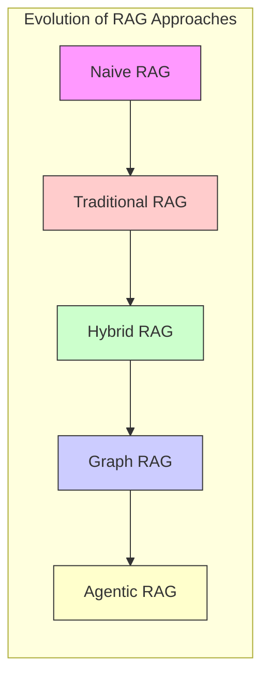
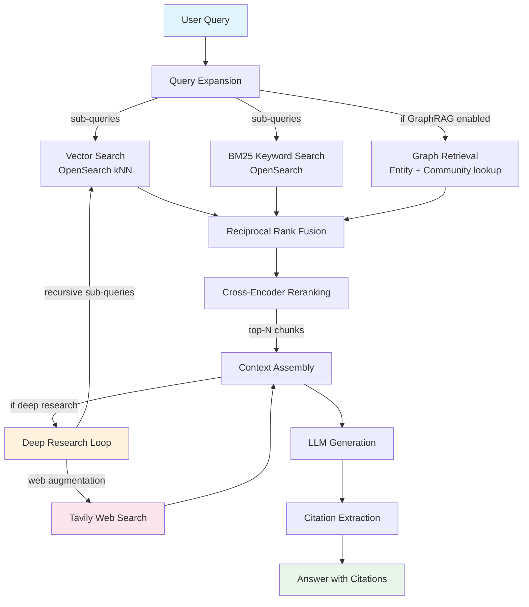
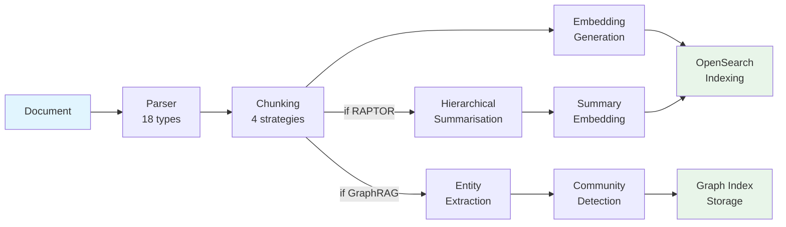

# SRS — RAG Strategy & Architecture

| Field   | Value      |
|---------|------------|
| Parent  | [SRS Index](./index.md) |
| Version | 1.0        |
| Date    | 2026-03-21 |

## 1. What is RAG and Why It Matters

Retrieval-Augmented Generation (RAG) combines information retrieval with generative AI. Instead of relying solely on an LLM's training data, RAG retrieves relevant documents at query time and injects them into the prompt. This reduces hallucinations, enables domain-specific answers, and keeps responses grounded in up-to-date organisational knowledge.

## 2. RAG Approach Comparison

### Detailed Comparison

| Approach | Description | Pros | Cons | Best Use Case |
|----------|-------------|------|------|---------------|
| **Naive RAG** | Embed chunks, retrieve top-K by cosine similarity, generate | Simple to implement; low latency | Poor precision; no keyword fallback; fails on exact-match queries | Prototypes, single-domain FAQs |
| **Traditional RAG** | Adds query preprocessing, metadata filters, prompt engineering | Better relevance; configurable | Still single-retrieval; misses cross-document relationships | Internal documentation search |
| **Hybrid RAG** | Combines vector search + BM25 keyword search + reranking | Balances semantic and lexical matching; robust across query types | Higher compute cost; requires tuning fusion weights | Enterprise knowledge bases with mixed query styles |
| **Graph RAG** | Builds knowledge graph (entities + communities) from documents, retrieves sub-graphs | Captures relationships; excels at multi-hop reasoning | Expensive graph construction; high storage overhead | Legal, medical, compliance — relationship-heavy domains |
| **Agentic RAG** | LLM-driven agent decides retrieval strategy, tools, and iteration | Most flexible; self-correcting | Highest latency and cost; harder to debug | Complex research tasks requiring multi-step reasoning |

## 3. B-Knowledge's Chosen Approach

B-Knowledge implements **Hybrid RAG with GraphRAG extensions**, combining the reliability of hybrid retrieval with the relationship-awareness of knowledge graphs.

### 3.1 Core Techniques

| Technique | Category | Purpose |
|-----------|----------|---------|
| Vector search (dense embeddings) | Retrieval | Semantic similarity matching |
| BM25 keyword search | Retrieval | Exact and partial keyword matching |
| Reciprocal Rank Fusion (RRF) | Fusion | Merges vector + BM25 result lists |
| Query expansion | Pre-retrieval | Generates sub-queries to improve recall |
| Cross-encoder reranking | Post-retrieval | Rescores candidates for precision |
| GraphRAG — entity extraction | Indexing | Builds entity-relationship graph from documents |
| GraphRAG — community detection | Indexing | Clusters entities into semantic communities |
| RAPTOR hierarchical summarisation | Indexing | Creates multi-level document summaries for abstract queries |
| Deep Research (recursive retrieval) | Retrieval | Multi-step retrieval with Tavily web search augmentation |
| Citation extraction | Post-generation | Maps generated sentences back to source chunks |

### 3.2 Why This Approach

1. **Diverse document types** — from code to legal contracts to presentations — require both semantic and keyword retrieval.
2. **Multilingual support** — vector search handles cross-language semantics; BM25 covers language-specific terms.
3. **Precision/recall balance** — hybrid retrieval maximises recall; cross-encoder reranking maximises precision.
4. **Relationship reasoning** — GraphRAG enables answering questions that span multiple documents.
5. **Depth when needed** — Deep Research mode uses agentic recursive retrieval for complex queries without imposing that cost on simple ones.

## 4. B-Knowledge RAG Pipeline

### Pipeline Stages Explained

1. **Query Expansion** — The LLM generates 2-4 sub-queries to capture different aspects of the user's intent.
2. **Parallel Retrieval** — Vector search, BM25, and optional graph retrieval run concurrently.
3. **Fusion** — Reciprocal Rank Fusion merges ranked lists without requiring score normalisation.
4. **Reranking** — A cross-encoder model rescores the top candidates, improving precision by ~15-25%.
5. **Context Assembly** — Selected chunks are ordered and formatted with source metadata.
6. **Deep Research (optional)** — For complex queries, the system iteratively refines retrieval, optionally augmenting with live web results via Tavily.
7. **Generation** — The LLM produces an answer grounded in the assembled context.
8. **Citation Extraction** — Each claim in the response is mapped to its source chunk for verifiability.

## 5. Indexing Pipeline

## 6. Configuration Points

Users can configure per dataset:

- **Embedding model** — provider and model selection
- **Chunk strategy** — fixed, recursive, semantic, or layout-aware
- **Chunk size and overlap** — token counts
- **GraphRAG toggle** — enable/disable entity extraction and community detection
- **RAPTOR toggle** — enable/disable hierarchical summarisation
- **Retrieval weights** — vector vs BM25 balance for RRF
- **Reranker model** — cross-encoder selection
- **Top-K and Top-N** — retrieval and reranking cutoffs
