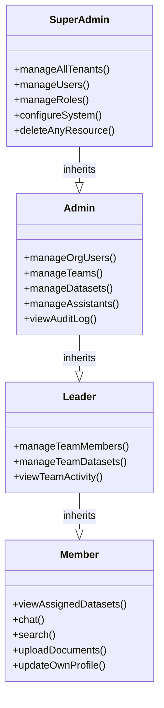

# SRS — User & Team Management

| Field   | Value      |
|---------|------------|
| Parent  | [SRS Index](./index.md) |
| Version | 1.0        |
| Date    | 2026-03-21 |

## 1. Overview

B-Knowledge provides multi-tenant user and team management with role-based access control (RBAC) and attribute-based access control (ABAC). Each tenant (organisation) maintains isolated users, teams, roles, and permissions.

## 2. Use Case Diagram

```mermaid
flowchart TD
    subgraph Actors
        SA[Super Admin]
        OA[Org Admin]
        TL[Team Leader]
        MB[Member]
    end

    subgraph User Management
        UC1[Create user]
        UC2[Update user profile]
        UC3[Deactivate user]
        UC4[Assign role]
        UC5[View user list]
    end

    subgraph Team Management
        UC6[Create team]
        UC7[Update team]
        UC8[Delete team]
        UC9[Add team member]
        UC10[Remove team member]
        UC11[Assign team leader]
    end

    subgraph Access Control
        UC12[Define RBAC permissions]
        UC13[Set ABAC policies]
        UC14[Track IP addresses]
    end

    SA --> UC1 & UC3 & UC4 & UC12 & UC13
    OA --> UC1 & UC2 & UC5 & UC6 & UC7 & UC8 & UC9 & UC10 & UC11
    TL --> UC5 & UC9 & UC10
    MB --> UC2
    SA --> UC14
```

## 3. Functional Requirements — User Management

| ID       | Requirement               | Description                                                                                     | Priority |
|----------|---------------------------|-------------------------------------------------------------------------------------------------|----------|
| USR-001  | Create user               | Admin creates a user with email, display name, and role within the current tenant                | Must     |
| USR-002  | Update user profile       | Users update their own display name and avatar; admins can update any user                       | Must     |
| USR-003  | Deactivate user           | Admin deactivates a user, revoking all active sessions immediately                               | Must     |
| USR-004  | Assign role               | Admin assigns one of four roles to a user within the tenant                                      | Must     |
| USR-005  | View user list            | Paginated, filterable list of users within the tenant; leaders see only their team members        | Must     |
| USR-006  | Bulk import users         | Admin imports users via CSV with email and role columns                                          | Should   |
| USR-007  | User search               | Search users by name or email with debounced autocomplete                                        | Should   |
| USR-008  | Track login IP            | Record IP address on each login; display last 10 IPs in user detail                              | Must     |
| USR-009  | Delete user               | Super-admin permanently deletes a user and all associated data; requires re-authentication        | Must     |

## 4. Functional Requirements — Team Management

| ID       | Requirement               | Description                                                                                     | Priority |
|----------|---------------------------|-------------------------------------------------------------------------------------------------|----------|
| TEAM-001 | Create team               | Admin creates a team with name, description, and optional parent team                            | Must     |
| TEAM-002 | Update team               | Admin or leader updates team name and description                                                | Must     |
| TEAM-003 | Delete team               | Admin deletes a team; members are unassigned, not deleted                                        | Must     |
| TEAM-004 | Add member                | Admin or leader adds existing users to the team                                                  | Must     |
| TEAM-005 | Remove member             | Admin or leader removes a user from the team                                                     | Must     |
| TEAM-006 | Assign team leader        | Admin promotes a team member to leader role for that team                                        | Must     |
| TEAM-007 | List team members         | Paginated list of team members with role and join date                                           | Must     |
| TEAM-008 | Nested teams              | Teams can have parent-child relationships for hierarchical org structures                         | Could    |

## 5. Functional Requirements — Access Control

| ID       | Requirement               | Description                                                                                     | Priority |
|----------|---------------------------|-------------------------------------------------------------------------------------------------|----------|
| RBAC-001 | Role-based permissions    | Each role has a predefined set of permissions enforced at API middleware level                    | Must     |
| RBAC-002 | Permission check API      | Backend middleware validates role permissions before executing any protected action               | Must     |
| ABAC-001 | Attribute-based policies  | Policies based on user attributes (team, IP range, time-of-day) for fine-grained access          | Should   |
| ABAC-002 | Dataset access policies   | Control which users/teams can access specific datasets via ABAC rules                            | Must     |

## 6. Role Hierarchy

### Permission Matrix

| Permission             | Super Admin | Admin | Leader | Member |
|------------------------|:-----------:|:-----:|:------:|:------:|
| Manage tenants         | Yes         | No    | No     | No     |
| Manage all users       | Yes         | Yes   | No     | No     |
| Manage teams           | Yes         | Yes   | Own    | No     |
| Manage datasets        | Yes         | Yes   | Team   | No     |
| Manage assistants      | Yes         | Yes   | Team   | No     |
| Upload documents       | Yes         | Yes   | Yes    | Yes    |
| Chat / search          | Yes         | Yes   | Yes    | Yes    |
| View audit log         | Yes         | Yes   | No     | No     |
| System configuration   | Yes         | No    | No     | No     |

## 7. Business Rules

| Rule | Description |
|------|-------------|
| BR-USR-01 | All user-scoped API endpoints enforce tenant isolation — users cannot access resources outside their active tenant |
| BR-USR-02 | IDOR prevention: object references are validated against the requesting user's tenant and permissions |
| BR-USR-03 | Role changes require re-authentication from the performing admin (within 5-minute window) |
| BR-USR-04 | Deactivating a user immediately invalidates all their sessions in Valkey |
| BR-USR-05 | Deleting a team cascades: members are unassigned from the team but user accounts are preserved |
| BR-USR-06 | A user can belong to multiple teams but holds one role per tenant |
| BR-USR-07 | Super-admin role can only be assigned by another super-admin |
| BR-USR-08 | User deletion is a hard delete with 30-day soft-delete grace period for recovery |
| BR-USR-09 | IP tracking records are retained for 90 days for audit compliance |
| BR-USR-10 | Bulk import validates email uniqueness within tenant before creating any records (atomic operation) |
