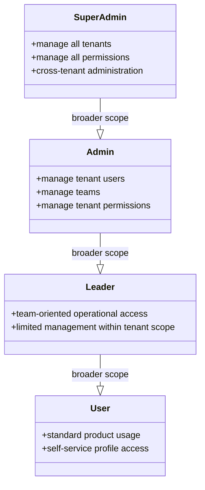
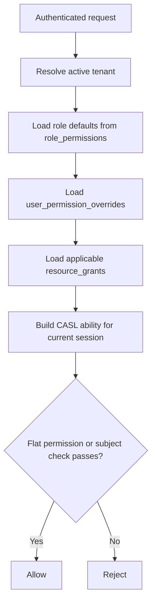

# SRS — User & Team Management

| Field   | Value      |
|---------|------------|
| Parent  | [SRS Index](./index.md) |
| Version | 1.1        |
| Date    | 2026-04-12 |

## 1. Overview

B-Knowledge provides tenant-scoped user and team management backed by the current permission-system milestone. User access is no longer defined by the legacy `member` role narrative or by a static RBAC document. Instead, the product combines:

- a four-role tenant model: `super-admin`, `admin`, `leader`, `user`
- a DB-backed permission catalog synchronized from the backend registry
- per-user allow and deny overrides
- row-scoped resource grants for protected resources
- CASL ability checks for row-level enforcement at runtime

This page defines the product requirements for user, team, and access-management behavior. Implementation detail and maintenance workflow are described in [Auth: RBAC & ABAC Permission Model](/detail-design/auth/rbac-abac), [RBAC & ABAC: Comprehensive Authorization Reference](/detail-design/auth/rbac-abac-comprehensive), [User Management Overview](/detail-design/user-team/user-management-overview), and [User Management: Step-by-Step Detail](/detail-design/user-team/user-management-detail).

## 2. Use Case Diagram

```mermaid
flowchart TD
    subgraph Actors
        SA[Super Admin]
        AD[Admin]
        LD[Leader]
        US[User]
    end

    subgraph User Management
        U1[Create user]
        U2[Update user profile]
        U3[Deactivate user]
        U4[Assign tenant role]
        U5[View user list]
    end

    subgraph Team Management
        T1[Create team]
        T2[Update team]
        T3[Delete team]
        T4[Add team member]
        T5[Remove team member]
    end

    subgraph Permission Management
        P1[Review permission catalog]
        P2[Replace role permissions]
        P3[Create user override]
        P4[Create resource grant]
        P5[Review effective access]
    end

    SA --> U1 & U3 & U4 & P1 & P2 & P3 & P4 & P5
    AD --> U1 & U2 & U4 & U5 & T1 & T2 & T3 & T4 & T5 & P1 & P2 & P3 & P4 & P5
    LD --> U5 & T2 & T4 & T5
    US --> U2
```

## 3. Functional Requirements — User Management

| ID       | Requirement | Description | Priority |
|----------|-------------|-------------|----------|
| USR-001  | Create user | Admin creates a user inside the current tenant with email, profile data, and one tenant role from the active role set. | Must |
| USR-002  | Update user profile | Users can update self-service profile fields; administrators can update tenant-scoped user records they are authorized to manage. | Must |
| USR-003  | Deactivate user | Admin can deactivate a user and the platform must invalidate permission-bearing sessions so the user cannot continue operating with stale access. | Must |
| USR-004  | Assign tenant role | Admin can assign `admin`, `leader`, or `user` inside the current tenant; `super-admin` remains a protected platform role. | Must |
| USR-005  | View user list | The system provides a paginated, tenant-scoped user directory; returned data must respect authentication and authorization checks. | Must |
| USR-006  | Review effective access | Authorized admins can inspect the effective access a user receives from role defaults, overrides, and resource grants. | Must |
| USR-007  | Override user permissions | Authorized admins can add explicit allow or deny rows for a single user without creating a new tenant role. | Must |
| USR-008  | Audit permission changes | Role changes, overrides, and grant mutations must be auditable so administrators can trace who changed access and when. | Must |

## 4. Functional Requirements — Team Management

| ID       | Requirement | Description | Priority |
|----------|-------------|-------------|----------|
| TEAM-001 | Create team | Admin creates a team within the current tenant. | Must |
| TEAM-002 | Update team | Admin or otherwise authorized leaders can update team metadata inside tenant boundaries. | Must |
| TEAM-003 | Delete team | Admin deletes a team without deleting the underlying user accounts. | Must |
| TEAM-004 | Add team member | Admin or otherwise authorized leaders can add an existing tenant user to a team. | Must |
| TEAM-005 | Remove team member | Admin or otherwise authorized leaders can remove a user from a team. | Must |
| TEAM-006 | Team-scoped access inputs | Team membership remains a valid access input for permission evaluation and future grant expansion, even when final access is enforced through the central permission engine. | Must |

## 5. Functional Requirements — Permission Model

| ID        | Requirement | Description | Priority |
|-----------|-------------|-------------|----------|
| PERM-001  | Registry-backed catalog | The canonical permission catalog must come from the backend registry and be synchronized into persistent storage for runtime use and admin discovery. | Must |
| PERM-002  | Role defaults | Tenant roles receive their default permission set from `role_permissions`, not from a static source file documented as the live source of truth. | Must |
| PERM-003  | User overrides | The platform supports per-user allow and deny overrides stored separately from role defaults so exceptions can be managed without inventing extra roles. | Must |
| PERM-004  | Resource grants | The platform supports row-scoped grants through the shared resource-grant model for protected resources, with Knowledge Base grant management active today and the same model shaping Document Category access surfaces. | Must |
| PERM-005  | Permission admin API | Permission management surfaces are exposed through `/api/permissions/` endpoints for catalog lookup, role replacement, user overrides, grants, and effective-access inspection, with dedicated admin permission surfaces such as `permissions.view` and `permissions.manage`. | Must |
| PERM-006  | Flat and row-scoped enforcement | Permission evaluation must support both flat capability checks and row-scoped subject checks so tenant-wide actions and resource-level access use the same permission engine. | Must |
| PERM-007  | Tenant isolation | Roles, overrides, and grants must remain tenant-scoped unless the caller is a platform-level `super-admin`. | Must |

## 6. Current Role Model

### Role Requirements

| Role | Scope | Requirements |
|------|-------|--------------|
| `super-admin` | Platform-wide | May manage all tenants and bypass tenant scoping where platform administration requires it. |
| `admin` | Current tenant | May manage tenant users, teams, and permission administration surfaces exposed to tenant administrators. |
| `leader` | Current tenant | Receives a narrower tenant-scoped permission set than admin and does not become the canonical source of permissions by role name alone. |
| `user` | Current tenant | Receives the base end-user access set and can be extended or restricted through overrides and grants. |

## 7. Permission Resolution Requirements

### Resolution Rules

| Rule | Description |
|------|-------------|
| BR-PERM-01 | The active tenant determines which role assignments, overrides, and grants participate in access evaluation for non-super-admin users. |
| BR-PERM-02 | The permission catalog must remain discoverable to backend and frontend admin surfaces without requiring maintainers to hardcode parallel permission lists. |
| BR-PERM-03 | Per-user deny overrides must be able to narrow access granted earlier by role defaults or resource grants. |
| BR-PERM-04 | Resource grants must be row-scoped and must not widen access outside the tenant or outside the granted resource identifier. |
| BR-PERM-05 | Registry-driven admin screens must expose permission management based on the current catalog rather than a manually maintained static matrix. |
| BR-PERM-06 | Historical legacy aliases such as `member` may appear only as migration context; they are not valid current-state roles for new requirements. |

## 8. Business Rules

| Rule | Description |
|------|-------------|
| BR-USR-01 | All user and team APIs enforce tenant isolation; users cannot operate on records outside the active tenant unless they are `super-admin`. |
| BR-USR-02 | User role changes, overrides, and resource grants must take effect through session and ability invalidation so stale access is not retained indefinitely. |
| BR-USR-03 | The live permission model is the registry-backed catalog plus runtime ability evaluation, not `rbac.ts` described as the operational source of truth. |
| BR-USR-04 | Team membership remains part of the domain model, but permission enforcement must be expressed through the shared permission engine rather than isolated team-only rule tables. |
| BR-USR-05 | Permission-management endpoints and UI surfaces must be restricted to authorized administrators through dedicated permission keys such as `permissions.view` and `permissions.manage`. |
| BR-USR-06 | Knowledge Base and related resource access must be represented through the shared grant vocabulary so the permission model stays extensible. |
