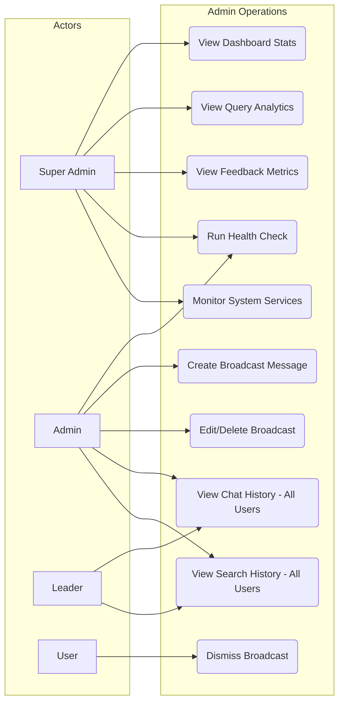
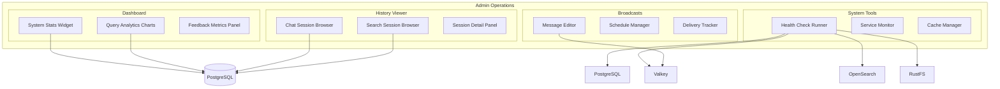

# FR-ADMIN-OPERATIONS: Admin Operations Functional Requirements

## 1. Overview

Admin Operations encompasses the dashboard analytics, system monitoring tools, broadcast messaging, and cross-user history viewing capabilities available to privileged roles.

## 2. Use Case Diagram

## 3. Functional Requirements

### 3.1 Dashboard & Analytics

| ID | Requirement | Priority | Description |
|----|-------------|----------|-------------|
| ADM-01 | System Statistics | Must | Display total users, datasets, documents, conversations, and search queries |
| ADM-02 | Query Analytics | Must | Show query volume over time (daily/weekly/monthly) with trend charts |
| ADM-03 | Feedback Metrics | Should | Aggregate thumbs-up/down counts across chat and search for quality tracking |
| ADM-04 | Top Queries Report | Should | List most frequent search queries and chat topics within a date range |
| ADM-05 | Usage by Dataset | Could | Break down query volume and feedback per knowledge base dataset |

### 3.2 System Tools

| ID | Requirement | Priority | Description |
|----|-------------|----------|-------------|
| ADM-06 | Health Check | Must | Verify connectivity to PostgreSQL, Valkey, OpenSearch, and RustFS |
| ADM-07 | Service Monitoring | Should | Display status and uptime of backend, RAG worker, and converter services |
| ADM-08 | Cache Management | Could | View and clear Valkey cache entries for troubleshooting |

### 3.3 Broadcast Messages

| ID | Requirement | Priority | Description |
|----|-------------|----------|-------------|
| ADM-09 | Broadcast CRUD | Must | Create, edit, and delete broadcast messages with title, content, and active date range |
| ADM-10 | Active Serving | Must | Serve active broadcasts to all users on login and dashboard |
| ADM-11 | User Dismissal | Must | Allow users to dismiss a broadcast; dismissed state persists per user |
| ADM-12 | Broadcast Scheduling | Should | Schedule broadcasts with start and end dates for automatic activation |

### 3.4 History Viewing

| ID | Requirement | Priority | Description |
|----|-------------|----------|-------------|
| ADM-13 | Chat Session History | Must | Browse chat conversations of all users within the tenant with filtering |
| ADM-14 | Search Session History | Must | Browse search sessions of all users within the tenant with filtering |
| ADM-15 | Session Detail View | Should | View full message thread or search results for a selected session |

## 4. Admin Features Component Diagram

## 5. Business Rules

| ID | Rule |
|----|------|
| BR-01 | Dashboard analytics (system stats, query analytics, feedback metrics) are restricted to **Super Admin** only |
| BR-02 | Broadcast message management requires the **manage_system** permission (Admin role) |
| BR-03 | All users can view and dismiss active broadcasts; dismissal is stored per user per broadcast |
| BR-04 | Chat and search history viewing is available to **Admin** and **Leader** roles within their tenant |
| BR-05 | History viewing is read-only; admins cannot modify or delete user conversations/searches |
| BR-06 | Health check results include service name, status (healthy/unhealthy), and response latency |
| BR-07 | Broadcast messages with an expired end date are automatically hidden from users |
| BR-08 | Analytics date range defaults to the last 30 days; maximum queryable range is 1 year |
| BR-09 | All admin operations are audit-logged with the performing user, action, and timestamp |
| BR-10 | System stats are cached in Valkey for 5 minutes to avoid expensive real-time aggregation |
