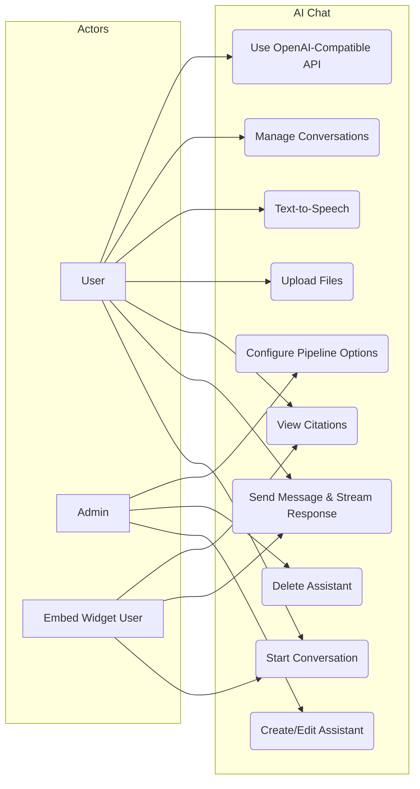
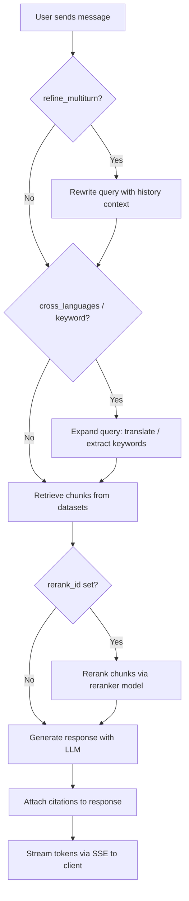

# FR-AI-CHAT: AI Chat Functional Requirements

## 1. Overview

AI Chat provides multi-turn RAG-powered conversations with configurable retrieval pipelines, citation support, and streaming responses. Users interact via web UI or an OpenAI-compatible API.

## 2. Use Case Diagram

## 3. Functional Requirements

| ID | Requirement | Priority | Description |
|----|-------------|----------|-------------|
| CHAT-01 | Assistant CRUD | Must | Create, read, update, delete chat assistants with name, prompt, and pipeline config |
| CHAT-02 | Assistant Configuration | Must | Configure retrieval pipeline options, linked datasets, and LLM model per assistant |
| CHAT-03 | Conversation Create | Must | Start a new conversation scoped to an assistant |
| CHAT-04 | Conversation List/Delete | Must | List user conversations with pagination; delete conversations and their messages |
| CHAT-05 | Message Streaming | Must | Stream assistant responses via SSE as tokens are generated |
| CHAT-06 | Citation Display | Must | Return source chunk references with each response; link to original documents |
| CHAT-07 | File Upload | Should | Accept image and PDF uploads within a conversation for inline context |
| CHAT-08 | Text-to-Speech | Should | Convert assistant text responses to audio via configured TTS model |
| CHAT-09 | OpenAI-Compatible API | Should | Expose `/v1/chat/completions` endpoint accepting standard OpenAI request format |
| CHAT-10 | Conversation Rename | Could | Allow users to rename conversations |
| CHAT-11 | Message Feedback | Should | Users can thumbs-up/down individual messages for quality tracking |
| CHAT-12 | Deep Research Mode | Could | Multi-step iterative research with extended token budget |

## 4. Configurable Pipeline Steps

| Step | Config Key | Type | Default | Description |
|------|-----------|------|---------|-------------|
| Multi-turn Refinement | `refine_multiturn` | boolean [OPTIONAL] | false | Rewrite user query using conversation history for standalone clarity |
| Cross-Language Expansion | `cross_languages` | boolean [OPTIONAL] | false | Translate query into additional languages for multilingual retrieval |
| Keyword Extraction | `keyword` | boolean [OPTIONAL] | false | Extract keywords from query for BM25 boosting |
| Knowledge Graph | `use_kg` | boolean [OPTIONAL] | false | Enrich retrieval with knowledge graph entity lookups |
| Reasoning Mode | `reasoning` | boolean [OPTIONAL] | false | Enable chain-of-thought reasoning in generation |
| Web Search | `tavily_api_key` | string [OPTIONAL] | null | Enable Tavily web search augmentation when API key is provided |
| Reranking | `rerank_id` | string [OPTIONAL] | null | Rerank retrieved chunks using specified reranker model |
| RBAC Datasets | `allow_rbac_datasets` | boolean [OPTIONAL] | false | Restrict retrieval to datasets the user has explicit access to |
| Empty Response | `empty_response` | string [OPTIONAL] | "" | Custom fallback message when no relevant chunks are found |

## 5. High-Level Message Flow

## 6. Business Rules

| ID | Rule |
|----|------|
| BR-01 | All assistant responses MUST be streamed via Server-Sent Events (SSE); no buffered responses |
| BR-02 | Conversation history sent to LLM is capped at the last **6 user-assistant message pairs** (12 messages) |
| BR-03 | Deep Research mode budget: max **50,000 tokens**, **15 LLM calls**, and **3 levels** of iterative depth |
| BR-04 | Assistants are scoped to a tenant; users can only access assistants within their tenant |
| BR-05 | File uploads are limited to images (PNG, JPG, GIF, WebP) and PDFs; max size governed by system config |
| BR-06 | The OpenAI-compatible API authenticates via API token and maps to an existing assistant |
| BR-07 | When `empty_response` is set and retrieval returns zero chunks, the system returns the configured fallback instead of calling the LLM |
| BR-08 | Citations reference specific chunk IDs, document names, and page numbers where available |
| BR-09 | Conversations and messages are soft-deleted to support admin audit history viewing |
