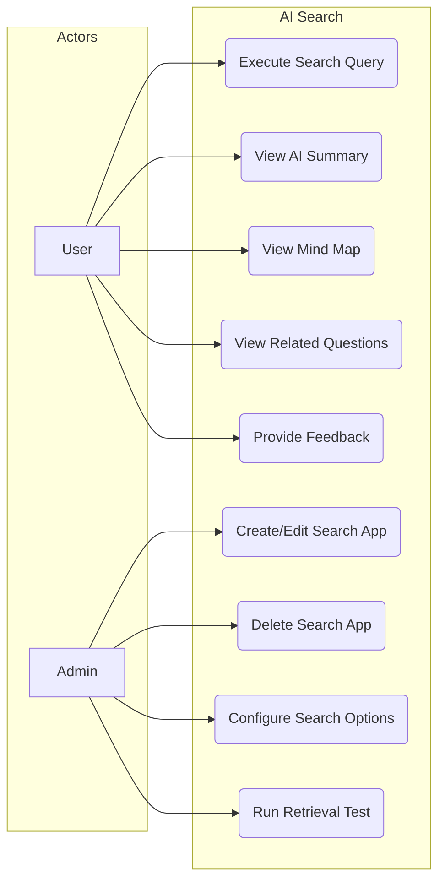
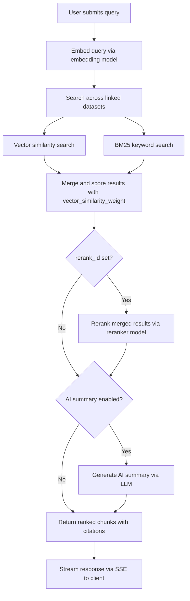

# FR-AI-SEARCH: AI Search Functional Requirements

## 1. Overview

AI Search provides hybrid retrieval (vector + BM25) across knowledge base datasets, with optional AI-generated summaries streamed via SSE, mind map visualization, and related question suggestions.

## 2. Use Case Diagram

## 3. Functional Requirements

| ID | Requirement | Priority | Description |
|----|-------------|----------|-------------|
| SRCH-01 | Search App CRUD | Must | Create, read, update, delete search applications with name, linked datasets, and config |
| SRCH-02 | Search App Configuration | Must | Configure LLM, reranker, similarity threshold, and retrieval strategy per app |
| SRCH-03 | Full-Text Search | Must | BM25-based keyword search across OpenSearch indices |
| SRCH-04 | Semantic Search | Must | Vector similarity search using embedded query against chunk embeddings |
| SRCH-05 | Hybrid Search | Must | Combine vector and BM25 scores with configurable weight for ranking |
| SRCH-06 | AI Summary Streaming | Should | Generate and stream an AI summary of top results via SSE |
| SRCH-07 | Mind Map Generation | Should | Produce a hierarchical mind map structure from search results |
| SRCH-08 | Related Questions | Should | Suggest follow-up questions based on query and retrieved content |
| SRCH-09 | Search Feedback | Should | Allow users to rate search result relevance (thumbs up/down) |
| SRCH-10 | Retrieval Test | Must | Admin tool to test retrieval quality: run query, inspect chunks, scores, and ranking |
| SRCH-11 | Metadata Filtering | Could | Filter results by document metadata (tags, source, date) before ranking |
| SRCH-12 | Search History | Could | Persist user search queries for analytics and re-execution |

## 4. Configurable Options

| Option | Config Key | Type | Required | Description |
|--------|-----------|------|----------|-------------|
| LLM Model | `llm_id` | string | Yes | Model used for AI summary generation |
| Reranker | `rerank_id` | string [OPTIONAL] | No | Reranker model for result re-scoring |
| Related Questions | `enable_related_questions` | boolean [OPTIONAL] | No | Toggle related question suggestions |
| Metadata Filter | `metadata_filter` | object [OPTIONAL] | No | Pre-filter documents by metadata before retrieval |
| Similarity Threshold | `similarity_threshold` | float [OPTIONAL] | No | Minimum similarity score to include a chunk (default 0.2) |
| Vector Weight | `vector_similarity_weight` | float [OPTIONAL] | No | Weight of vector score in hybrid ranking (0.0-1.0, default 0.3) |

## 5. Search Execution Flow

## 6. Business Rules

| ID | Rule |
|----|------|
| BR-01 | A search app can link a maximum of **20 knowledge base datasets** |
| BR-02 | Title field matches receive a **10x boost** factor in BM25 scoring |
| BR-03 | Important keyword matches receive a **30x boost** factor in BM25 scoring |
| BR-04 | AI summaries are streamed via SSE; the client renders tokens incrementally |
| BR-05 | Search apps are tenant-scoped; users only see apps within their tenant |
| BR-06 | The retrieval test tool is restricted to admin and leader roles |
| BR-07 | Mind map generation requires a successful search with at least 3 result chunks |
| BR-08 | Feedback entries are linked to the search session and used for analytics |
| BR-09 | When `similarity_threshold` is set, chunks scoring below the threshold are excluded before reranking |
| BR-10 | Hybrid scoring formula: `final = vector_similarity_weight * vector_score + (1 - vector_similarity_weight) * bm25_score` |
