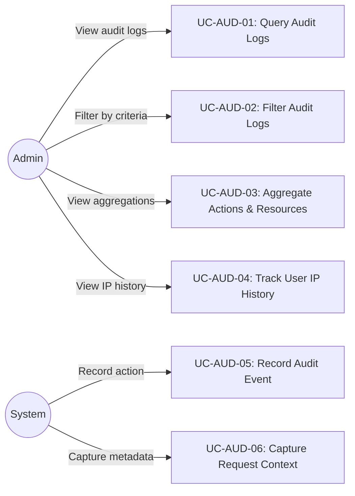
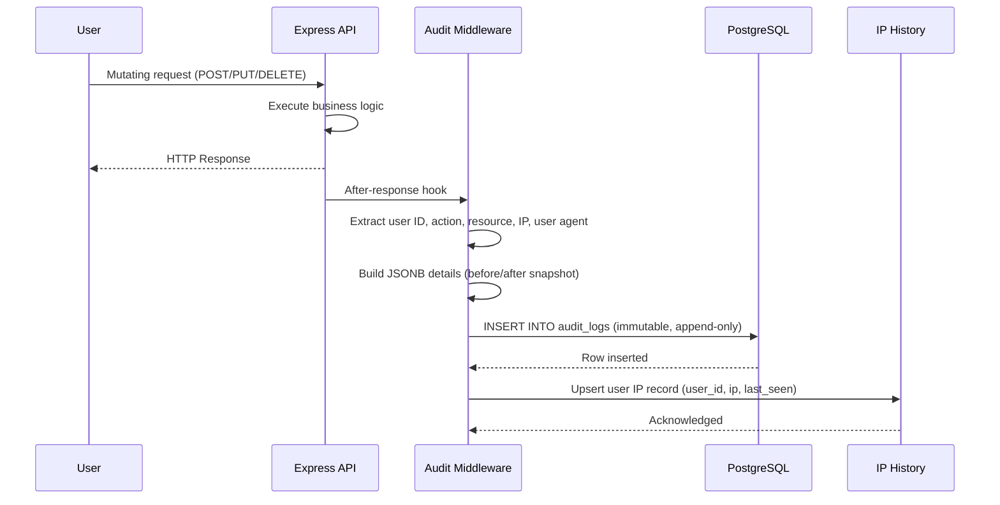
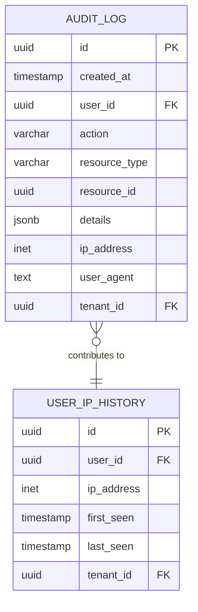

# FR: Audit & Compliance

## 1. Overview

This document specifies the functional requirements for the B-Knowledge audit and compliance subsystem. The system maintains an immutable, append-only audit trail of all significant user and system actions, enabling administrators to investigate activity, meet compliance obligations, and track user access patterns.

## 2. Actors & Use Cases

## 3. Functional Requirements

### 3.1 Audit Log Recording

| ID | Requirement | Priority | Notes |
|----|-------------|----------|-------|
| AUD-FR-01 | System SHALL record an audit log entry for every mutating API action (create, update, delete) | Must | Middleware-driven, not optional |
| AUD-FR-02 | Each audit entry SHALL include: timestamp, user ID, action type, resource type, resource ID, JSONB details, IP address, user agent | Must | JSONB stores before/after snapshots |
| AUD-FR-03 | Audit log entries SHALL be immutable once written (no UPDATE or DELETE operations permitted) | Must | Enforced at application and DB policy level |
| AUD-FR-04 | System SHALL capture the originating IP address and user agent from the request context | Must | Forwarded headers supported for proxied deployments |
| AUD-FR-05 | Audit recording SHALL NOT block the primary request response | Should | Async insert or fire-and-forget pattern |

### 3.2 Audit Log Querying & Filtering

| ID | Requirement | Priority | Notes |
|----|-------------|----------|-------|
| AUD-FR-10 | Admin SHALL be able to filter audit logs by date range (from/to) | Must | Inclusive bounds |
| AUD-FR-11 | Admin SHALL be able to filter audit logs by user ID | Must | Dropdown populated from distinct users |
| AUD-FR-12 | Admin SHALL be able to filter audit logs by action type | Must | e.g., create, update, delete, login |
| AUD-FR-13 | Admin SHALL be able to filter audit logs by resource type | Must | e.g., document, dataset, user, connector |
| AUD-FR-14 | Admin SHALL be able to perform text search across audit log details | Should | JSONB containment or full-text |
| AUD-FR-15 | Results SHALL be paginated with configurable page size | Must | Default 20, max 100 |

### 3.3 Aggregation

| ID | Requirement | Priority | Notes |
|----|-------------|----------|-------|
| AUD-FR-20 | System SHALL provide a list of distinct action types present in the audit log | Must | Used to populate filter dropdowns |
| AUD-FR-21 | System SHALL provide a list of distinct resource types present in the audit log | Must | Used to populate filter dropdowns |

### 3.4 IP History Tracking

| ID | Requirement | Priority | Notes |
|----|-------------|----------|-------|
| AUD-FR-30 | System SHALL maintain a per-user IP access history | Must | Derived from audit log or dedicated table |
| AUD-FR-31 | Admin SHALL be able to view all IP addresses a user has accessed the system from | Must | Sorted by last seen timestamp |
| AUD-FR-32 | IP history SHALL include first-seen and last-seen timestamps per IP per user | Should | Useful for anomaly detection |

## 4. Sequence Diagram: Audit Event Recording

## 5. Data Model

## 6. Business Rules

| Rule ID | Rule | Rationale |
|---------|------|-----------|
| AUD-BR-01 | No DELETE or UPDATE operations are permitted on the `audit_logs` table | Immutability guarantee for compliance |
| AUD-BR-02 | Only users with `admin` role may access audit log endpoints | Sensitive operational data |
| AUD-BR-03 | Audit entries are scoped to the current tenant | Multi-tenant isolation |
| AUD-BR-04 | JSONB details field stores structured before/after data, not free text | Enables structured querying |
| AUD-BR-05 | Audit log retention is unbounded by default; archival is out of scope for v1 | Future enhancement |
| AUD-BR-06 | Failed authentication attempts SHALL also be logged | Security monitoring |

## 7. API Endpoints

| Method | Path | Description | Auth |
|--------|------|-------------|------|
| GET | `/api/audit-logs` | List audit logs with filters and pagination | Admin |
| GET | `/api/audit-logs/actions` | Distinct action types | Admin |
| GET | `/api/audit-logs/resource-types` | Distinct resource types | Admin |
| GET | `/api/audit-logs/ip-history/:userId` | IP history for a user | Admin |
