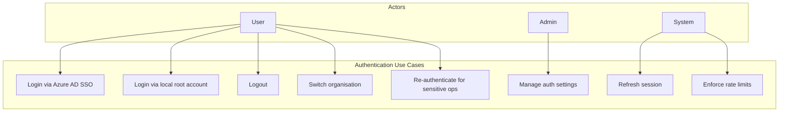
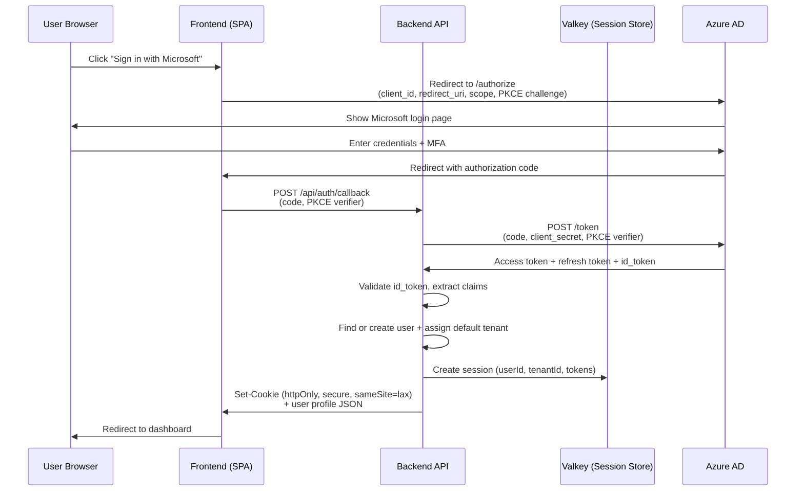
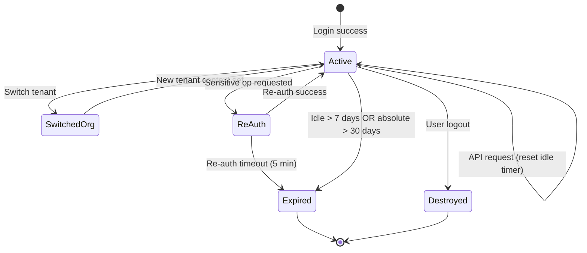

# SRS — Authentication

| Field   | Value      |
|---------|------------|
| Parent  | [SRS Index](./index.md) |
| Version | 1.0        |
| Date    | 2026-03-21 |

## 1. Overview

B-Knowledge supports two authentication methods: Azure AD Single Sign-On (primary) and local root login (fallback). Sessions are server-side, stored in Valkey, and scoped to a single tenant at a time with the ability to switch organisations.

## 2. Use Case Diagram

## 3. Functional Requirements

| ID       | Requirement                          | Description                                                                                       | Priority |
|----------|--------------------------------------|---------------------------------------------------------------------------------------------------|----------|
| AUTH-001 | Azure AD SSO login                   | Users authenticate via OAuth 2.0 Authorization Code flow with PKCE against Azure AD               | Must     |
| AUTH-002 | Local root login                     | A single root account can log in with email/password when `ENABLE_LOCAL_LOGIN=true`                | Must     |
| AUTH-003 | Session creation                     | On successful auth, create a server-side session in Valkey with a secure HTTP-only cookie          | Must     |
| AUTH-004 | Session persistence                  | Sessions survive server restarts (stored in Valkey, not in-memory)                                 | Must     |
| AUTH-005 | Session expiry                       | Sessions expire after 7 days of inactivity; absolute max lifetime 30 days                         | Must     |
| AUTH-006 | Logout                               | Destroy session in Valkey and clear cookie; optionally trigger Azure AD front-channel logout        | Must     |
| AUTH-007 | Multi-org switching                  | Authenticated users can switch active tenant without re-login; session retains new tenant context   | Must     |
| AUTH-008 | Re-authentication                    | Sensitive operations (role change, delete org) require password/SSO re-verification within 5 min    | Should   |
| AUTH-009 | Token refresh                        | System refreshes Azure AD tokens before expiry using refresh token grant                           | Must     |
| AUTH-010 | Auth rate limiting                   | Limit authentication endpoints to 20 requests per 15-minute window per IP                          | Must     |
| AUTH-011 | Login event logging                  | Record all login attempts (success/failure) with IP, user agent, and timestamp in audit log         | Must     |
| AUTH-012 | Disable local login in production    | When `ENABLE_LOCAL_LOGIN=false`, local login endpoint returns 403                                  | Must     |

## 4. Azure AD OAuth 2.0 Flow

## 5. Session Lifecycle

## 6. Business Rules

| Rule | Description |
|------|-------------|
| BR-AUTH-01 | Session idle TTL is 7 days; configurable via `SESSION_IDLE_TTL_DAYS` env var |
| BR-AUTH-02 | Session absolute TTL is 30 days regardless of activity |
| BR-AUTH-03 | Auth endpoints rate-limited to 20 requests per 15 minutes per IP address |
| BR-AUTH-04 | Failed login attempts are logged with IP for security audit |
| BR-AUTH-05 | Local root login is disabled by default in production (`ENABLE_LOCAL_LOGIN=false`) |
| BR-AUTH-06 | Session cookie flags: `httpOnly`, `secure` (when HTTPS), `sameSite=lax` |
| BR-AUTH-07 | Azure AD refresh tokens are rotated on each use; old tokens are invalidated |
| BR-AUTH-08 | Multi-org switch does not require re-authentication but is logged in audit trail |
| BR-AUTH-09 | Re-authentication window for sensitive ops is 5 minutes from last verification |
| BR-AUTH-10 | All auth-related API responses use constant-time comparison to prevent timing attacks |

## 7. Security Considerations

- All authentication traffic must use HTTPS in production.
- Passwords for local root account are hashed with bcrypt (cost factor 12).
- CSRF protection via `sameSite` cookie attribute and origin validation.
- Azure AD client secret is stored in environment variables, never in code or database.
- Session IDs are cryptographically random (256-bit entropy).
