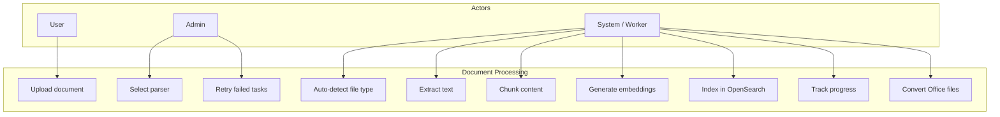
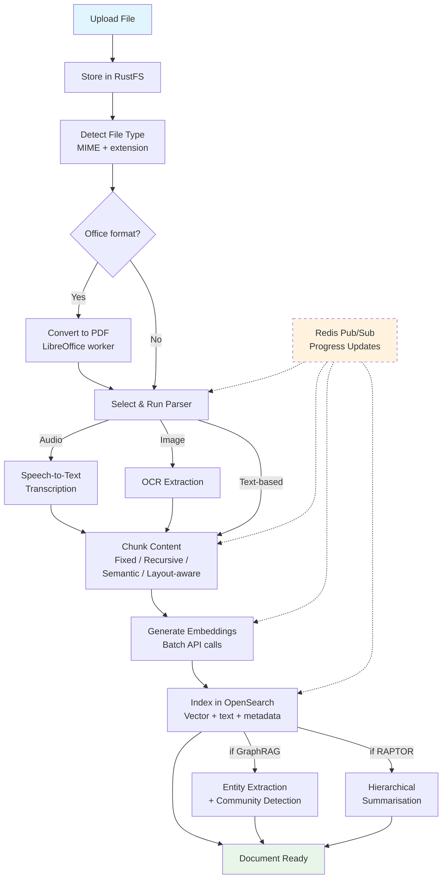

# SRS — Document Processing

| Field   | Value      |
|---------|------------|
| Parent  | [SRS Index](./index.md) |
| Version | 1.0        |
| Date    | 2026-03-21 |

## 1. Overview

Document processing is the core pipeline that transforms raw files into searchable, retrievable knowledge. It spans parsing (text extraction), chunking (segmentation), embedding (vectorisation), and indexing (storage in OpenSearch). The pipeline is executed by the Python RAG Worker with job orchestration via Redis/Valkey.

## 2. Use Case Diagram

## 3. Functional Requirements

| ID       | Requirement                | Description                                                                          | Priority |
|----------|----------------------------|--------------------------------------------------------------------------------------|----------|
| DOC-001  | File upload                | Accept files via multipart upload; store originals in RustFS (S3)                    | Must     |
| DOC-002  | File type detection        | Auto-detect MIME type and map to appropriate parser                                  | Must     |
| DOC-003  | Parser selection           | User can override auto-detected parser; 18 parser types available                    | Must     |
| DOC-004  | Text extraction            | Parser extracts structured text, tables, and metadata from the document              | Must     |
| DOC-005  | Office conversion          | DOCX/XLSX/PPTX/DOC/XLS/PPT are converted to PDF via LibreOffice before parsing      | Must     |
| DOC-006  | Chunking                   | Split extracted text into chunks using the configured strategy                       | Must     |
| DOC-007  | Embedding generation       | Generate vector embeddings for each chunk using the configured model                 | Must     |
| DOC-008  | Vector indexing            | Store chunk text + vector + metadata in OpenSearch                                   | Must     |
| DOC-009  | Progress tracking          | Publish progress updates via Redis pub/sub; frontend displays real-time progress bar | Must     |
| DOC-010  | Retry failed tasks         | Failed tasks can be retried manually; auto-retry up to 3 times with backoff          | Must     |
| DOC-011  | Concurrent task limits     | Limit concurrent processing tasks per tenant to prevent resource starvation          | Must     |
| DOC-012  | Cancellation               | Users can cancel in-progress processing tasks                                        | Should   |
| DOC-013  | Partial re-processing      | Re-run specific pipeline stages (e.g., re-chunk without re-parsing)                  | Should   |
| DOC-014  | Batch processing           | Process multiple documents in parallel within concurrency limits                     | Must     |

## 4. Parser Types

| # | Parser    | Target Content                           | Key Capability                              |
|---|-----------|------------------------------------------|---------------------------------------------|
| 1 | naive     | General text documents                   | Basic text extraction, universal fallback    |
| 2 | code      | Source code files                        | Language-aware splitting, syntax preservation|
| 3 | book      | Long-form books (EPUB, PDF)             | Chapter detection, ToC-based splitting       |
| 4 | paper     | Academic papers (PDF)                    | Abstract/section extraction, citation parsing|
| 5 | manual    | Technical manuals                        | Section hierarchy, cross-reference handling  |
| 6 | table     | Spreadsheets, CSV, structured tables     | Row/column extraction, header detection      |
| 7 | qa        | FAQ and Q&A documents                    | Question-answer pair extraction              |
| 8 | resume    | CVs and resumes                          | Section extraction (education, experience)   |
| 9 | laws      | Legal documents, regulations             | Article/clause numbering, cross-references   |
| 10| email     | Email threads (EML, MSG)                 | Thread extraction, metadata parsing          |
| 11| audio     | Audio files (MP3, WAV)                   | Speech-to-text transcription, then chunking  |
| 12| clinical  | Clinical/medical documents               | PHI-aware extraction, section detection      |
| 13| picture   | Images (PNG, JPG, TIFF)                  | OCR text extraction, caption detection       |
| 14| presentation | Slide decks (PPTX, PDF)              | Slide-by-slide extraction, speaker notes     |
| 15| adr       | Architecture Decision Records            | Status/context/decision structured parsing   |
| 16| openapi   | OpenAPI/Swagger specifications           | Endpoint extraction, schema parsing          |
| 17| one       | OneNote exports                          | Section/page hierarchy extraction            |
| 18| tag       | Tagged/annotated documents               | Tag-based segmentation and metadata          |

## 5. Chunking Strategies

| Strategy       | Description                                                        | Best For                        |
|----------------|--------------------------------------------------------------------|---------------------------------|
| Fixed          | Split at fixed token count with overlap                            | Uniform content, simple docs    |
| Recursive      | Recursively split by separators (paragraphs > sentences > words)   | General-purpose, default choice |
| Semantic       | Split at semantic boundaries using embedding similarity             | Long documents, topic shifts    |
| Layout-aware   | Split respecting document layout (headings, tables, lists)         | Structured docs, manuals, PDFs  |

## 6. Processing Pipeline

## 7. Supported File Formats

| Category      | Formats                                           |
|---------------|---------------------------------------------------|
| Documents     | PDF, DOCX, DOC, TXT, MD, RTF, ODT                |
| Spreadsheets  | XLSX, XLS, CSV, TSV, ODS                          |
| Presentations | PPTX, PPT, ODP                                    |
| Web           | HTML, XHTML, XML, JSON, YAML                      |
| Code          | JS, TS, PY, JAVA, GO, RS, CPP, C, RB, PHP, and more |
| Images        | PNG, JPG, JPEG, TIFF, BMP, WEBP                   |
| Audio         | MP3, WAV, OGG, FLAC, M4A                          |
| Email         | EML, MSG                                          |
| Archives      | ZIP (extracted, then individual files processed)   |
| Specialised   | EPUB, MOBI (books), OneNote exports               |

## 8. Business Rules

| Rule | Description |
|------|-------------|
| BR-DOC-01 | Concurrent processing tasks limited to 5 per tenant (configurable via `MAX_CONCURRENT_TASKS`) |
| BR-DOC-02 | Progress updates published via Redis pub/sub channel `task:{taskId}:progress` |
| BR-DOC-03 | Failed tasks auto-retry up to 3 times with exponential backoff (10s, 30s, 90s) |
| BR-DOC-04 | Maximum file size: 100 MB per file (inherited from dataset config) |
| BR-DOC-05 | Office-to-PDF conversion timeout: 120 seconds per file |
| BR-DOC-06 | Embedding generation is batched (up to 100 chunks per API call) to reduce LLM API round-trips |
| BR-DOC-07 | Each chunk stores: text, vector, document ID, dataset ID, tenant ID, position, and metadata |
| BR-DOC-08 | Processing tasks are tenant-isolated — worker validates tenant ownership before processing |
| BR-DOC-09 | Cancelling a task stops processing at the next stage boundary; partial results are cleaned up |
| BR-DOC-10 | Audio transcription uses configurable STT provider; default timeout 300 seconds per file |
