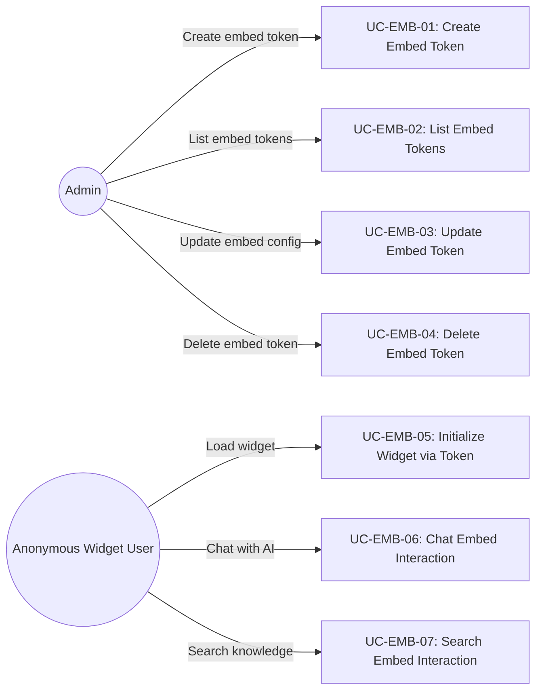
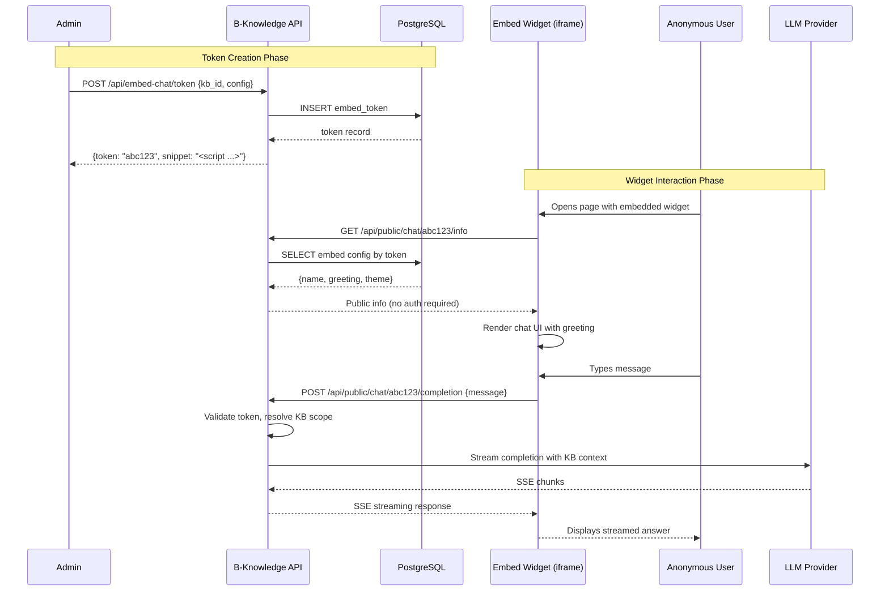

# FR: Embed Widgets

## 1. Overview

This document specifies the functional requirements for B-Knowledge embed widgets. Embed widgets allow administrators to create embeddable chat and search interfaces that can be integrated into external websites via iframe or script tag. Anonymous end users interact with these widgets using token-based authentication, requiring no session or login.

## 2. Actors & Use Cases

## 3. Functional Requirements

### 3.1 Chat Embed Token Management (Admin)

| ID | Requirement | Priority | Notes |
|----|-------------|----------|-------|
| EMB-FR-01 | Admin SHALL be able to create a chat embed token linked to a specific knowledge base and LLM config | Must | Token is a unique opaque string |
| EMB-FR-02 | Admin SHALL be able to list all chat embed tokens for a knowledge base | Must | Paginated |
| EMB-FR-03 | Admin SHALL be able to update chat embed token configuration (greeting, theme, allowed domains) | Should | CORS origin list |
| EMB-FR-04 | Admin SHALL be able to delete a chat embed token, immediately revoking access | Must | Hard delete |

### 3.2 Chat Embed (Anonymous User)

| ID | Requirement | Priority | Notes |
|----|-------------|----------|-------|
| EMB-FR-10 | Widget SHALL load public info (name, greeting, theme) via token without authentication | Must | `GET /api/public/chat/:token/info` |
| EMB-FR-11 | Widget SHALL establish an anonymous session using the embed token | Must | No login required; session is ephemeral |
| EMB-FR-12 | Anonymous user SHALL be able to send messages and receive streaming AI completions | Must | SSE-based streaming |
| EMB-FR-13 | Chat context SHALL be scoped to the knowledge base linked to the token | Must | No cross-KB data leakage |
| EMB-FR-14 | Widget SHALL support conversation history within the anonymous session | Should | Lost on page reload unless persisted client-side |

### 3.3 Search Embed Token Management (Admin)

| ID | Requirement | Priority | Notes |
|----|-------------|----------|-------|
| EMB-FR-20 | Admin SHALL be able to create a search embed token linked to a specific knowledge base | Must | Separate from chat tokens |
| EMB-FR-21 | Admin SHALL be able to list, update, and delete search embed tokens | Must | Same CRUD pattern as chat tokens |

### 3.4 Search Embed (Anonymous User)

| ID | Requirement | Priority | Notes |
|----|-------------|----------|-------|
| EMB-FR-30 | Widget SHALL load public info via search token without authentication | Must | `GET /api/public/search/:token/info` |
| EMB-FR-31 | Anonymous user SHALL be able to submit search queries and receive streaming answers with source references | Must | SSE streaming with citations |
| EMB-FR-32 | Search results SHALL be scoped to the knowledge base linked to the token | Must | Tenant and KB isolation |

## 4. Sequence Diagram: Embed Widget Lifecycle

## 5. Business Rules

| Rule ID | Rule | Rationale |
|---------|------|-----------|
| EMB-BR-01 | Embed tokens use token-based auth; no session cookie is required | Widgets run in third-party iframes |
| EMB-BR-02 | Public embed endpoints SHALL be rate-limited (general rate limit: 1000 req/15min) | Prevent abuse of public endpoints |
| EMB-BR-03 | CORS headers SHALL allow the configured allowed domains for each token | Enable iframe embedding on specific sites |
| EMB-BR-04 | Token deletion SHALL immediately revoke all access; no grace period | Security: instant revocation |
| EMB-BR-05 | Embed tokens are scoped to a single knowledge base and tenant | Multi-tenant isolation |
| EMB-BR-06 | Streaming responses use Server-Sent Events (SSE) | Unidirectional streaming fits chat/search UX |
| EMB-BR-07 | Widget assets are served from the B-Knowledge domain; only the iframe is embedded externally | CSP compatibility |

## 6. API Endpoints

### Admin Endpoints (Session Auth Required)

| Method | Path | Description |
|--------|------|-------------|
| POST | `/api/embed-chat/token` | Create chat embed token |
| GET | `/api/embed-chat/tokens/:kbId` | List chat tokens for KB |
| PUT | `/api/embed-chat/token/:id` | Update chat token config |
| DELETE | `/api/embed-chat/token/:id` | Delete chat token |
| POST | `/api/embed-search/token` | Create search embed token |
| GET | `/api/embed-search/tokens/:kbId` | List search tokens for KB |
| DELETE | `/api/embed-search/token/:id` | Delete search token |

### Public Endpoints (Token Auth)

| Method | Path | Description |
|--------|------|-------------|
| GET | `/api/public/chat/:token/info` | Get chat widget public info |
| POST | `/api/public/chat/:token/completion` | Chat completion (SSE) |
| GET | `/api/public/search/:token/info` | Get search widget public info |
| POST | `/api/public/search/:token/query` | Search query (SSE) |
