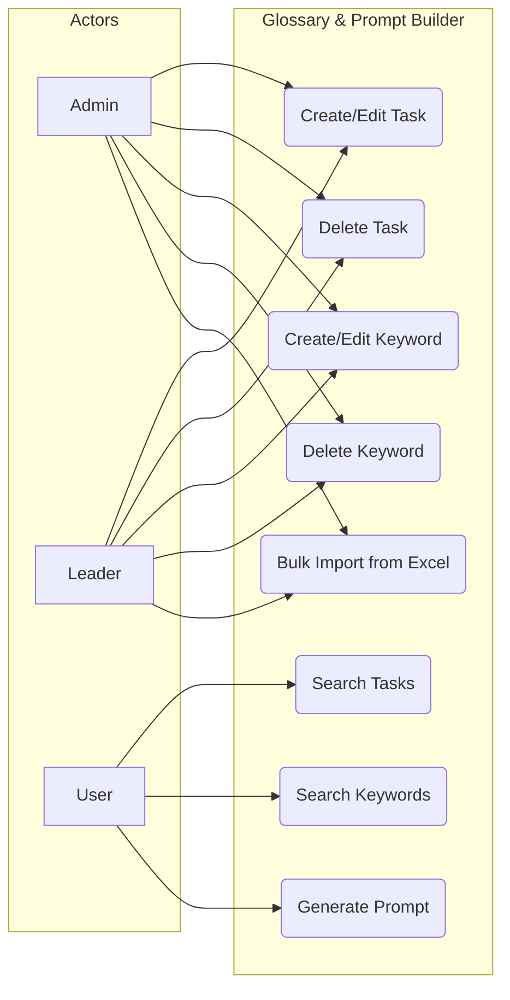
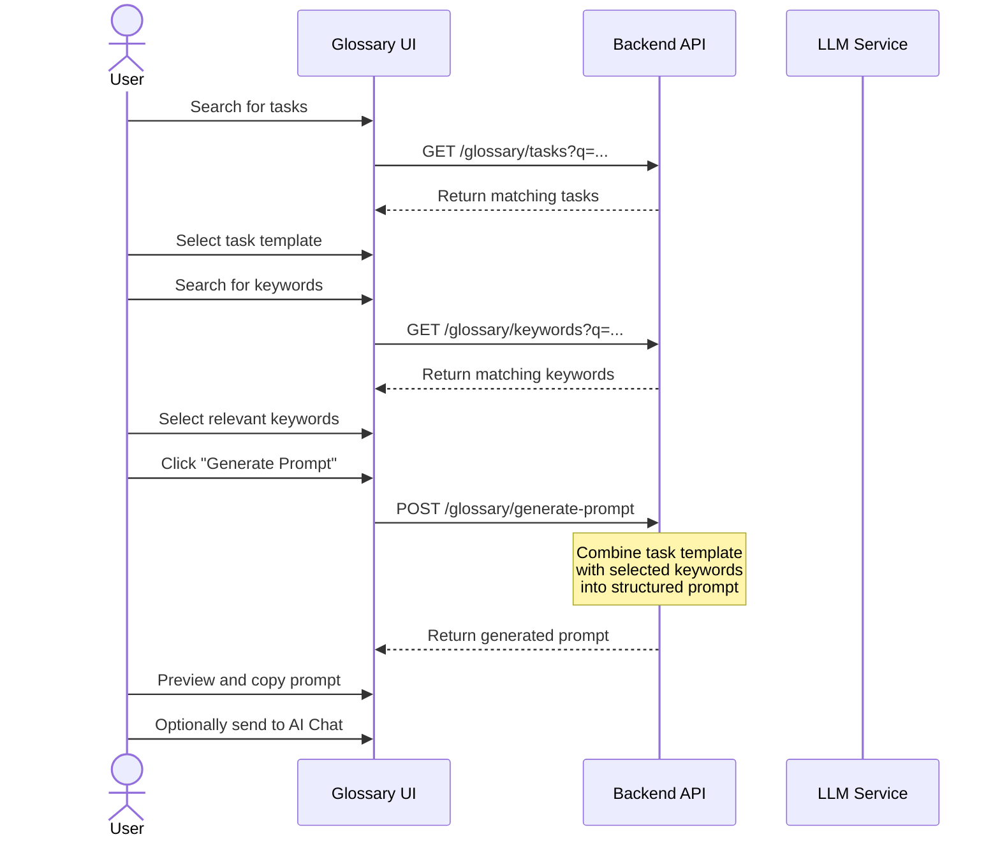

# FR-GLOSSARY: Glossary & Prompt Builder Functional Requirements

## 1. Overview

The Glossary module provides a structured repository of task templates and keywords that feed into a prompt builder. Users search for relevant tasks and keywords, then generate tailored prompts for AI interactions.

## 2. Use Case Diagram

## 3. Functional Requirements

| ID | Requirement | Priority | Description |
|----|-------------|----------|-------------|
| GLOS-01 | Task CRUD | Must | Create, read, update, delete task templates with multi-language name and description (en, vi, ja) |
| GLOS-02 | Keyword CRUD | Must | Create, read, update, delete keywords with multi-language labels and optional description |
| GLOS-03 | Task Search | Must | Search tasks by name or description with text matching and pagination |
| GLOS-04 | Keyword Search | Must | Search keywords by label with text matching and pagination |
| GLOS-05 | Prompt Builder | Must | Select tasks and keywords, then generate a structured prompt combining them |
| GLOS-06 | Bulk Import | Should | Import tasks and keywords from Excel spreadsheets (.xlsx) with validation |
| GLOS-07 | Task Categorization | Should | Organize tasks into categories for browsing |
| GLOS-08 | Keyword Tagging | Could | Tag keywords with metadata for filtering and grouping |
| GLOS-09 | Prompt Preview | Should | Preview the generated prompt before copying or sending to chat |
| GLOS-10 | Prompt History | Could | Save previously generated prompts for reuse |

## 4. Prompt Generation Flow

## 5. Data Model

| Entity | Field | Type | Description |
|--------|-------|------|-------------|
| Task | id | UUID | Primary key |
| Task | name_en | string | Task name in English |
| Task | name_vi | string | Task name in Vietnamese |
| Task | name_ja | string | Task name in Japanese |
| Task | description_en | text | Task description in English |
| Task | description_vi | text | Task description in Vietnamese |
| Task | description_ja | text | Task description in Japanese |
| Task | category | string | Optional category grouping |
| Task | tenant_id | UUID | Tenant scope |
| Keyword | id | UUID | Primary key |
| Keyword | label_en | string | Keyword label in English |
| Keyword | label_vi | string | Keyword label in Vietnamese |
| Keyword | label_ja | string | Keyword label in Japanese |
| Keyword | description | text | Optional keyword description |
| Keyword | tenant_id | UUID | Tenant scope |

## 6. Business Rules

| ID | Rule |
|----|------|
| BR-01 | Only **Admin** and **Leader** roles can create, edit, and delete tasks and keywords |
| BR-02 | All users (including Member role) can search tasks, search keywords, and generate prompts |
| BR-03 | Task names and keyword labels must be provided in at least one language; other locales are optional |
| BR-04 | Bulk import validates each row; invalid rows are skipped and reported in an error summary |
| BR-05 | Generated prompts combine the task description with selected keyword labels into a structured template |
| BR-06 | All glossary data is tenant-scoped; users only see entries within their tenant |
| BR-07 | Duplicate keyword labels within the same tenant and locale are rejected |
| BR-08 | Excel import supports .xlsx format only; maximum 1000 rows per import |
