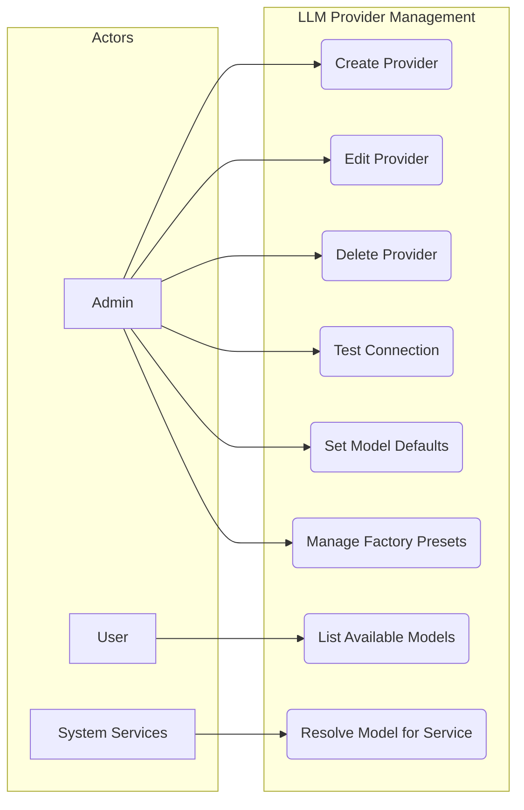
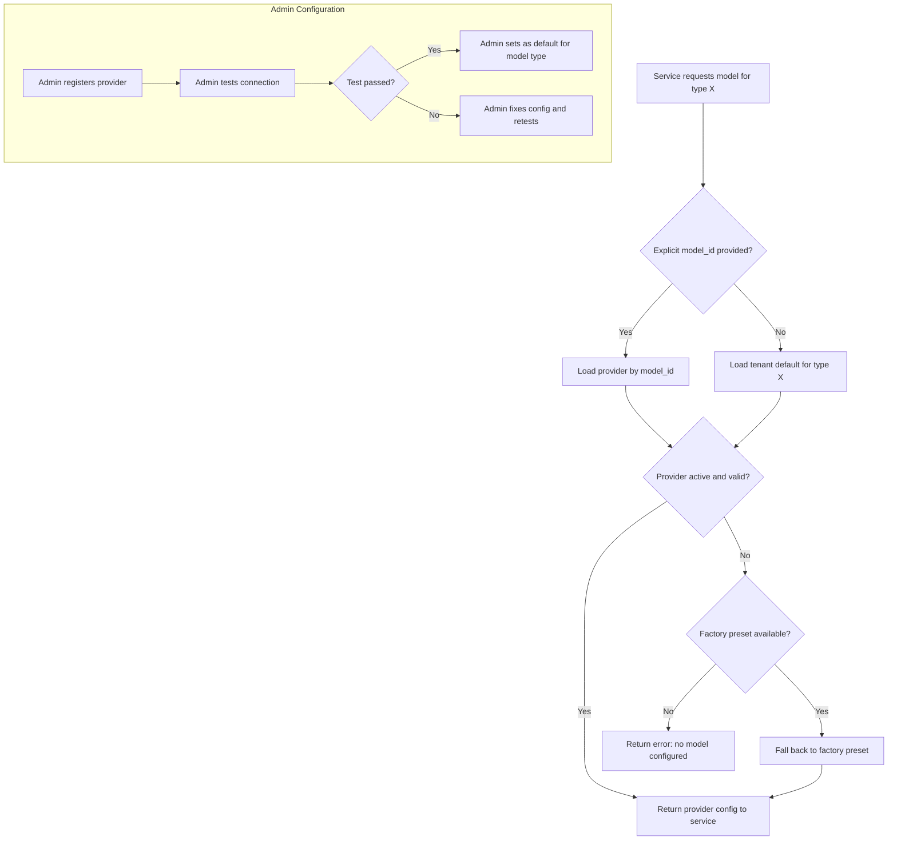

# FR-LLM-PROVIDER: LLM Provider Management Functional Requirements

## 1. Overview

LLM Provider Management allows administrators to register, configure, and manage AI model providers. The system supports multiple provider backends and model types, with factory presets and per-tenant overrides.

## 2. Use Case Diagram

## 3. Functional Requirements

| ID | Requirement | Priority | Description |
|----|-------------|----------|-------------|
| LLM-01 | Provider CRUD | Must | Create, read, update, soft-delete LLM providers with factory, name, API key, and base URL |
| LLM-02 | Connection Testing | Must | Verify provider connectivity by sending a test request to the configured endpoint |
| LLM-03 | Model Defaults | Must | Set a default model per model type (chat, embedding, rerank, etc.) at tenant level |
| LLM-04 | Factory Presets | Should | Pre-configured provider templates for common services (OpenAI, Azure, Jina, Cohere, etc.) |
| LLM-05 | Public Model Listing | Must | Expose available models (filtered by type) for selection in Chat, Search, and other features |
| LLM-06 | Model Resolution | Must | Resolve the active model for a given type, falling back to tenant default if not explicitly set |
| LLM-07 | Provider Validation | Must | Validate API key format and required fields before saving |
| LLM-08 | Multi-Model Support | Should | A single provider entry can serve multiple model types (e.g., OpenAI for chat and embedding) |

## 4. Provider Model Types

| model_type | Purpose | Example Providers |
|------------|---------|-------------------|
| `chat` | Conversational LLM for generating responses | OpenAI GPT, Azure OpenAI, Anthropic Claude |
| `embedding` | Text embedding for vector search | OpenAI Ada, Jina Embeddings, Cohere Embed |
| `rerank` | Result reranking for improved relevance | Cohere Rerank, Jina Reranker |
| `speech2text` | Audio transcription | OpenAI Whisper, Azure Speech |
| `tts` | Text-to-speech audio generation | OpenAI TTS, Azure TTS |
| `image2text` | Image description and OCR | OpenAI GPT-4 Vision, Azure Vision |

## 5. Model Resolution Flow

## 6. Business Rules

| ID | Rule |
|----|------|
| BR-01 | Providers are **soft-deleted**; deletion marks the record inactive but preserves references |
| BR-02 | Composite unique key: **factory + name + model_type** per tenant prevents duplicate entries |
| BR-03 | Only Admin role can create, edit, delete, and test providers |
| BR-04 | All users can list available models filtered by type for selection in assistants and search apps |
| BR-05 | A tenant must have at least one active chat model and one active embedding model for core features to function |
| BR-06 | API keys are stored encrypted at rest and never returned in full via API responses |
| BR-07 | Connection test timeout is 10 seconds; failures include the error message for troubleshooting |
| BR-08 | Factory presets are system-level templates; tenants can override with their own API keys |
| BR-09 | When a provider is soft-deleted, any feature referencing it falls back to the tenant default |
