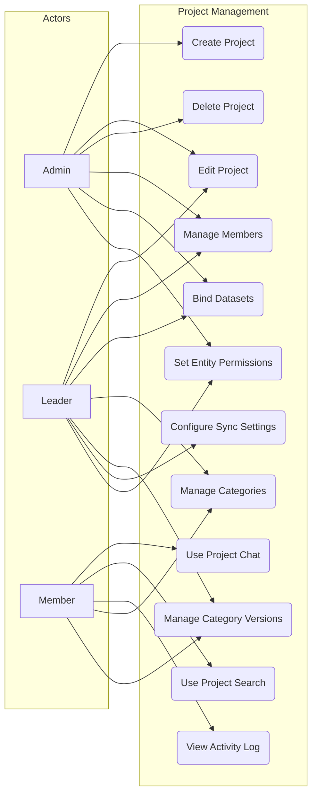
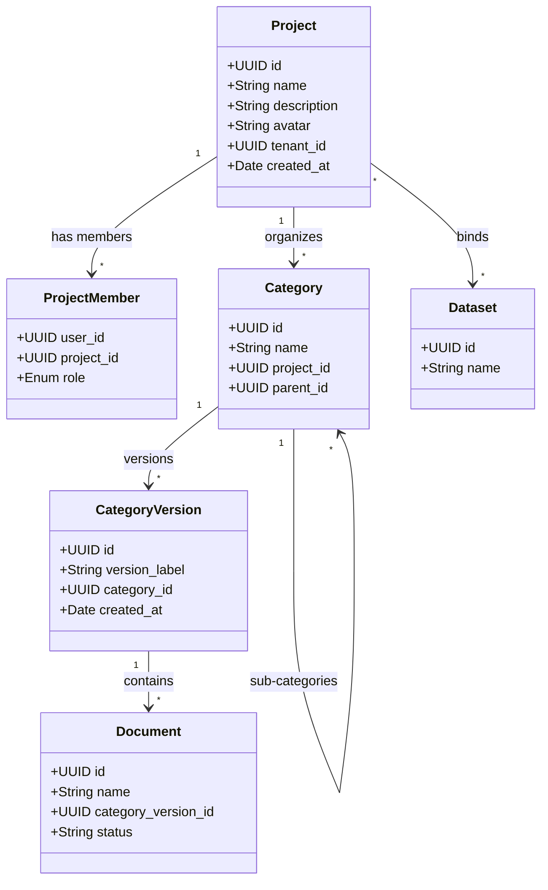

# FR-PROJECT-MANAGEMENT: Project Management Functional Requirements

## 1. Overview

Projects provide organizational containers for datasets, categories, documents, and collaborative workflows. They support role-based access with admin, leader, and member tiers, and integrate with AI Chat and Search features.

## 2. Use Case Diagram

## 3. Functional Requirements

| ID | Requirement | Priority | Description |
|----|-------------|----------|-------------|
| PROJ-01 | Project CRUD | Must | Create, read, update, delete projects with name, description, and avatar |
| PROJ-02 | Member Management | Must | Add/remove members; assign roles (admin, leader, member) per project |
| PROJ-03 | Dataset Binding | Must | Link one or more knowledge base datasets to a project for scoped retrieval |
| PROJ-04 | Category CRUD | Must | Create, edit, delete categories within a project to organize documents |
| PROJ-05 | Category Versions | Should | Create versions of a category; track document snapshots over time |
| PROJ-06 | Project Chat | Should | Launch AI Chat conversations scoped to the project's bound datasets |
| PROJ-07 | Project Search | Should | Execute AI Search queries scoped to the project's bound datasets |
| PROJ-08 | Sync Configuration | Could | Configure sync settings for external data sources linked to the project |
| PROJ-09 | Entity Permissions | Should | Set fine-grained permissions on categories and documents within a project |
| PROJ-10 | Activity Log | Should | Record and display project activity (member changes, document updates, searches) |
| PROJ-11 | Project Listing | Must | List projects with filtering, pagination, and role-based visibility |
| PROJ-12 | Project Dashboard | Could | Show project-level stats: document count, member count, recent activity |

## 4. Project Structure

## 5. Business Rules

| ID | Rule |
|----|------|
| BR-01 | All projects are scoped to a tenant; users cannot access projects outside their tenant |
| BR-02 | **Admin** and **Leader** roles can create, edit, and manage project settings and members |
| BR-03 | **Member** role has read-only access to project settings; can use chat, search, and view activity |
| BR-04 | Only **Admin** can delete a project; deletion soft-deletes the project and disassociates datasets |
| BR-05 | Dataset binding is many-to-many: a dataset can belong to multiple projects |
| BR-06 | Category hierarchy supports nesting (parent-child) up to 5 levels deep |
| BR-07 | Category versions are immutable once finalized; new changes require a new version |
| BR-08 | Project Chat and Search inherit the project's bound datasets as their retrieval scope |
| BR-09 | Activity log entries are append-only and cannot be modified or deleted by any role |
| BR-10 | Member removal revokes all access immediately; active sessions are invalidated |
