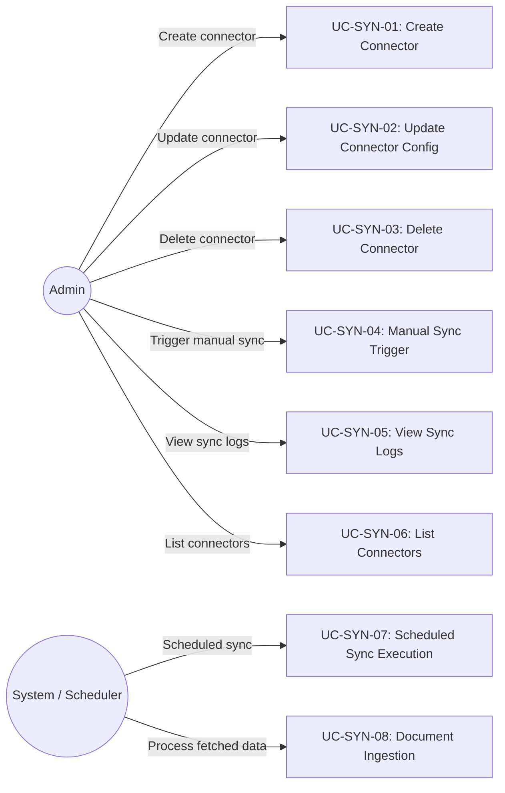
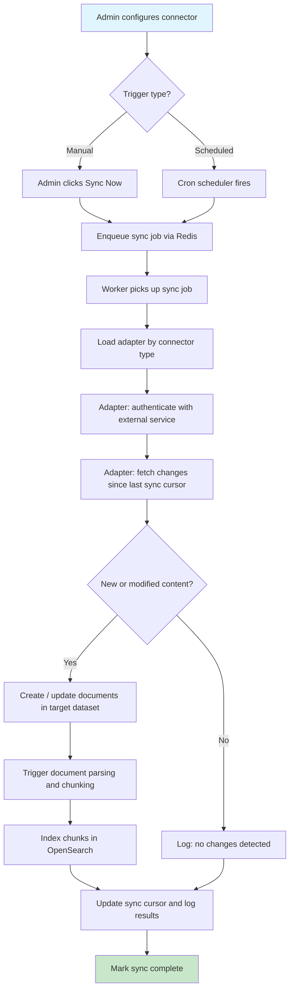
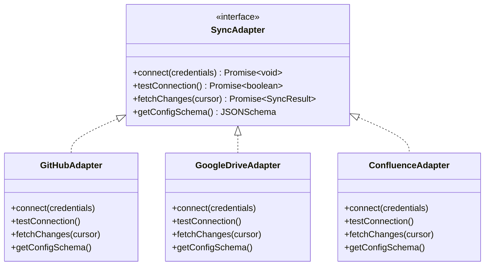

# FR: Sync Connectors

## 1. Overview

This document specifies the functional requirements for B-Knowledge sync connectors. Sync connectors enable administrators to configure external data source adapters (GitHub, Google Drive, Confluence, etc.) that automatically or manually synchronize content into knowledge base datasets for indexing and retrieval.

## 2. Actors & Use Cases

## 3. Functional Requirements

### 3.1 Connector CRUD

| ID | Requirement | Priority | Notes |
|----|-------------|----------|-------|
| SYN-FR-01 | Admin SHALL be able to create a connector specifying: adapter type, credentials, source config, target dataset, sync schedule | Must | Adapter type from registry |
| SYN-FR-02 | Admin SHALL be able to list all connectors for a knowledge base | Must | Paginated, shows last sync status |
| SYN-FR-03 | Admin SHALL be able to update connector configuration (credentials, schedule, source paths) | Must | Does not trigger immediate sync |
| SYN-FR-04 | Admin SHALL be able to delete a connector and optionally remove synced documents | Must | Soft delete connector, optional cascade |
| SYN-FR-05 | Connector credentials SHALL be stored encrypted at rest | Must | AES-256 or equivalent |

### 3.2 Sync Execution

| ID | Requirement | Priority | Notes |
|----|-------------|----------|-------|
| SYN-FR-10 | Admin SHALL be able to trigger a manual sync for any connector | Must | Queued via Redis |
| SYN-FR-11 | System SHALL execute scheduled syncs based on connector cron configuration | Should | Cron-based scheduling |
| SYN-FR-12 | Sync process SHALL fetch only new or modified content since last sync (incremental) | Must | Use ETags, modified timestamps, or cursors |
| SYN-FR-13 | Fetched content SHALL be created as documents in the target dataset | Must | Standard document creation flow |
| SYN-FR-14 | After document creation, the system SHALL trigger parsing and indexing | Must | Same pipeline as manual uploads |

### 3.3 Sync Logs

| ID | Requirement | Priority | Notes |
|----|-------------|----------|-------|
| SYN-FR-20 | System SHALL record a sync log entry for each sync execution | Must | Start time, end time, status, counts |
| SYN-FR-21 | Sync log SHALL include: documents added, updated, deleted, errors encountered | Must | Summary counts and error details |
| SYN-FR-22 | Admin SHALL be able to view paginated sync logs per connector | Must | Sorted by most recent first |

### 3.4 Adapter Registry

| ID | Requirement | Priority | Notes |
|----|-------------|----------|-------|
| SYN-FR-30 | System SHALL support a pluggable adapter registry for connector types | Must | New adapters without core changes |
| SYN-FR-31 | Each adapter SHALL implement a standard interface: `connect()`, `fetchChanges()`, `testConnection()` | Must | Adapter pattern |
| SYN-FR-32 | System SHALL support the following built-in adapters: GitHub, Google Drive, Confluence | Must | MVP adapter set |
| SYN-FR-33 | Each adapter SHALL expose its required configuration schema for UI rendering | Should | JSON Schema for dynamic forms |

## 4. Sync Flow

## 5. Adapter Interface

## 6. Business Rules

| Rule ID | Rule | Rationale |
|---------|------|-----------|
| SYN-BR-01 | Only users with `manage_knowledge_base` permission may create or manage connectors | Authorization control |
| SYN-BR-02 | Sync logs are paginated (default 20, max 100 per page) | Performance on large histories |
| SYN-BR-03 | Connector adapters are registered in a central registry and resolved by type string | Extensibility without code changes to core |
| SYN-BR-04 | A connector belongs to exactly one knowledge base and one dataset | Clear data ownership |
| SYN-BR-05 | If a sync job fails, the cursor is NOT advanced; next sync retries from the same point | Data consistency |
| SYN-BR-06 | Concurrent syncs for the same connector are prevented via Redis lock | Avoid duplicate documents |
| SYN-BR-07 | Connector credentials are tenant-scoped and never exposed in API responses | Multi-tenant security |

## 7. API Endpoints

| Method | Path | Description | Auth |
|--------|------|-------------|------|
| POST | `/api/connectors` | Create connector | manage_knowledge_base |
| GET | `/api/connectors/:kbId` | List connectors for KB | manage_knowledge_base |
| PUT | `/api/connectors/:id` | Update connector config | manage_knowledge_base |
| DELETE | `/api/connectors/:id` | Delete connector | manage_knowledge_base |
| POST | `/api/connectors/:id/sync` | Trigger manual sync | manage_knowledge_base |
| GET | `/api/connectors/:id/test` | Test connection | manage_knowledge_base |
| GET | `/api/connectors/:id/logs` | Get sync logs (paginated) | manage_knowledge_base |
