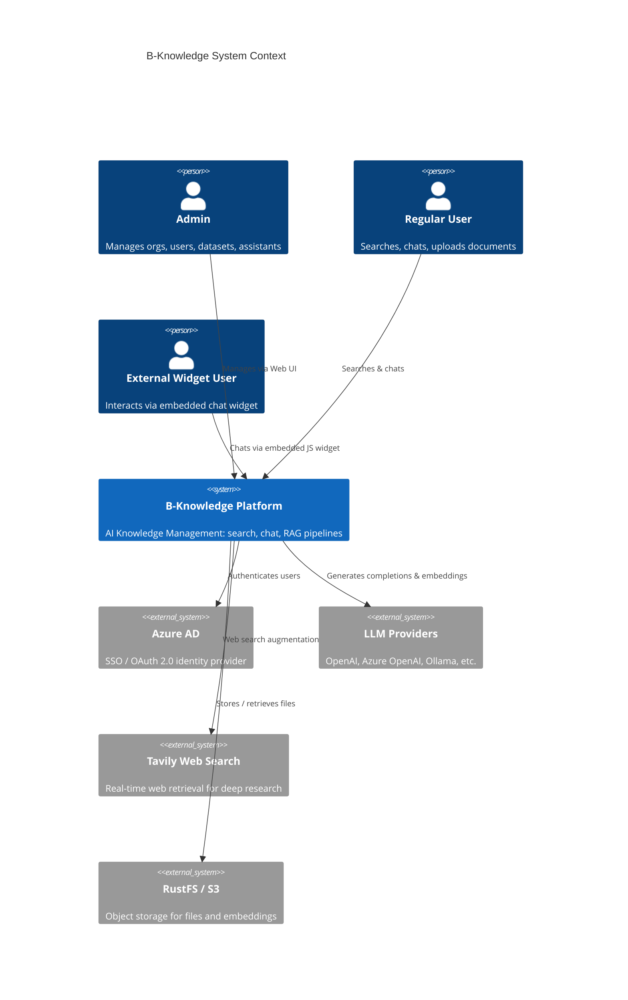

# Software Requirements Specification — B-Knowledge

| Field          | Value                              |
|----------------|------------------------------------|
| Version        | 1.0                                |
| Date           | 2026-03-21                         |
| Status         | Draft                              |
| Classification | Internal                           |

## 1. Purpose

This document defines the functional and non-functional requirements for **B-Knowledge**, an open-source AI Knowledge Management platform that centralises AI Search, Chat, and Knowledge Base capabilities. It serves as the authoritative reference for developers, QA engineers, and stakeholders.

## 2. Project Scope

B-Knowledge enables organisations to:

- Ingest documents in 30+ formats and build searchable knowledge bases.
- Chat with documents via Retrieval-Augmented Generation (RAG).
- Expose knowledge through embeddable widgets and REST APIs.
- Manage users, teams, roles, and multi-tenant organisations.

### 2.1 System Context

## 3. Stakeholders

| Stakeholder        | Role                                    | Concern                                 |
|--------------------|-----------------------------------------|-----------------------------------------|
| Platform Admin     | Manages tenants, users, infra config    | Security, uptime, cost control          |
| Org Admin          | Manages datasets, assistants, teams     | Data quality, access control            |
| End User           | Searches knowledge, chats with AI       | Accuracy, speed, ease of use            |
| Widget Consumer    | Uses embedded chat on external sites    | Latency, relevance                      |
| Developer          | Extends platform via API                | API stability, documentation            |
| DevOps / SRE       | Deploys and monitors the platform       | Observability, scalability              |

## 4. Glossary

| Term             | Definition                                                                 |
|------------------|---------------------------------------------------------------------------|
| RAG              | Retrieval-Augmented Generation — augments LLM prompts with retrieved context |
| LLM              | Large Language Model (e.g., GPT-4, Claude, Llama)                         |
| Embedding        | Dense vector representation of text for semantic similarity search         |
| Chunk            | A segment of a document after splitting for indexing                       |
| Dataset          | A Knowledge Base — a collection of documents with shared config            |
| Assistant        | A chat agent configured with specific datasets, prompts, and LLM settings |
| Tenant           | An isolated organisation within the multi-tenant platform                 |
| BM25             | Sparse keyword-based ranking algorithm used alongside vector search        |
| Cross-Encoder    | A reranking model that scores query-document pairs for relevance           |
| GraphRAG         | RAG technique using knowledge graphs (entities + communities)              |
| RAPTOR           | Recursive Abstractive Processing for Tree-Organized Retrieval              |
| Deep Research    | Multi-step recursive retrieval with web search augmentation                |
| Parser           | Module that extracts structured text from a specific file format           |
| Valkey           | Redis-compatible in-memory store used for caching, sessions, queues        |
| OpenSearch       | Search engine for vector and full-text indexing                            |
| RustFS           | S3-compatible object storage                                              |

## 5. Sub-Documents

| Document                                                    | Scope                              |
|-------------------------------------------------------------|------------------------------------|
| [RAG Strategy & Architecture](./fr-rag-strategy.md)         | RAG approaches, pipeline design    |
| [Authentication](./fr-authentication.md)                    | SSO, sessions, multi-org           |
| [User & Team Management](./fr-user-team-management.md)      | RBAC, ABAC, teams                  |
| [Dataset Management](./fr-dataset-management.md)            | Knowledge bases, access control    |
| [Document Processing](./fr-document-processing.md)          | Parsers, chunking, indexing        |

## 6. Technology Stack Summary

| Layer       | Technology                                         |
|-------------|----------------------------------------------------|
| Backend     | Node.js 22 / Express 4.21 / TypeScript / Knex      |
| Frontend    | React 19 / Vite 7.3 / TanStack Query / Tailwind    |
| RAG Worker  | Python 3.11 / FastAPI / Peewee ORM                 |
| Converter   | Python 3 / LibreOffice / Redis queue               |
| Database    | PostgreSQL 17                                       |
| Cache       | Valkey 8 (Redis-compatible)                        |
| Search      | OpenSearch 3.5                                      |
| Storage     | RustFS (S3-compatible)                             |
| Auth        | Azure AD OAuth 2.0 / Local root login             |
| Proxy       | Nginx                                              |
