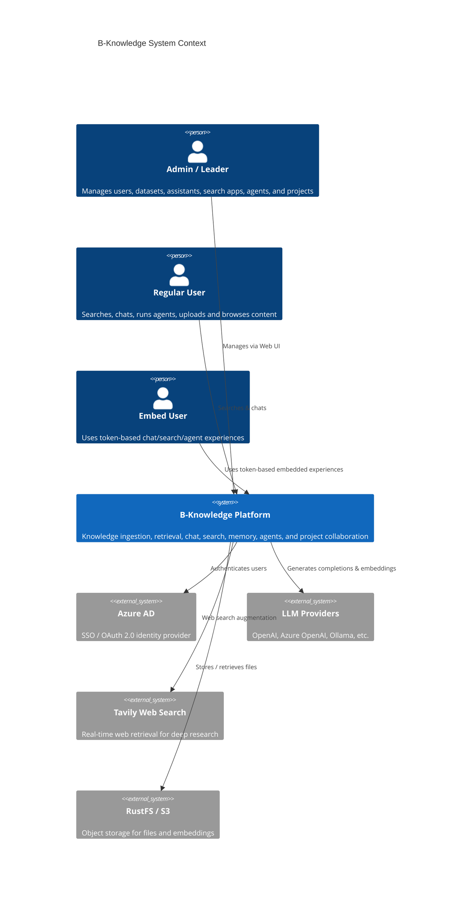

# Software Requirements Specification — B-Knowledge

| Field          | Value                              |
|----------------|------------------------------------|
| Version        | 1.1                                |
| Date           | 2026-03-25                         |
| Status         | Draft                              |
| Classification | Internal                           |

## 1. Purpose

This document defines the functional and non-functional requirements for **B-Knowledge**, an open-source AI knowledge platform covering document ingestion, AI chat, AI search, agent workflows, memory, projects, administration, and external APIs. It serves as the source-oriented reference for developers, QA engineers, and stakeholders.

## 2. Project Scope

B-Knowledge enables organisations to:

- Ingest documents into tenant-scoped datasets with parsing, chunking, enrichment, and indexing.
- Run AI Chat with citations, file upload, embed flows, and OpenAI-compatible APIs.
- Run AI Search with retrieval, streamed summaries, related questions, mind maps, SQL fallback, and public share/embed pages.
- Design and execute agent workflows with canvas editing, webhook triggers, embed triggers, and tool credentials.
- Persist searchable memory pools and import history into memory.
- Manage projects, users, teams, audit, dashboard, glossary, sync, broadcast, and external API access.

### 2.1 System Context

## 3. Stakeholders

| Stakeholder        | Role                                    | Concern                                 |
|--------------------|-----------------------------------------|-----------------------------------------|
| Platform Admin     | Manages tenants, users, infra config    | Security, uptime, cost control          |
| Org Admin          | Manages datasets, assistants, teams     | Data quality, access control            |
| End User           | Searches knowledge, chats with AI       | Accuracy, speed, ease of use            |
| Embed Consumer     | Uses public chat/search/agent embeds    | Latency, relevance, safe public access  |
| Developer          | Extends platform via API                | API stability, documentation            |
| DevOps / SRE       | Deploys and monitors the platform       | Observability, scalability              |

## 4. Glossary

| Term             | Definition                                                                 |
|------------------|---------------------------------------------------------------------------|
| RAG              | Retrieval-Augmented Generation — augments LLM prompts with retrieved context |
| LLM              | Large Language Model (e.g., GPT-4, Claude, Llama)                         |
| Embedding        | Dense vector representation of text for semantic similarity search         |
| Chunk            | A segment of a document after splitting for indexing                       |
| Dataset          | A Knowledge Base — a collection of documents with shared config            |
| Assistant        | A chat agent configured with specific datasets, prompts, and LLM settings |
| Tenant           | An isolated organisation within the multi-tenant platform                 |
| BM25             | Sparse keyword-based ranking algorithm used alongside vector search        |
| Cross-Encoder    | A reranking model that scores query-document pairs for relevance           |
| GraphRAG         | RAG technique using knowledge graphs (entities + communities)              |
| RAPTOR           | Recursive Abstractive Processing for Tree-Organized Retrieval              |
| Deep Research    | Multi-step recursive retrieval with web search augmentation                |
| Parser           | Module that extracts structured text from a specific file format           |
| Valkey           | Redis-compatible in-memory store used for caching, sessions, queues        |
| OpenSearch       | Search engine for vector and full-text indexing                            |
| RustFS           | S3-compatible object storage                                              |

## 5. Sub-Documents

| Document | Scope |
|----------|-------|
| [RAG Strategy & Architecture](/srs/core-platform/fr-rag-strategy) | Retrieval stack, ingestion, indexing |
| [Authentication](/srs/core-platform/fr-authentication) | Azure AD, local login, sessions, org switching |
| [User & Team Management](/srs/core-platform/fr-user-team-management) | Users, teams, roles, permissions |
| [Dataset Management](/srs/core-platform/fr-dataset-management) | Dataset CRUD, access, versions, settings |
| [Document Processing](/srs/core-platform/fr-document-processing) | Upload, parse, enrich, convert, index |
| [AI Chat](/srs/ai-features/fr-ai-chat) | Assistants, conversations, streaming, embed, OpenAI API |
| [AI Search](/srs/ai-features/fr-ai-search) | Search apps, ask/search, related questions, share/embed |
| [Agents](/srs/ai-features/fr-agents) | Workflow builder, execution engine, triggers |
| [Memory](/srs/ai-features/fr-memory) | Memory pools, extraction, search, import |
| [Project Management](/srs/management/fr-project-management) | Projects, categories, versions, datasets, chats, searches |
| [Feedback System](/srs/management/fr-feedback-system) | Answer feedback collection, analytics, and export |
| [Guideline & Onboarding](/srs/management/fr-guideline-onboarding) | In-app help dialogs, guided tours, first-visit detection |
| [Code Knowledge Graph](/srs/integrations/fr-code-graph) | Code structure graph (Memgraph), call analysis, NL queries |
| [External API & API Keys](/srs/integrations/fr-external-api) | Programmatic API access with scoped API keys |

## 6. Technology Stack Summary

| Layer | Technology |
|-------|------------|
| Backend | Node.js 22 / Express 4.21 / TypeScript / Knex |
| Frontend | React 19 / Vite 7.3 / TanStack Query / Tailwind / shadcn/ui |
| RAG Worker | Python 3.11 / FastAPI / Peewee ORM |
| Converter | Python 3 / LibreOffice / Redis queue |
| Database | PostgreSQL 17 |
| Cache | Valkey 8 (Redis-compatible) |
| Search | OpenSearch 3.5 |
| Storage | RustFS (S3-compatible) |
| Auth | Azure AD OAuth 2.0 / Local login |
| Proxy | Nginx |
