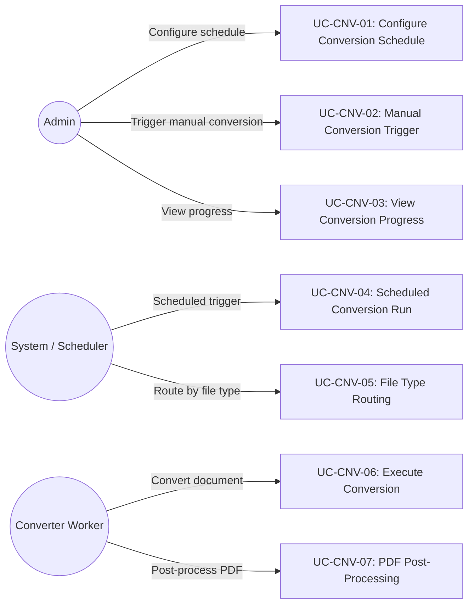
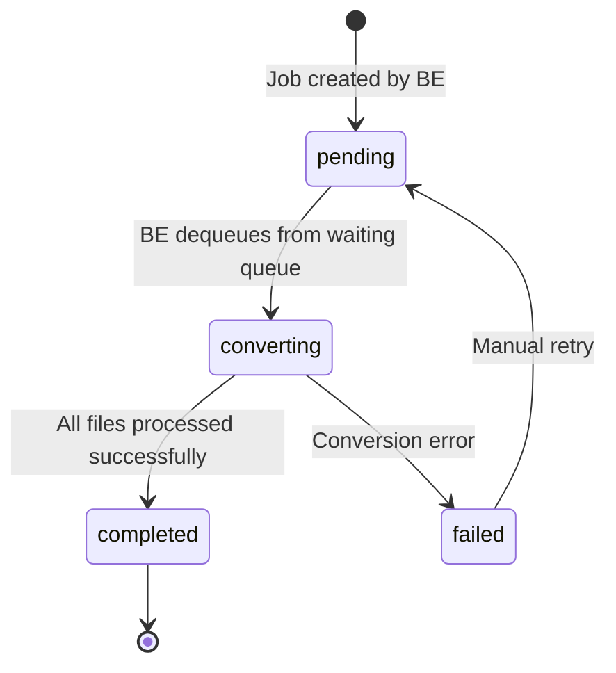
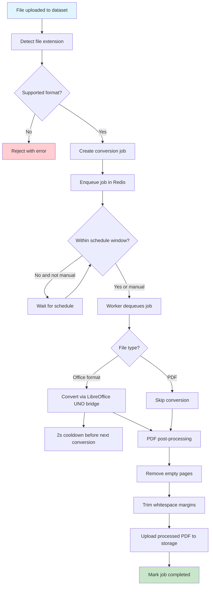

# FR: Document Converter

| Field   | Value      |
|---------|------------|
| Parent  | [SRS Index](../index.md) |
| Version | 1.2        |
| Date    | 2026-04-14 |

## 1. Overview

This document specifies the functional requirements for the B-Knowledge document converter subsystem. The converter is a **Redis queue worker** (NOT a FastAPI service) that transforms Office documents (Word, PowerPoint, Excel) into PDF format using LibreOffice, then performs PDF post-processing (empty page removal, whitespace trimming, margin padding). Jobs are managed through a Redis queue with progress tracking.

The worker polls Redis every 30 seconds (`POLL_INTERVAL`) for pending conversion jobs.

## 2. Actors & Use Cases

## 3. Functional Requirements

### 3.1 Job Creation & Management

| ID | Requirement | Priority | Notes |
|----|-------------|----------|-------|
| CNV-FR-01 | System SHALL create a conversion job when a supported file is uploaded to a dataset | Must | Automatic on upload |
| CNV-FR-02 | Admin SHALL be able to trigger manual conversion for pending documents | Must | Via API or UI |
| CNV-FR-03 | Each job SHALL track: file ID, source format, target format, status, progress, error details | Must | Stored in DB |
| CNV-FR-04 | Jobs SHALL be enqueued via Redis for asynchronous processing | Must | Decoupled from API |

### 3.2 File Type Routing

| ID | Requirement | Priority | Notes |
|----|-------------|----------|-------|
| CNV-FR-10 | System SHALL route files to the appropriate conversion method based on file extension | Must | See conversion routes table |
| CNV-FR-11 | Unsupported file types SHALL be rejected with a clear error message | Must | No silent failures |
| CNV-FR-12 | PDF files SHALL bypass conversion and proceed directly to post-processing | Should | Already in target format |

### 3.3 Conversion Routes

| Extension | Source Format | Method | Tool |
|-----------|--------------|--------|------|
| `.doc`, `.docx`, `.docm` | Word | LibreOffice CLI (`soffice --convert-to pdf`) | LibreOffice |
| `.ppt`, `.pptx`, `.pptm` | PowerPoint | LibreOffice CLI (`soffice --convert-to pdf`) | LibreOffice |
| `.xls`, `.xlsx`, `.xlsm` | Excel | Python-UNO bridge (per-sheet fit-to-page scaling) | LibreOffice UNO |
| `.odt` | OpenDocument Text | LibreOffice CLI | LibreOffice |
| `.odp` | OpenDocument Presentation | LibreOffice CLI | LibreOffice |
| `.ods` | OpenDocument Spreadsheet | LibreOffice CLI | LibreOffice |
| `.pdf` | PDF | Pass-through | Post-processing only |

**Excel special handling:** Excel files use the Python-UNO bridge for advanced page setup control including per-sheet `FitToPagesWide=1` (fit all columns on one page width) with `FitToPagesTall=0` (auto). Falls back to basic LibreOffice CLI if UNO connection fails.

### 3.4 PDF Post-Processing

| ID | Requirement | Priority | Notes |
|----|-------------|----------|-------|
| CNV-FR-20 | System SHALL remove empty pages from converted PDFs | Must | pdfminer content detection; pages with no text or images |
| CNV-FR-21 | System SHALL trim excessive whitespace margins from PDF pages | Should | Analyzes content bounds, applies CropBox with margin padding |
| CNV-FR-22 | System SHALL add margin padding after whitespace trimming | Should | Prevents content from touching page edges |
| CNV-FR-23 | Post-processing SHALL preserve original content fidelity | Must | No content loss |

### 3.5 Scheduling & Execution

| ID | Requirement | Priority | Notes |
|----|-------------|----------|-------|
| CNV-FR-30 | Admin SHALL be able to configure a conversion schedule window (start/end hours) | Should | Avoid peak-hour load |
| CNV-FR-31 | System SHALL process conversion jobs only within the configured schedule window, unless manually triggered | Should | Manual overrides schedule |
| CNV-FR-32 | System SHALL impose a 2-second delay between consecutive LibreOffice conversion jobs | Must | Prevent LibreOffice crashes |
| CNV-FR-33 | System SHALL support parallel PDF post-processing with up to 8 concurrent workers | Must | Configurable worker count |

### 3.6 Progress Tracking

| ID | Requirement | Priority | Notes |
|----|-------------|----------|-------|
| CNV-FR-40 | System SHALL publish job progress updates via Redis pub/sub | Must | Real-time UI updates |
| CNV-FR-41 | Admin SHALL be able to view current conversion queue status and per-job progress | Must | Dashboard view |

## 4. Job State Machine

**Note:** The Node.js backend sets job status to `converting` when it dequeues from the waiting queue. The converter worker looks for jobs in `converting` status that still have pending files to process.

## 4.1 Redis Key Layout

| Key Pattern | Type | Description |
|-------------|------|-------------|
| `converter:vjob:{jobId}` | Hash | Version job metadata (status, file count, timestamps) |
| `converter:vjob:pending` | Sorted Set | Pending job IDs (FIFO by timestamp) |
| `converter:vjob:status:{status}` | Set | Job IDs grouped by status (`converting`, `completed`, `failed`) |
| `converter:files:{jobId}` | Set | File tracking IDs belonging to a job |
| `converter:file:{fileId}` | Hash | Per-file tracking record (status, progress, error) |

## 5. Conversion Flow

## 6. Business Rules

| Rule ID | Rule | Rationale |
|---------|------|-----------|
| CNV-BR-01 | A 2-second delay MUST be enforced between consecutive LibreOffice conversions | LibreOffice UNO bridge stability |
| CNV-BR-02 | PDF post-processing MAY run up to 8 workers in parallel (configurable) | Post-processing is CPU-bound but safe to parallelize |
| CNV-BR-03 | Conversion schedule window is configurable per tenant | Avoid peak-hour resource contention |
| CNV-BR-04 | Manual trigger overrides the schedule window restriction | Admin needs on-demand conversion |
| CNV-BR-05 | Failed jobs may be retried manually; automatic retry is not supported in v1 | Prevent infinite retry loops |
| CNV-BR-06 | Converted PDFs are stored in the same S3 bucket as the original file | Unified file storage |
| CNV-BR-07 | Original files are preserved; conversion creates a new PDF artifact | No data loss |

## 7. API Endpoints

| Method | Path | Description | Auth |
|--------|------|-------------|------|
| GET | `/api/rag/datasets/:id/converter-jobs/:jobId/status` | Check converter job status | Authenticated |

**Note:** The converter is a background Redis worker, not a REST service. Job creation happens automatically during document upload via the RAG module. The single status endpoint above allows the frontend to poll job progress.

## 8. Configuration

| Variable | Default | Description |
|----------|---------|-------------|
| `POLL_INTERVAL` | `30` | Seconds between Redis queue polls |
