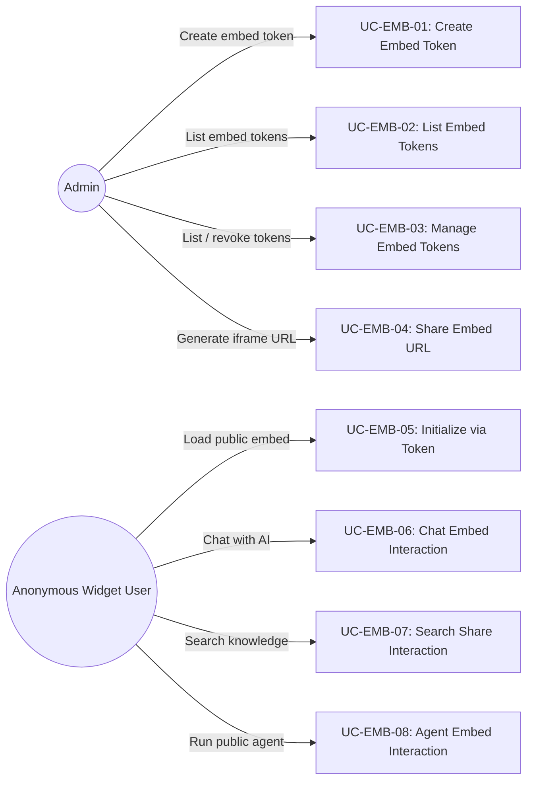
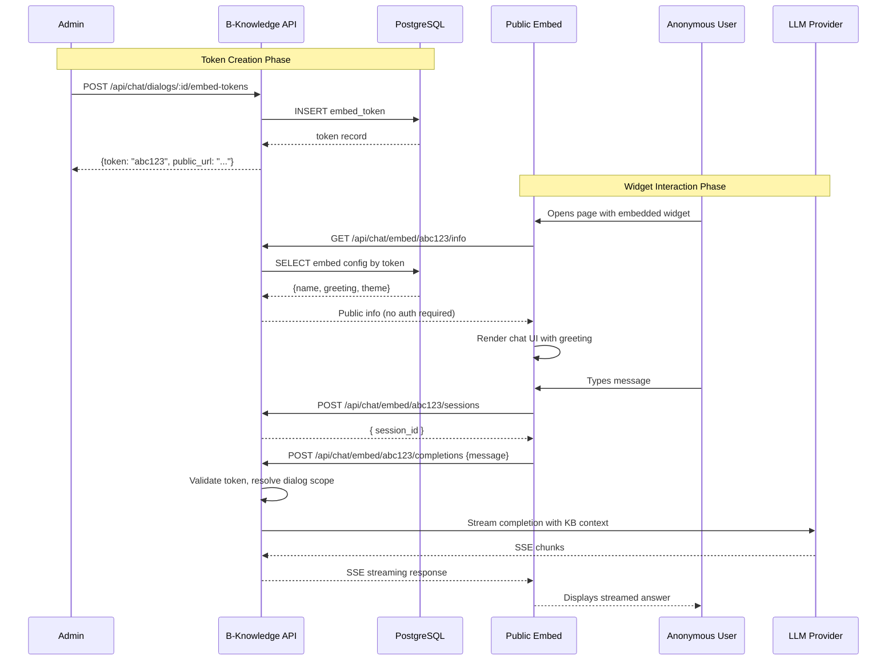

# FR: Embed Widgets

| Field   | Value      |
|---------|------------|
| Parent  | [SRS Index](../index.md) |
| Version | 1.2        |
| Date    | 2026-04-14 |

## 1. Overview

This document specifies the functional requirements for B-Knowledge embed experiences. The current source supports token-based public chat, search, and agent embeds. Search is explicitly iframe/share-page based, while chat and agents expose token-authenticated public endpoints. Anonymous end users interact through token-based access without a browser session.

### 1.1 Frontend Features

| Widget Type | FE Location | Description |
|-------------|-------------|-------------|
| Chat embed | `fe/src/features/chat-widget/` | Floating chat button + window (`ChatWidget`, `ChatWidgetButton`, `ChatWidgetWindow`) |
| Search embed | `fe/src/features/search-widget/` | Full search bar + results page (`SearchWidget`, `SearchWidgetBar`, `SearchWidgetResults`) |
| Agent embed | `fe/src/features/agent-widget/` | Agent button + widget (`AgentWidgetButton`) |

## 2. Actors & Use Cases

## 3. Functional Requirements

### 3.1 Chat Embed Token Management (Admin)

| ID | Requirement | Priority | Notes |
|----|-------------|----------|-------|
| EMB-FR-01 | Admin SHALL be able to create a chat embed token linked to a specific chat dialog | Must | Token is a unique opaque string |
| EMB-FR-02 | Admin SHALL be able to list all chat embed tokens for a dialog | Must | Management view |
| EMB-FR-03 | Admin SHALL be able to revoke a chat embed token, immediately revoking access | Must | Hard delete |

### 3.2 Chat Embed (Anonymous User)

| ID | Requirement | Priority | Notes |
|----|-------------|----------|-------|
| EMB-FR-10 | Public chat SHALL load dialog info via token without authentication | Must | `GET /api/chat/embed/:token/info` |
| EMB-FR-11 | Widget SHALL establish an anonymous session using the embed token | Must | No login required; session is ephemeral |
| EMB-FR-12 | Anonymous user SHALL be able to send messages and receive streaming AI completions | Must | SSE-based streaming |
| EMB-FR-13 | Chat context SHALL be scoped to the dialog and datasets linked to the token | Must | No cross-dialog data leakage |
| EMB-FR-14 | Widget SHALL support conversation history within the anonymous session | Should | Lost on page reload unless persisted client-side |

### 3.3 Search Embed Token Management (Admin)

| ID | Requirement | Priority | Notes |
|----|-------------|----------|-------|
| EMB-FR-20 | Admin SHALL be able to create a search embed token linked to a specific search app | Must | Separate from chat tokens |
| EMB-FR-21 | Admin SHALL be able to list and delete search embed tokens | Must | Same CRUD pattern as chat tokens |

### 3.4 Search Embed (Anonymous User)

| ID | Requirement | Priority | Notes |
|----|-------------|----------|-------|
| EMB-FR-30 | Public search SHALL load public-safe search app config via token without authentication | Must | `GET /api/search/embed/:token/config` |
| EMB-FR-31 | Anonymous user SHALL be able to submit search queries and receive streaming answers with source references | Must | `POST /api/search/embed/:token/ask` |
| EMB-FR-32 | Anonymous user SHALL be able to paginate search results without re-streaming page 1 | Should | `POST /api/search/embed/:token/search` |
| EMB-FR-33 | Search results SHALL be scoped to the search app datasets linked to the token | Must | Tenant and dataset isolation |
| EMB-FR-34 | The public search share page SHALL be accessible at `/search/share/:token` | Must | iframe-first UX |

### 3.5 Agent Embed

| ID | Requirement | Priority | Notes |
|----|-------------|----------|-------|
| EMB-FR-40 | Admin SHALL be able to obtain an agent embed token for a published agent | Must | Token-based public access |
| EMB-FR-41 | Public users SHALL be able to load agent config via token and agent ID | Must | Public config only |
| EMB-FR-42 | Public users SHALL be able to run an embedded agent and stream output | Must | Token-authenticated run flow |

## 4. Sequence Diagram: Embed Widget Lifecycle

## 5. Business Rules

| Rule ID | Rule | Rationale |
|---------|------|-----------|
| EMB-BR-01 | Embed tokens use token-based auth; no session cookie is required | Widgets run in third-party iframes |
| EMB-BR-02 | Public embed endpoints SHALL be rate-limited (general rate limit: 1000 req/15min) | Prevent abuse of public endpoints |
| EMB-BR-03 | Public embed routes are token-based and do not rely on browser sessions | Third-party embedding compatibility |
| EMB-BR-04 | Token deletion SHALL immediately revoke all access; no grace period | Security: instant revocation |
| EMB-BR-05 | Embed tokens are scoped to a single dialog, search app, or agent and tenant context | Multi-tenant isolation |
| EMB-BR-06 | Streaming responses use Server-Sent Events (SSE) | Unidirectional streaming fits chat/search UX |
| EMB-BR-07 | Search embed is iframe/share-page first in the current implementation | Matches source UX |

## 6. API Endpoints

### Admin Endpoints (Session Auth Required)

| Method | Path | Description |
|--------|------|-------------|
| POST | `/api/chat/dialogs/:id/embed-tokens` | Create chat embed token |
| GET | `/api/chat/dialogs/:id/embed-tokens` | List chat embed tokens |
| DELETE | `/api/chat/embed-tokens/:tokenId` | Delete chat embed token |
| POST | `/api/search/apps/:id/embed-tokens` | Create search embed token |
| GET | `/api/search/apps/:id/embed-tokens` | List search embed tokens |
| DELETE | `/api/search/embed-tokens/:tokenId` | Delete search embed token |
| POST | `/api/agents/:id/embed-token` | Create or get agent embed token |
| GET | `/api/agents/:id/embed-tokens` | List agent embed tokens |
| DELETE | `/api/agents/embed-tokens/:tokenId` | Delete agent embed token |

### Public Endpoints (Token Auth)

| Method | Path | Description |
|--------|------|-------------|
| GET | `/api/chat/embed/:token/info` | Get chat public info |
| POST | `/api/chat/embed/:token/sessions` | Create anonymous chat session |
| POST | `/api/chat/embed/:token/completions` | Chat completion (SSE) |
| GET | `/api/search/embed/:token/info` | Get public search app info (name, description) |
| GET | `/api/search/embed/:token/config` | Get public search app config (avatar, empty_response, search_config) |
| POST | `/api/search/embed/:token/search` | Paginated search |
| POST | `/api/search/embed/:token/ask` | Search ask (SSE) |
| POST | `/api/search/embed/:token/related-questions` | Public related questions |
| POST | `/api/search/embed/:token/mindmap` | Public mind map |
| GET | `/api/agents/embed/:token/:agentId/config` | Get public agent config |
| POST | `/api/agents/embed/:token/:agentId/run` | Run embedded agent (SSE) |
