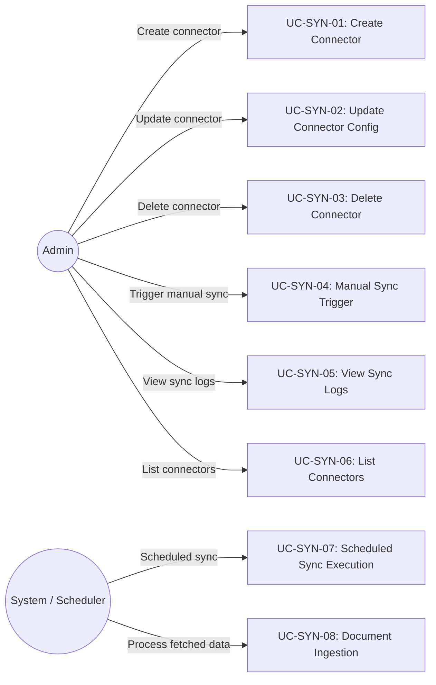
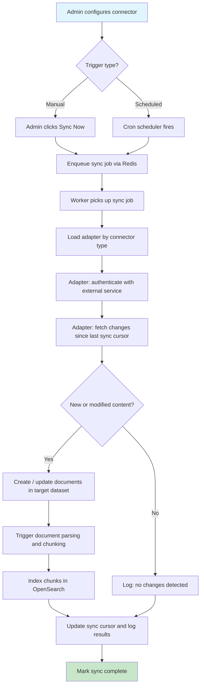
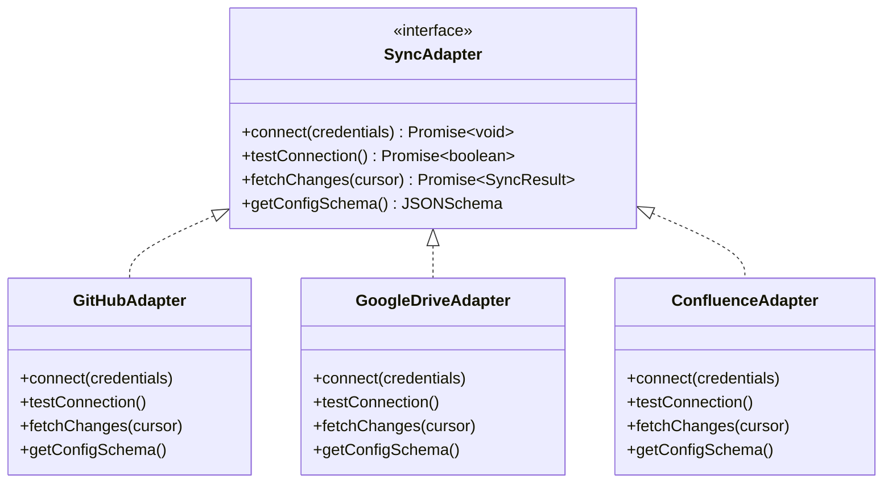

# FR: Sync Connectors

| Field   | Value      |
|---------|------------|
| Parent  | [SRS Index](../index.md) |
| Version | 1.2        |
| Date    | 2026-04-14 |

## 1. Overview

This document specifies the functional requirements for B-Knowledge sync connectors. Sync connectors let administrators configure external data source adapters that synchronize content into datasets for normal document processing and retrieval.

## 2. Actors & Use Cases

## 3. Functional Requirements

### 3.1 Connector CRUD

| ID | Requirement | Priority | Status | Notes |
|----|-------------|----------|--------|-------|
| SYN-FR-01 | Admin SHALL be able to create a connector specifying: adapter type, credentials, source config, target dataset, sync schedule | Must | Implemented | Adapter type from registry |
| SYN-FR-02 | Admin SHALL be able to list connectors, optionally filtered by dataset / knowledge base | Must | Implemented | Paginated, shows last sync status |
| SYN-FR-03 | Admin SHALL be able to update connector configuration (credentials, schedule, source paths) | Must | Implemented | Does not trigger immediate sync |
| SYN-FR-04 | Admin SHALL be able to delete a connector and optionally remove synced documents | Must | Implemented | Soft delete connector, optional cascade |
| SYN-FR-05 | Connector credentials SHALL be stored encrypted at rest | Must | Implemented | AES-256 or equivalent |
| SYN-FR-06 | Admin SHALL be able to pause and resume connectors to temporarily disable scheduled syncing | Must | Implemented | Toggle status between 'active' and 'paused' |

### 3.2 Sync Execution

| ID | Requirement | Priority | Status | Notes |
|----|-------------|----------|--------|-------|
| SYN-FR-10 | Admin SHALL be able to trigger a manual sync for any connector | Must | Implemented | Queued via Redis |
| SYN-FR-11 | System SHALL execute scheduled syncs based on connector cron configuration | Should | Implemented | Cron-based scheduling |
| SYN-FR-12 | Sync process SHALL fetch only new or modified content since last sync (incremental) | Must | Implemented | Use ETags, modified timestamps, or cursors |
| SYN-FR-13 | Fetched content SHALL be created as documents in the target dataset | Must | Implemented | Standard document creation flow |
| SYN-FR-14 | After document creation, the system SHALL trigger parsing and indexing | Must | Implemented | Same pipeline as manual uploads |
| SYN-FR-15 | System SHALL prevent concurrent syncs for the same connector via Redis distributed lock | Must | Implemented | SYN-BR-06 implementation |

### 3.3 Sync Logs

| ID | Requirement | Priority | Status | Notes |
|----|-------------|----------|--------|-------|
| SYN-FR-20 | System SHALL record a sync log entry for each sync execution | Must | Implemented | Start time, end time, status, counts |
| SYN-FR-21 | Sync log SHALL include: documents added, updated, deleted, errors encountered | Must | Implemented | Summary counts and error details |
| SYN-FR-22 | Admin SHALL be able to view paginated sync logs per connector | Must | Implemented | Sorted by most recent first |

### 3.4 Adapter Registry

| ID | Requirement | Priority | Status | Notes |
|----|-------------|----------|--------|-------|
| SYN-FR-30 | System SHALL support a pluggable adapter registry for connector types | Must | Implemented | New adapters without core changes |
| SYN-FR-31 | Each adapter SHALL implement a standard interface: `connect()`, `fetchChanges()`, `testConnection()` | Must | Implemented | Adapter pattern |
| SYN-FR-32 | System SHALL support built-in adapters exposed by the current sync module registry | Must | Implemented | Exact set is implementation-defined |
| SYN-FR-33 | Each adapter SHALL expose its required configuration schema for UI rendering | Should | Implemented | JSON Schema for dynamic forms |

### 3.5 Delta Sync

| ID | Requirement | Priority | Status | Notes |
|----|-------------|----------|--------|-------|
| SYN-FR-50 | System SHALL track `source_doc_id` per synced document to identify external origin | Must | Implemented | Added in migration `20260328160459_add_delta_sync_fields` |
| SYN-FR-51 | System SHALL track `source_updated_at` per synced document for change detection | Must | Implemented | Timestamp from external source; used for incremental sync |
| SYN-FR-52 | Delete cascade SHALL only remove documents with `source_doc_id` set (preserves manual uploads) | Must | Implemented | Prevents accidental removal of user-uploaded content |

### 3.6 Security

| ID | Requirement | Priority | Status | Notes |
|----|-------------|----------|--------|-------|
| SYN-FR-40 | Connector credentials SHALL be encrypted at rest using AES-256-CBC | Must | Implemented | Uses `cryptoService` from `@/shared/services/crypto.service.js` |
| SYN-FR-41 | API responses SHALL mask sensitive credential values with `'********'` | Must | Implemented | Controller replaces tokens/passwords before response |
| SYN-FR-42 | Existing credentials sent back as masked `'********'` SHALL be preserved on update | Must | Implemented | Service merges masked fields with stored encrypted values |

## 4. Sync Flow

## 5. Adapter Interface

## 6. Business Rules

| Rule ID | Rule | Rationale |
|---------|------|-----------|
| SYN-BR-01 | Only users with `manage_knowledge_base` permission may create or manage connectors | Authorization control |
| SYN-BR-02 | Sync logs are paginated (default 20, max 100 per page) | Performance on large histories |
| SYN-BR-03 | Connector adapters are registered in a central registry and resolved by type string | Extensibility without code changes to core |
| SYN-BR-04 | A connector is associated with one dataset/knowledge-base target context | Clear data ownership |
| SYN-BR-05 | If a sync job fails, the cursor is NOT advanced; next sync retries from the same point | Data consistency |
| SYN-BR-06 | Concurrent syncs for the same connector are prevented via Redis lock | Avoid duplicate documents |
| SYN-BR-07 | Connector credentials are tenant-scoped and never exposed in API responses | Multi-tenant security |

## 7. API Endpoints

| Method | Path | Description | Auth |
|--------|------|-------------|------|
| POST | `/api/sync/connectors/test-connection` | Test connection credentials | `sync_connectors.create` |
| POST | `/api/sync/connectors` | Create connector | `sync_connectors.create` |
| GET | `/api/sync/connectors` | List connectors (optional `?kb_id=` filter) | authenticated |
| GET | `/api/sync/connectors/:id` | Get connector | authenticated |
| PUT | `/api/sync/connectors/:id` | Update connector config | `sync_connectors.edit` |
| DELETE | `/api/sync/connectors/:id` | Delete connector (optional `?cascade=true`) | `sync_connectors.delete` |
| POST | `/api/sync/connectors/:id/sync` | Trigger manual sync | `sync_connectors.run` |
| GET | `/api/sync/connectors/:id/logs` | Get sync logs (paginated) | authenticated |
| GET | `/api/sync/connectors/:id/progress` | Stream sync progress events (SSE) | authenticated |

### 7.1 Schedule Registration

Connectors with a `schedule` field (cron expression) are registered at startup via `syncSchedulerService`. The scheduler loads all active connectors with schedules from the database and registers `node-cron` tasks for each. Schedule changes on connector update/create automatically re-register the cron task.

## 8. FileSource Connector Types

The `FileSource` enum (defined in `advance-rag/common/constants.py`) lists all supported connector types:

| # | Connector | Enum Value |
|---|-----------|------------|
| 1 | Local upload | `""` (empty) |
| 2 | Knowledge base | `knowledgebase` |
| 3 | Amazon S3 | `s3` |
| 4 | Notion | `notion` |
| 5 | Discord | `discord` |
| 6 | Confluence | `confluence` |
| 7 | Gmail | `gmail` |
| 8 | Google Drive | `google_drive` |
| 9 | Jira | `jira` |
| 10 | SharePoint | `sharepoint` |
| 11 | Slack | `slack` |
| 12 | Microsoft Teams | `teams` |
| 13 | WebDAV | `webdav` |
| 14 | Moodle | `moodle` |
| 15 | Dropbox | `dropbox` |
| 16 | Box | `box` |
| 17 | Cloudflare R2 | `r2` |
| 18 | Oracle Cloud Storage | `oci_storage` |
| 19 | Google Cloud Storage | `google_cloud_storage` |
| 20 | Airtable | `airtable` |
| 21 | Asana | `asana` |
| 22 | GitHub | `github` |
| 23 | GitLab | `gitlab` |
| 24 | IMAP (email) | `imap` |
| 25 | Bitbucket | `bitbucket` |
| 26 | Zendesk | `zendesk` |
| 27 | Seafile | `seafile` |
| 28 | MySQL | `mysql` |
| 29 | PostgreSQL | `postgresql` |
| 30 | DingTalk AI Table | `dingtalk_ai_table` |
