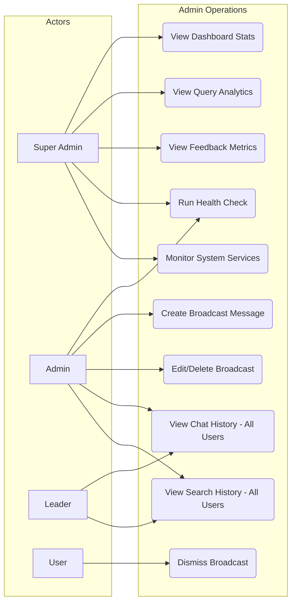

# FR-ADMIN-OPERATIONS: Admin Operations Functional Requirements

> Version 1.2 | Updated 2026-04-14

## 1. Overview

Admin Operations encompasses the dashboard analytics, system monitoring tools, broadcast messaging, and cross-user history viewing capabilities available to privileged roles.

## 2. Use Case Diagram

## 3. Functional Requirements

### 3.1 Dashboard & Analytics

| ID | Requirement | Priority | Status | Description |
|----|-------------|----------|--------|-------------|
| ADM-01 | System Statistics | Must | Implemented | Display total sessions, messages, unique users, avg messages/session, activity trends, top users, and usage breakdown (chat vs. search) |
| ADM-02 | Query Analytics | Must | Implemented | Show query volume, average response time, failed/low-confidence rates, top 10 queries, and daily trend charts |
| ADM-03 | Feedback Metrics | Must | Implemented | Satisfaction rate, worst datasets, zero-result rate, daily feedback trend, recent negative feedback with Langfuse trace links |
| ADM-04 | Feedback Source Breakdown | Should | Implemented | Count feedback records grouped by source type (chat, search, agent) |
| ADM-05 | Usage by Dataset | Could | **Not Implemented** | Per-dataset usage breakdown is not implemented |

> **Implementation Notes:**
> - Dashboard endpoints live in the `dashboard` module, not the `system` module.
> - Health check is in the `system-tools` module, not the dashboard module.
> - `DashboardService.getLangfuseTraceUrl(traceId)` constructs deep-link URLs for Langfuse traces on negative feedback entries.
> - Dashboard stats merge **both** external history tables (`history_chat_sessions`, `history_search_records`) and internal chat tables (`chat_sessions`, `chat_messages`).

### 3.2 System Tools

| ID | Requirement | Priority | Status | Description |
|----|-------------|----------|--------|-------------|
| ADM-06 | Health Check | Must | Implemented | Verify connectivity to PostgreSQL, Valkey, OpenSearch, RustFS, and Langfuse (in `system-tools` module) |
| ADM-07 | Service Monitoring | Should | Implemented | Worker heartbeat tracking for TaskExecutors and Converters via Redis, plus host system metrics (CPU, memory, disk, uptime, load average) |
| ADM-08 | Cache Management | Could | **Not Implemented** | View and clear Valkey cache entries is not implemented |

### 3.3 Broadcast Messages

| ID | Requirement | Priority | Description |
|----|-------------|----------|-------------|
| ADM-09 | Broadcast CRUD | Must | Create, edit, and delete broadcast messages with message, color, font_color, starts_at, ends_at, is_active, and is_dismissible fields |
| ADM-10 | Active Serving | Must | Serve active broadcasts to all users; dismissed broadcasts are filtered per user |
| ADM-11 | User Dismissal | Must | Allow users to dismiss a broadcast; dismissed state persists per user per broadcast in `user_dismissed_broadcasts` table |
| ADM-12 | Broadcast Scheduling | Must | Schedule broadcasts with `starts_at` and `ends_at` dates for automatic activation |

### 3.4 System History Viewing

System history endpoints live in the **system** module (not dashboard).

| ID | Requirement | Priority | Description |
|----|-------------|----------|-------------|
| ADM-13 | Chat Session History | Must | Browse chat conversations of all users within the tenant with filtering (email, date range, text search, feedback filter) |
| ADM-14 | Search Session History | Must | Browse search sessions of all users within the tenant with filtering |
| ADM-15 | Session Detail View | Must | View full message thread or search results for a selected session |
| ADM-16 | Agent Run History | Must | Browse agent runs of all users with filtering and feedback counts |
| ADM-17 | Agent Run Detail View | Must | View full steps and feedback for a specific agent run |
| ADM-18 | System Chat History | Must | Browse system-level chat history (admin components) |

## 4. API Endpoints

### 4.1 Dashboard Endpoints (module: `dashboard`)

| Method | Path | Auth | Description |
|--------|------|------|-------------|
| GET | `/api/admin/dashboard/stats` | Admin, Leader | Aggregated dashboard statistics (sessions, messages, trends, top users) |
| GET | `/api/admin/dashboard/analytics/queries` | Admin, Super-Admin | Query analytics metrics (volume, latency, quality, trends) |
| GET | `/api/admin/dashboard/analytics/feedback` | Admin, Super-Admin | Feedback analytics (satisfaction, worst datasets, negative entries with Langfuse links) |

### 4.2 System History Endpoints (module: `system`)

| Method | Path | Auth | Description |
|--------|------|------|-------------|
| GET | `/api/system/history/chat` | Admin | Paginated chat sessions with feedback counts |
| GET | `/api/system/history/chat/:sessionId` | Admin | Chat session detail (all messages) |
| GET | `/api/system/history/search` | Admin | Paginated search sessions with feedback counts |
| GET | `/api/system/history/search/:sessionId` | Admin | Search session detail (all records) |
| GET | `/api/system/history/agent-runs` | Admin | Paginated agent runs with feedback counts |
| GET | `/api/system/history/agent-runs/:runId` | Admin | Agent run detail (steps + feedback) |
| GET | `/api/system/history/system-chat` | Admin | System-level chat history |

### 4.3 Dashboard Service Functions

| Function | Description |
|----------|-------------|
| `getStats(startDate?, endDate?)` | Aggregate sessions, messages, unique users, trends, top users, usage breakdown |
| `getQueryAnalytics(tenantId, startDate?, endDate?)` | Total queries, avg response time, failed/low-conf rates, top queries, daily trend |
| `getFeedbackAnalytics(tenantId, startDate?, endDate?)` | Satisfaction rate, worst datasets, zero-result rate, daily trend, negative feedback with Langfuse URLs |
| `getFeedbackSourceBreakdown(tenantId, startDate?, endDate?)` | Feedback counts per source (chat, search, agent) |
| `getLangfuseTraceUrl(traceId)` | Construct Langfuse deep-link URL from trace ID |

## 5. Business Rules

| ID | Rule |
|----|------|
| BR-01 | Dashboard stats (`/stats`) are available to **Admin** and **Leader** roles |
| BR-02 | Dashboard analytics (query and feedback) are restricted to **Admin** and **Super-Admin** roles |
| BR-03 | Broadcast message management requires registry-backed `broadcast.*` permissions |
| BR-04 | All users can view and dismiss active broadcasts; dismissal is stored per user per broadcast |
| BR-05 | System history viewing is available to **Admin** role only, scoped by tenant |
| BR-06 | History viewing is read-only; admins cannot modify or delete user conversations/searches |
| BR-07 | Health check is in the `system-tools` module, not dashboard |
| BR-08 | Broadcast messages with an expired `ends_at` date are automatically hidden from users |
| BR-09 | All admin operations are audit-logged with the performing user, action, and timestamp |
| BR-10 | System history service delegates all DB access to `SystemHistoryModel` via `ModelFactory` (correct layering) |
