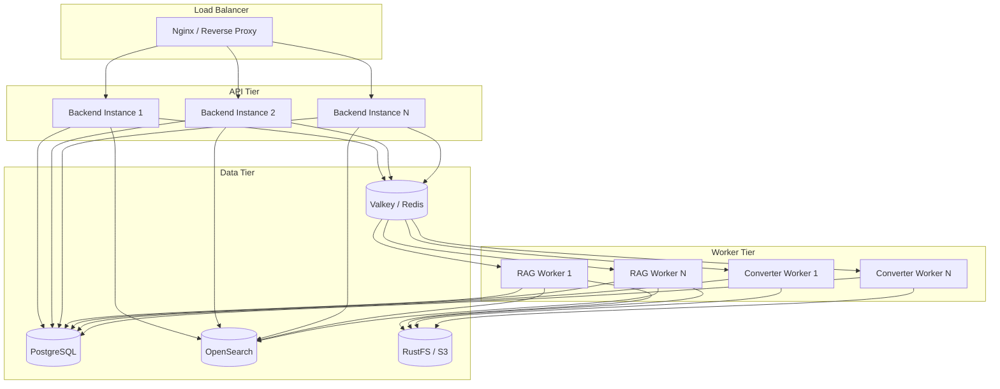
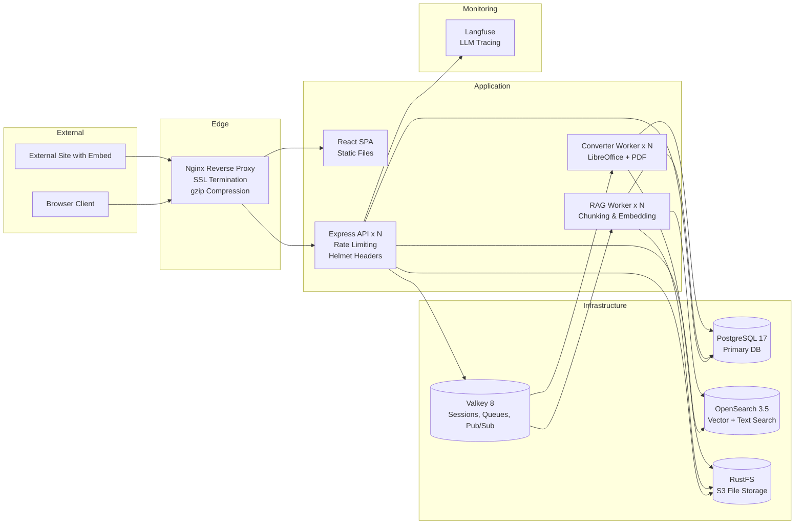

# Non-Functional Requirements

## 1. Overview

This document specifies the non-functional requirements (NFRs) for the B-Knowledge platform, covering performance, security, scalability, availability, internationalization, and observability.

## 2. Performance

### 2.1 Rate Limiting

| Scope | Limit | Window | Notes |
|-------|-------|--------|-------|
| General API | 1000 requests | 15 minutes | Per IP, applied globally |
| Authentication endpoints | 20 requests | 15 minutes | Per IP, login/register/reset |
| Public embed endpoints | 1000 requests | 15 minutes | Per token + IP combination |

### 2.2 Connection & Transport

| ID | Requirement | Value | Notes |
|----|-------------|-------|-------|
| NFR-PERF-01 | HTTP keep-alive connections | 32 max | Prevents connection exhaustion |
| NFR-PERF-02 | Response compression | gzip enabled | Via compression middleware |
| NFR-PERF-03 | OpenSearch connection pool | Configurable pool size | Matches expected query concurrency |
| NFR-PERF-04 | Database connection pool | Configurable via Knex | Default min 2, max 10 |
| NFR-PERF-05 | Static asset caching | Cache-Control headers | Vite content-hashed filenames |

## 3. Security

### 3.1 HTTP Security Headers (Helmet)

| Header | Configuration | Purpose |
|--------|--------------|---------|
| Content-Security-Policy | Strict source directives | Prevent XSS and injection |
| X-Frame-Options | DENY (except embed widget routes) | Clickjacking prevention |
| Strict-Transport-Security | max-age=31536000; includeSubDomains | Enforce HTTPS |
| X-Content-Type-Options | nosniff | Prevent MIME sniffing |
| Referrer-Policy | strict-origin-when-cross-origin | Limit referrer leakage |
| X-DNS-Prefetch-Control | off | Privacy protection |

### 3.2 Authentication & Session

| ID | Requirement | Notes |
|----|-------------|-------|
| NFR-SEC-01 | Session-based authentication using httpOnly, secure, sameSite cookies | No tokens in localStorage |
| NFR-SEC-02 | Session store backed by Redis (Valkey) | Horizontal scaling support |
| NFR-SEC-03 | Session secret must be a strong random value in production | Configurable via `SESSION_SECRET` |
| NFR-SEC-04 | CORS restricted to configured origins only | No wildcard in production |
| NFR-SEC-05 | All mutation endpoints validated with Zod schemas | Prevent malformed input |
| NFR-SEC-06 | IDOR prevention: all resource access verified against tenant and user scope | Multi-tenant isolation |
| NFR-SEC-07 | Passwords hashed with bcrypt (cost factor 12+) | Industry standard |
| NFR-SEC-08 | Local login can be disabled via `ENABLE_LOCAL_LOGIN=false` | For SSO-only deployments |

## 4. Scalability

### 4.1 Horizontal Scaling Architecture

### 4.2 Scaling Requirements

| ID | Requirement | Notes |
|----|-------------|-------|
| NFR-SCAL-01 | All services deployable as Docker containers | `docker-compose` for dev, orchestrator for prod |
| NFR-SCAL-02 | Redis pub/sub for async inter-service communication | Decouples API from workers |
| NFR-SCAL-03 | Concurrent task execution controlled by semaphore | Prevents resource exhaustion |
| NFR-SCAL-04 | Stateless API tier (session in Redis) | Enables horizontal scaling behind load balancer |
| NFR-SCAL-05 | File storage via S3-compatible API (RustFS) | Shared across all instances |

## 5. Availability

| ID | Requirement | Notes |
|----|-------------|-------|
| NFR-AVAIL-01 | Health check endpoints on all services | `/health` returns 200 when ready |
| NFR-AVAIL-02 | Graceful shutdown on SIGTERM and SIGINT | Drain connections, finish in-flight requests |
| NFR-AVAIL-03 | Auto-migration on backend boot | Knex runs pending migrations at startup |
| NFR-AVAIL-04 | Worker health: waits for backend health before starting | Startup dependency check |
| NFR-AVAIL-05 | Redis reconnection with exponential backoff | Resilient to transient Redis failures |

## 6. Internationalization

| ID | Requirement | Notes |
|----|-------------|-------|
| NFR-I18N-01 | All user-facing strings externalized to locale files | No hardcoded UI text |
| NFR-I18N-02 | Three supported locales: English (`en`), Vietnamese (`vi`), Japanese (`ja`) | Selectable in user settings |
| NFR-I18N-03 | Locale detection from browser or user preference | Fallback to `en` |
| NFR-I18N-04 | Class-based dark mode support | `dark` class on root element, all components support both themes |
| NFR-I18N-05 | Date/number formatting respects active locale | Via Intl APIs |

## 7. Observability

| ID | Requirement | Notes |
|----|-------------|-------|
| NFR-OBS-01 | LLM call tracing via Langfuse | Token usage, latency, prompt tracking |
| NFR-OBS-02 | Structured logging via Loguru (Python) and console (Node.js) | JSON format in production |
| NFR-OBS-03 | Query analytics: search queries logged with result counts and latency | Improve retrieval quality |
| NFR-OBS-04 | Audit log for all admin and mutating actions | See FR: Audit & Compliance |

## 8. Deployment Diagram

## 9. Compliance Matrix

| Category | Requirement Count | Must | Should |
|----------|------------------|------|--------|
| Performance | 5 | 3 | 2 |
| Security | 8 | 8 | 0 |
| Scalability | 5 | 5 | 0 |
| Availability | 5 | 3 | 2 |
| Internationalization | 5 | 3 | 2 |
| Observability | 4 | 2 | 2 |
| **Total** | **32** | **24** | **8** |
