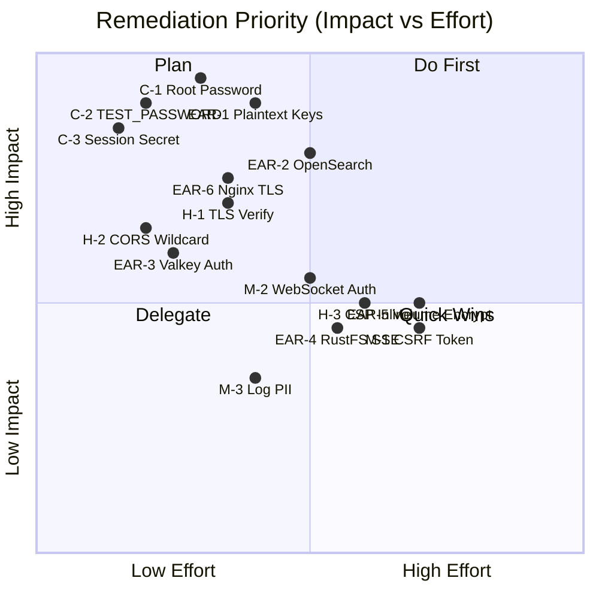

# B-Knowledge Security & Compliance Audit Report

## Executive Summary

This audit reviewed the **B-Knowledge** backend (`be/`) for security hardening, secret management, authentication/authorization controls, and compliance readiness. The codebase demonstrates **solid foundational security** (Helmet, session hardening, RBAC, Zod validation, rate limiting) but has **7 high/critical findings** that should be remediated before production deployment, particularly in healthcare or regulated environments.

---

## Findings by Severity

### 🔴 CRITICAL

---

#### C-1 · Plaintext Root Password Comparison with Hardcoded Default

| Item | Detail |
|------|--------|
| **File** | [auth.service.ts](file:///d:/Project/b-solution/b-knowledge/be/src/modules/auth/auth.service.ts#L289-L291) |
| **Config** | [config/index.ts](file:///d:/Project/b-solution/b-knowledge/be/src/shared/config/index.ts#L117-L118) |
| **Issue** | Root login performs `password === config.rootPassword` — a direct string comparison with no hashing. The default password is `'admin'`. |
| **Risk** | Timing-safe comparison is absent, and if `ENABLE_ROOT_LOGIN` is left `true` in production with the default password, the system has a trivially exploitable admin backdoor. |
| **Recommendation** | 1. Hash the root password at config load time with `bcrypt` or `argon2`. 2. Compare with a constant-time function. 3. **Fail startup** if `ENABLE_ROOT_LOGIN=true` and `KB_ROOT_PASSWORD` is still `'admin'`. |

---

#### C-2 · `TEST_PASSWORD` Global Backdoor

| Item | Detail |
|------|--------|
| **File** | [auth.service.ts](file:///d:/Project/b-solution/b-knowledge/be/src/modules/auth/auth.service.ts#L341) |
| **Issue** | When `ENABLE_ROOT_LOGIN=true` and `TEST_PASSWORD` is set, **any user** in the database can be logged into by providing that single shared password. |
| **Risk** | A leaked or guessed `TEST_PASSWORD` grants full impersonation of any user, including admins. |
| **Recommendation** | 1. Guard behind `NODE_ENV !== 'production'`. 2. Add startup warning/block if set in production. 3. Log every test-password login with an alert-level severity. |

---

#### C-3 · Session Secret Defaults to `'change-me'`

| Item | Detail |
|------|--------|
| **File** | [config/index.ts](file:///d:/Project/b-solution/b-knowledge/be/src/shared/config/index.ts#L110-L112) |
| **Issue** | `SESSION_SECRET` falls back to `'change-me'`. The production guard only warns for `JWT_SECRET`, not the session secret. |
| **Risk** | A known session secret allows session cookie forgery — complete authentication bypass. |
| **Recommendation** | Crash on startup in production if `SESSION_SECRET` is unset or equals the default. Enforce minimum entropy (≥ 32 random bytes). |

---

### 🟠 HIGH

---

#### H-1 · TLS Certificate Verification Disabled for OpenSearch

| Item | Detail |
|------|--------|
| **Files** | [rag-graphrag.service.ts:L45](file:///d:/Project/b-solution/b-knowledge/be/src/modules/rag/services/rag-graphrag.service.ts#L44-L45), [rag-search.service.ts:L38](file:///d:/Project/b-solution/b-knowledge/be/src/modules/rag/services/rag-search.service.ts#L38) |
| **Issue** | `ssl: { rejectUnauthorized: false }` is unconditionally set with a comment "for local development", but there is no environment guard. |
| **Risk** | In production, this allows MITM attacks between the backend and OpenSearch. An attacker on the same network can intercept and modify search queries/results containing sensitive knowledge base content. |
| **Recommendation** | 1. Default `rejectUnauthorized: true`. 2. Only disable via an explicit env var (`ES_TLS_VERIFY=false`) and log a warning. 3. Support a custom CA certificate path for self-signed certs. |

---

#### H-2 · CORS Allows Wildcard Origin When Unconfigured

| Item | Detail |
|------|--------|
| **File** | [config/index.ts](file:///d:/Project/b-solution/b-knowledge/be/src/shared/config/index.ts#L88-L95) |
| **Issue** | `CORS_ORIGIN` defaults to `'*'` (wildcard). Combined with `credentials: true`, this means any website can make credentialed requests to the API. |
| **Risk** | Cross-origin cookie theft, CSRF via pre-flight bypass, data exfiltration from any malicious page. |
| **Recommendation** | 1. **Never** allow `'*'` with `credentials: true` (browsers block it, but `cors` middleware may not). 2. Crash on startup in production if `CORS_ORIGIN` is `'*'`. 3. Default to `frontendUrl` instead. |

---

#### H-3 · CSP Allows `'unsafe-inline'` for Scripts

| Item | Detail |
|------|--------|
| **File** | [index.ts](file:///d:/Project/b-solution/b-knowledge/be/src/app/index.ts#L47) |
| **Issue** | `scriptSrc: ["'self'", "'unsafe-inline'"]` permits inline script execution, drastically weakening XSS protection from CSP. |
| **Risk** | If any XSS vector exists in the frontend rendering, CSP will not block injected inline scripts. |
| **Recommendation** | Replace `'unsafe-inline'` with nonce-based CSP (`'nonce-<random>'`) or `'strict-dynamic'`. If inline scripts are unavoidable, use `'unsafe-hashes'` with specific hash values. |

---

### 🟡 MEDIUM

---

#### M-1 · No CSRF Token for Non-OAuth State-Changing Requests

| Item | Detail |
|------|--------|
| **Observation** | The OAuth flow correctly validates a CSRF `state` parameter. However, regular `POST`/`PUT`/`DELETE` API calls rely solely on `sameSite: 'lax'` cookies for CSRF protection. |
| **Risk** | `sameSite: 'lax'` allows top-level navigation `GET` requests to carry cookies. While `POST` is blocked, complex attack chains (e.g., via form submits with method override) may bypass this. |
| **Recommendation** | Implement a double-submit cookie pattern or synchronizer token for all mutation endpoints. Alternatively, require a custom header (e.g., `X-Requested-With`) that triggers CORS preflight. |

---

#### M-2 · WebSocket Connections Lack Authentication

| Item | Detail |
|------|--------|
| **File** | [socket.service.ts](file:///d:/Project/b-solution/b-knowledge/be/src/shared/services/socket.service.ts) |
| **Issue** | Socket.IO rooms (`join`, `leave`, [emit](file:///d:/Project/b-solution/b-knowledge/be/src/shared/services/socket.service.ts#243-258)) are used for real-time updates but appear to lack session/token authentication on the handshake. Any client with the WebSocket URL can join rooms. |
| **Risk** | Unauthorized real-time data access — a user could subscribe to another user's parsing progress or chat updates. |
| **Recommendation** | Add Socket.IO middleware to validate the session cookie or a signed token on `connection`. Verify room membership against the authenticated user's permissions. |

---

#### M-3 · Sensitive Data in Logs

| Item | Detail |
|------|--------|
| **Files** | [auth.service.ts:L384-L388](file:///d:/Project/b-solution/b-knowledge/be/src/modules/auth/auth.service.ts#L384-L388), [auth.controller.ts:L205](file:///d:/Project/b-solution/b-knowledge/be/src/modules/auth/auth.controller.ts#L205) |
| **Issue** | Failed login attempts log the `username` and `ipAddress` together at `warn` level. The root password value is referenced in the controller (for length check). While not directly logged, proximity to log statements creates risk. |
| **Risk** | Excessive PII in logs. In healthcare/regulated contexts, IP-to-user correlations in logs may violate data minimization principles. |
| **Recommendation** | Hash or truncate usernames in failure logs. Ensure no password values reach any log path. Implement structured log redaction. |

---

### 🟢 LOW / INFORMATIONAL

---

#### L-1 · `trust proxy` Set to `1` — Verify Proxy Chain

| Item | Detail |
|------|--------|
| **File** | [index.ts:L39](file:///d:/Project/b-solution/b-knowledge/be/src/app/index.ts#L39) |
| **Note** | `trust proxy: 1` trusts the first reverse proxy. If the app sits behind multiple proxies, the client IP from `X-Forwarded-For` may be incorrect. |
| **Action** | Verify the deployment topology matches the proxy trust depth. |

#### L-2 · `unhandledRejection` Keeps Process Alive

| Item | Detail |
|------|--------|
| **File** | [index.ts:L173-L178](file:///d:/Project/b-solution/b-knowledge/be/src/app/index.ts#L173-L178) |
| **Note** | Unhandled promise rejections are logged but the process continues. In Node.js 22+, these throw by default. Keeping the process alive may leave it in an undefined state. |
| **Action** | Consider controlled shutdown on repeated unhandled rejections. |

#### L-3 · 30-Minute Server Timeout

| Item | Detail |
|------|--------|
| **File** | [index.ts:L118](file:///d:/Project/b-solution/b-knowledge/be/src/app/index.ts#L118) |
| **Note** | `server.setTimeout(30 * 60 * 1000)` sets a 30-minute HTTP timeout. This is unusually long and could enable slowloris-style DoS. |
| **Action** | Reduce to 120–300 seconds for regular API traffic. Use a separate long-timeout path for file upload/download if needed. |

---

## Positive Security Controls ✅

The codebase implements several strong security patterns:

| Control | Implementation | File |
|---------|---------------|------|
| **Helmet** | Full header hardening (HSTS, X-Frame-Options, etc.) | [app/index.ts](file:///d:/Project/b-solution/b-knowledge/be/src/app/index.ts) |
| **Session Cookies** | `httpOnly: true`, `sameSite: 'lax'`, `secure` in production | [app/index.ts](file:///d:/Project/b-solution/b-knowledge/be/src/app/index.ts) |
| **Redis Session Store** | Server-side session storage when configured | [app/index.ts](file:///d:/Project/b-solution/b-knowledge/be/src/app/index.ts) |
| **Rate Limiting** | Auth-specific (10 req/min) + general API (200 req/min) | [app/routes.ts](file:///d:/Project/b-solution/b-knowledge/be/src/app/routes.ts) |
| **Zod Validation** | Middleware validates all `POST`/`PUT`/`DELETE` bodies | [validate.middleware.ts](file:///d:/Project/b-solution/b-knowledge/be/src/shared/middleware/validate.middleware.ts) |
| **RBAC** | 3-role model (admin/leader/user) with granular permissions | [rbac.ts](file:///d:/Project/b-solution/b-knowledge/be/src/shared/config/rbac.ts) |
| **Ownership Checks** | `checkOwnership` middleware prevents IDOR on user-scoped resources | [auth.middleware.ts](file:///d:/Project/b-solution/b-knowledge/be/src/shared/middleware/auth.middleware.ts) |
| **Reauth Window** | 15-minute window for sensitive operations | [auth.middleware.ts](file:///d:/Project/b-solution/b-knowledge/be/src/shared/middleware/auth.middleware.ts) |
| **File Upload Limits** | OWASP-aligned size limits by extension type | [file-upload.config.ts](file:///d:/Project/b-solution/b-knowledge/be/src/shared/config/file-upload.config.ts) |
| **OAuth State** | CSRF state token validated on Azure AD callback | [auth.controller.ts](file:///d:/Project/b-solution/b-knowledge/be/src/modules/auth/auth.controller.ts) |
| **Content-Type Guard** | JSON Content-Type enforced on mutation routes | [app/routes.ts](file:///d:/Project/b-solution/b-knowledge/be/src/app/routes.ts) |
| **Production Startup Validation** | Warns on missing `JWT_SECRET` in production | [config/index.ts](file:///d:/Project/b-solution/b-knowledge/be/src/shared/config/index.ts) |

---

## Encryption at Rest & In Transit — Infrastructure Deep Dive

> [!CAUTION]
> **No encryption at rest is configured for any service in the stack.** Sensitive data (LLM API keys, connector credentials, chat messages, knowledge base documents) is stored and transmitted in cleartext across all infrastructure components.

### Summary Matrix

| Service | Encryption at Rest | Encryption in Transit | Auth | Severity |
|---------|-------------------|----------------------|------|----------|
| **PostgreSQL 15** | ❌ None (no TDE, no pgcrypto) | ❌ No `sslmode` enforced | ✅ Password auth | 🔴 CRITICAL |
| **OpenSearch 2.x** | ❌ None | ❌ HTTP (SSL disabled) | ❌ Security plugin disabled | 🔴 CRITICAL |
| **Valkey 8** | ❌ AOF writes cleartext | ❌ No TLS | ❌ No password | 🟠 HIGH |
| **RustFS** | ❌ No SSE configured | ❌ No TLS between backend↔RustFS | ✅ Access/Secret key | 🟠 HIGH |
| **Docker Volumes** | ❌ Plain `driver: local` | N/A | N/A | 🟡 MEDIUM |
| **Nginx** | N/A | ❌ SSL block commented out | N/A | 🟠 HIGH |

---

### EAR-1 · PostgreSQL — Plaintext API Keys & No Column Encryption

| Item | Detail |
|------|--------|
| **Schema** | [initial_schema.ts](file:///d:/Project/b-solution/b-knowledge/be/src/shared/db/migrations/20260312000000_initial_schema.ts#L427-L442) |
| **Init SQL** | [01-init.sql](file:///d:/Project/b-solution/b-knowledge/docker/init-db/01-init.sql) |
| **Issue** | The `model_providers.api_key` column is defined as `table.text('api_key')` — raw plaintext. No `pgcrypto` extension is loaded. The `connectors.config` JSONB field may also contain OAuth tokens or API credentials in cleartext. The init SQL only loads `uuid-ossp` and `pg_trgm`. |
| **Evidence** | `table.text('api_key')` at L432; `CREATE EXTENSION IF NOT EXISTS "uuid-ossp"` and `"pg_trgm"` only |
| **Risk** | A database dump, backup theft, or SQL injection exposes every LLM provider API key. API responses mask keys with `'***'`, but the underlying column is fully readable. |
| **Recommendation** | 1. Add `CREATE EXTENSION IF NOT EXISTS pgcrypto` to init SQL. 2. Encrypt `api_key` using `pgp_sym_encrypt()` with an application-managed encryption key. 3. Decrypt only in the service layer via `pgp_sym_decrypt()`. 4. Audit `connectors.config` for embedded secrets and apply the same pattern. |

---

### EAR-2 · OpenSearch — Security Plugin Disabled, HTTP Plaintext

| Item | Detail |
|------|--------|
| **Compose** | [docker-compose.yml](file:///d:/Project/b-solution/b-knowledge/docker/docker-compose.yml) |
| **Issue** | OpenSearch runs with `plugins.security.disabled=true` and `plugins.security.ssl.http.enabled=false`. This disables all authentication, authorization, audit logging, and transport/HTTP encryption. |
| **Evidence** | `- plugins.security.disabled=true` and `- plugins.security.ssl.http.enabled=false` in environment vars |
| **Risk** | Any process in the Docker network can read/write/delete all indexes without credentials. Knowledge base embeddings, chat history indexes, and RAG data are fully exposed. No encryption at rest for index segments on disk. |
| **Recommendation** | 1. Enable the security plugin and configure internal users. 2. Enable SSL for HTTP (`plugins.security.ssl.http.enabled=true`) with self-signed or CA certs. 3. Enable encryption at rest via OpenSearch's `encryption_at_rest` index setting or underlying volume encryption. |

---

### EAR-3 · Valkey — No Password, No TLS, Cleartext Persistence

| Item | Detail |
|------|--------|
| **Compose** | [docker-compose.yml](file:///d:/Project/b-solution/b-knowledge/docker/docker-compose.yml) |
| **Issue** | Valkey container has no `requirepass` and no TLS configuration. AOF persistence (`appendonly yes`) writes session data and cached content in cleartext to `valkey_data` volume. |
| **Evidence** | `command: valkey-server --appendonly yes --save "" --appendfsync no` — no `--requirepass`, no `--tls-*` flags |
| **Risk** | Any container in the network can connect and read/write all cached data (sessions, rate-limit state). If the volume is backed up or the host disk is compromised, session tokens are exposed. |
| **Recommendation** | 1. Add `--requirepass` with a strong secret from env var. 2. Update backend config to include the password in the Redis/Valkey connection string. 3. Consider `--tls-port` with cert/key for encrypted connections. |

---

### EAR-4 · RustFS — No Server-Side Encryption, Wildcard CORS

| Item | Detail |
|------|--------|
| **Compose** | [docker-compose.yml](file:///d:/Project/b-solution/b-knowledge/docker/docker-compose.yml) |
| **Issue** | RustFS (S3-compatible storage) has no SSE (Server-Side Encryption) configured. `RUSTFS_DOMAIN=http://rustfs:9000` uses HTTP. CORS is set to `RUSTFS_BROWSER_REDIRECT_URL=http://localhost:9001`. No encryption flags in the container startup. |
| **Risk** | Uploaded documents (PDF, DOCX, etc.) are stored in cleartext on disk. If the `rustfs_data` volume or host filesystem is compromised, all knowledge base files are immediately readable. |
| **Recommendation** | 1. Enable SSE-S3 (automatic encryption) via RustFS configuration or environment variable. 2. Switch to HTTPS for RustFS connections. 3. Restrict CORS origin to the actual admin console URL. |

---

### EAR-5 · Docker Volumes — No Disk-Level Encryption

| Item | Detail |
|------|--------|
| **Compose** | [docker-compose.yml](file:///d:/Project/b-solution/b-knowledge/docker/docker-compose.yml) |
| **Issue** | All 5 named volumes (`postgres_data`, `opensearch_data`, `valkey_data`, `rustfs_data`, `ragflow_data`) use `driver: local` with no encryption driver or options. |
| **Risk** | Physical disk access, stolen backups, or host compromise exposes all persisted data — database files, search indexes, cache dumps, uploaded documents. |
| **Recommendation** | 1. Use LUKS/dm-crypt for the host filesystem under Docker's data-root. 2. Alternatively, use a volume driver that supports encryption (e.g., `rexray` with encrypted EBS). 3. For Kubernetes migration, use `StorageClass` with `encrypted: true`. |

---

### EAR-6 · Nginx — TLS/SSL Fully Commented Out

| Item | Detail |
|------|--------|
| **File** | [nginx.conf](file:///d:/Project/b-solution/b-knowledge/docker/nginx/nginx.conf#L177-L198) |
| **Issue** | The HTTPS server block (L180–L198) is entirely commented out. All traffic is served over HTTP on port 80. No HSTS header is active (only present in the commented SSL block). |
| **Risk** | All data between client browsers and the server — including session cookies, API keys in requests, chat messages, and document content — is transmitted in cleartext. |
| **Recommendation** | 1. Uncomment the SSL block and configure certificate paths. 2. Add HTTP→HTTPS redirect on port 80. 3. Enable HSTS with `includeSubDomains` and `preload`. 4. Use `ssl_protocols TLSv1.2 TLSv1.3` only (already in the commented config). |

---

## Healthcare / Compliance Considerations

> [!CAUTION]
> If this system handles Protected Health Information (PHI) or personally identifiable data, the following gaps require attention beyond the findings above.

| Requirement | Status | Gap |
|-------------|--------|-----|
| **Audit Logging** | ✅ `audit` module exists | Verify all data access (not just mutations) is logged |
| **Encryption at Rest** | ❌ **Not implemented** | See EAR-1 through EAR-5 above — no service encrypts data at rest |
| **Encryption in Transit** | ❌ **HTTP only** | See EAR-6/H-1 — Nginx SSL commented out, OpenSearch SSL disabled |
| **Access Logging** | ✅ IP history tracked | Ensure logs are tamper-resistant and retained per policy |
| **Data Minimization** | ⚠️ See M-3 | Reduce PII in logs, implement retention policies |
| **Right to Deletion** | ❓ Not observed | Verify user data can be fully purged (GDPR Art. 17) |
| **Breach Notification** | ❓ Not observed | Ensure incident response procedures exist |

---

## Remediation Priority

**Suggested order**: C-3 → C-1 → C-2 → EAR-1 → EAR-6 → H-2 → EAR-3 → H-1 → EAR-2 → M-2 → H-3 → EAR-4 → M-3 → EAR-5 → M-1
